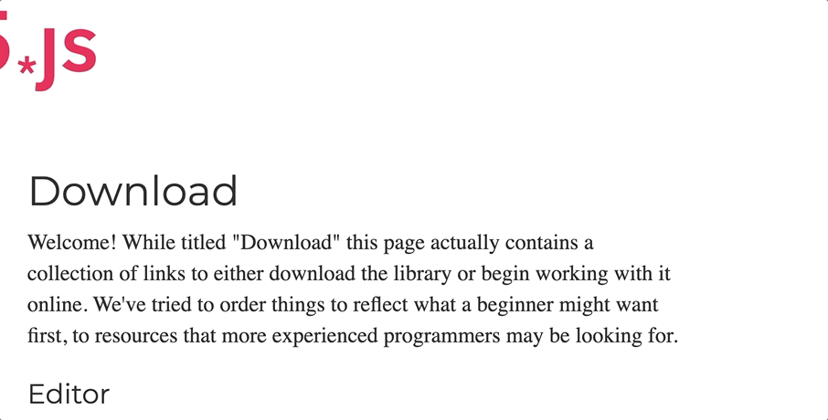
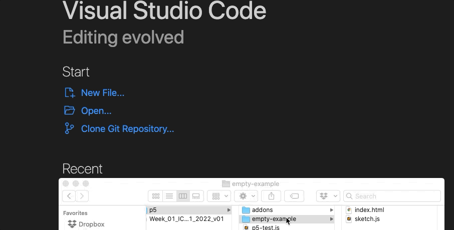

# Week 01

## Limbering Up

The aim of this first workshop is just to ease ourselves into the tools and processes we'll be using throughout the module.

First, we're just going to try using p5's online editor. Then we're going to get serious straight away with the professional level code editor VS code.

We'll essentially be doing the same thing twice: making an interactive piece of creative code with the online editor, then making it again using "proper" separate html and javascript files!

### Task 1 - Getting Started

- Head to the [p5 website](https://p5js.org/get-started/) and do the "Get Started" section using the online code editor under the heading "Your First Sketch". 

It's a good idea to right click (ctrl-click on Mac) link for the p5.js web editor and open that in a new window or tab. Then you can follow the instructions in one tab and add your code in the other one...

### Task 2 - Going Pro

OK it's all well and good being able to edit code in the editor. But this is a BSc degree and we want to use the tools of the trade. We're going to be using the VS Code editor. So if you're working on your own machine, download and install it from [here](https://code.visualstudio.com/).

- Now go over to [p5 download page](https://p5js.org/download/) and navigate to the download button. Then download the .zip file:

- Unzip the p5 folder (double click on Mac or right click and select 'Extract All' on Windows)
- Put the unzipped folder in a folder with the path /y-username/UWE_2022_2023/Year1/ICC/Week1
- Open the application VS Code
- Create a new window in VS Code by going to file->new window
- Drag the entire p5 folder onto the VS Code window:

- Now just take a look inside the 'empty-example' folder in VS code: we can see our blank sketch in sketch.js. 
- Let's just open the index.html page in our browser too!

- OK, now simply follow the same instructions as on the [Get Started](https://p5js.org/get-started/) page to re-create your sketch on your local machine

- Each time you edit sketch.js in VS code, make sure you save it, then hit the refresh button in your web browser to see the results:

Woohoo! Now you've made your first piece of creative code!

If you mangaged to get that done really quickly spend some time exploring the p5.js [examples](https://p5js.org/examples/).  See if you can make a new project folder and get one of them running locally on your machine.

### Before you go make sure you copy your entire Week1 folder into your OneDrive (or where ever you're keeping your work). You will need to get used to doing this every week!

