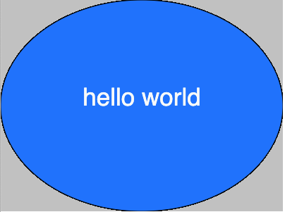

# Week 02

## Code Challenge 1 - Answer

- Hopefully your sketch now looks something like this:  

<p align="center">

</p>

- Your code should like this

```javascript
function setup() {
  createCanvas(400, 300);
  background(200);
}

function draw() {
  fill(30, 125, 255);
  ellipse(200, 150, 400, 300);
  fill(250);
  textSize(35);
  textAlign(CENTER);
  text("hello world", 200, 150);
}
```
The parameters being passed to the ```text()``` function are explained here:   
[https://p5js.org/reference/p5/text/](https://p5js.org/reference/p5/text/) 

The parameters being passed to the ```ellipse()``` function are explained here:   
[https://p5js.org/reference/p5/ellipse/](https://p5js.org/reference/p5/ellipse/)

Now, have a read of [Coordinates and Transformations](https://p5js.org/tutorials/coordinates-and-transformations/) as it will help you understand the coordinate system used in p5.js - we talked about this in class.