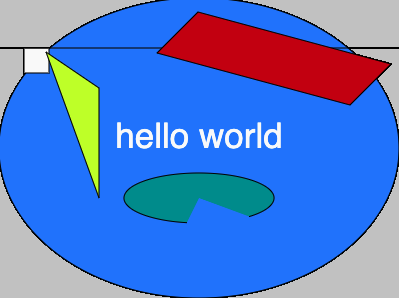

# Week 02

## Code Challenge 2 - Answer

Hopefully your sketch looks like a bit like this:  

<p align="center">

</p>

Your shapes code should should like this

```javascript
triangle(347,54,392,9,392,66);
```

```javascript
quad(158,55,199,14,392,66,351,107);
```
```javascript
line(0, 50, 400, 50);
```

```javascript
rect(25,50,25,25);
```
```javascript
arc(300,300,50,50,90,270);
```

And your whole sketch code should look something like this:  

```javascript
function setup() {
  createCanvas(400, 300);
  background(color(200));
}

function draw() {
  // Code Challenge 1
  fill(30, 125, 300);
  ellipse(200,150, 400,300);
  fill(250);
  textSize(35);
  textAlign(CENTER);
  text("hello world", 200, 150);
  
  // Code Challenge 2
  rect(25,50,25,25);
  fill(0, 255, 0)
  line(0, 50, 400, 50);
  fill(200, 255, 0);
  triangle(47, 54, 100, 90, 100, 200);
  fill(200, 0, 0);
  quad(158,55,199,14,392,66,351,107);
  fill(0,150, 150);
  arc(200,200,150,50,90,170);
}
```
