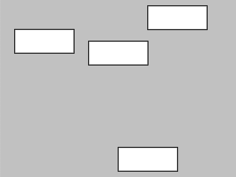

# Week 02

## Code Challenge 3 - Answer

Hopefully your sketch looks like a bit like this:  

<p align="center">

</p>

All the ```rect()``` shapes are sharing the value stored within the variables.  
So all the ```rect()``` shapes width and height are controlled by the variables ```rectWidth``` and ```rectHeight```

And your whole sketch code should look something like this:  

```javascript
let rectWidth = 100;
let rectHeight = 40;

function setup() {
  createCanvas(400, 300);
  background(color(200));
}

function draw() {
  rect(25,50,rectWidth,rectHeight);
  rect(150,70,rectWidth,rectHeight);
  rect(250,10,rectWidth,rectHeight);
  rect(200,250,rectWidth,rectHeight);
}
```
