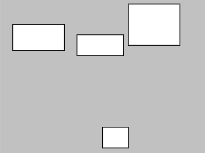

# Week 02

## Code Challenge 4 - Answer

Hopefully your sketch looks like a bit like this:  

<p align="center">

</p>

Simple arithmetic operators:


- ``` + ``` for addition.
- ``` - ``` for subtraction.
- ``` * ``` for multiplication.
- ``` / ``` for division.

In this sketch we have
- Added ```10``` to the height of the first rectangle. 

- Subtracted ```10``` from the width of the second rectangle. 

- Multiplied the height of the third rectangle by ```2```. 

- Divided the width of the fourth rectangle by ```2```. 

And your whole sketch code should look something like this:  

```javascript
let rectWidth = 100;
let rectHeight = 40;

function setup() {
  createCanvas(400, 300);
  background(color(200));
}

function draw() {
  rect(25,50,rectWidth,rectHeight+10);
  rect(150,70,rectWidth-10,rectHeight);
  rect(250,10,rectWidth,rectHeight*2);
  rect(200,250,rectWidth/2,rectHeight);
}
```
