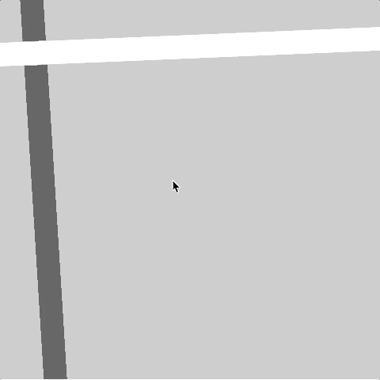
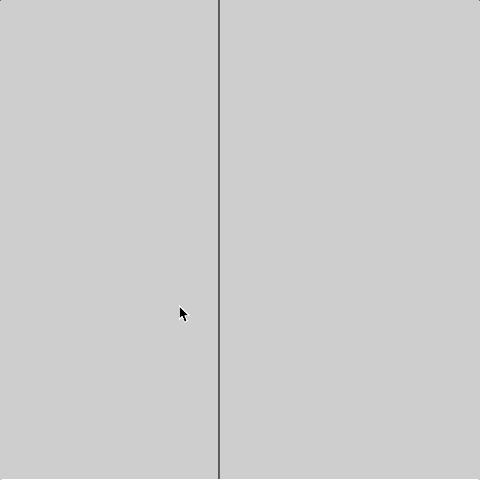

# Week 03

## Basic Interactivity


### Task 1 - Drawing with the mouse

Okay setup a new project as you've been shown previously and if you use the empty example you should already have the `setup()` and `draw()` functions.  We're now going to recreate the first drawing sketch that you saw in the lecture so in the ```setup()``` function as well as our ```createCanvas()``` function we've got [```fill()```](https://p5js.org/reference/#/p5/fill) and [```noStroke()```](https://p5js.org/reference/#/p5/noStroke).  Check out the links to the reference pages if you're not sure what these do.  

Next in the ```draw()``` function we're just drawing an ellipse.  Can you fill in the values inside the ellipse so that it is drawn at the mouse's location on the screen?


<details>
<summary>Want to see a hint?</summary>
<br>
[HINT](https://p5js.org/reference/#/p5/mouseX)
<br><br>
	
<p>
https://p5js.org/reference/#/p5/mouseX
</p>
</details>  

The end result of this task should look something like this:
<p align="center">

</p>

### Task 2 - Draw a continuous line

Now we're going to try and draw a continuous line!

```javascript
function setup(){
  createCanvas(480,480);
  strokeWeight(4);
  stroke(0, 102);
}


function draw() {
  line(...,...,...,...);
}
```

Inside the draw function we're going to use the ```line()``` function.

Notice how we now need to specify [```strokeWeight()```](https://p5js.org/reference/#/p5/strokeWeight) and [```stroke()```](https://p5js.org/reference/#/p5/stroke) as we're drawing a line.  Again have a look at their reference pages if you're not sure what they do.

If you look at `line()`'s reference [page](https://p5js.org/reference/#/p5/line) you'll notice it takes four location values.  Can you remember a way to input the location of the mouse on the previous frame?

[HINT](https://p5js.org/reference/#/p5/pmouseX)

The end result of this task should look something like this:
<p align="center">

</p>

### Task 3 - Calculate speed of movement

We're now going to use the difference between the current and previous mouse locations to calcuate the speed that the mouse cursor is moving.  We will then use this value to change the weight of the line we are drawing.  We want to do this on each frame so we'll add the following lines of code to our `draw()` function:

```javascript
let weight = dist(mouseX, mouseY, pmouseX, pmouseY);
strokeWeight(weight);	
```

The end result of this task should look something like this:
<p align="center">

</p>

### Task 4 - Draw fluidly

The following technique called 'easing' can be used to make our drawn object lag behind the location of the mouse and makes for a more fluid drawing style.

Try this code:

```javascript

let x = 0;
let easing = 0.01;

function setup(){
  	createCanvas(480,480);
}

function draw() {
	let targetX = mouseX;
	x += (targetX - x) * easing;
  	ellipse(x, 40, 12, 12);
   	console.log(targetX + " : " + x);
}
```

* See how the difference between the two numbers that are output to the console (to open the console right-click the mouse and press 'Inspect', then find the console tab) are greater when you move the mouse and then comes closer together as you stop moving.

* Change the code from Task 3 so that lines on both axis (X and Y) are drawn with the easing technique.

* Try changing the value of the ```easing``` variable and see how it changes the movement.

The end result of this task should look something like this:
<p align="center">

</p>

### Task 5 - Conditionals

Look at the following code:

```javascript
function setup() {
	createCanvas(480, 480);
	strokeWeight(30);
	background(204);
}

function draw() {
	stroke(102);
	line(40,0,70,height);

	if (mouseIsPressed == true){
		stroke(0);
	} else {
		stroke(255);
	}

  	line(0,70,width,50);
}
```

We're changing the colour of the line depending on whether the mouse is pressed.

* Add an ```if else``` statement so that something else happens when a key is pressed.

* Using ```if``` or ```if else``` statements make different things happen on screen when you press specific keys.

[HINT](https://p5js.org/reference/#/p5/keyTyped)

The end result of this task should look something like this:
<p align="center">

</p>

### Task 6 - Find the cursor

For this task start by creating a new sketch with the following code:

```javascript
let x;

function setup() {
	createCanvas(480, 480);
	x = width/2;
}

function draw() {
	background(204);
  	line(x,0,x,height);
}
```
Now you need to add some code to the `draw()` function.  This code will check to see if the mouse cursor is on the left or right of the line and then move the line towards the cursor.

The end result of this task should look something like this:
<p align="center">

</p>

### Extra task

* Write your own function that is called inside the `draw()` function.  Make the input to your function different depending on whether a mouse or key is pressed.

If you're looking for some help or inspiration for this task watch [THIS](https://www.youtube.com/watch?v=zkc417YapfE&list=PLRqwX-V7Uu6Zy51Q-x9tMWIv9cueOFTFA) Daniel Shiffman tutorial. 


