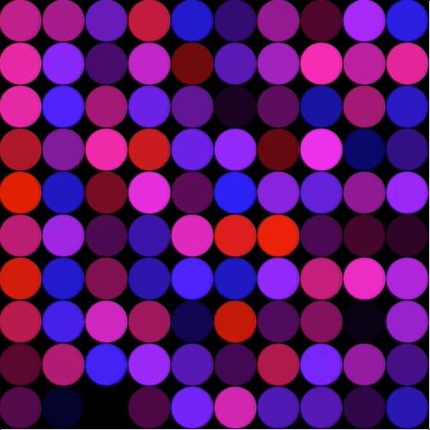
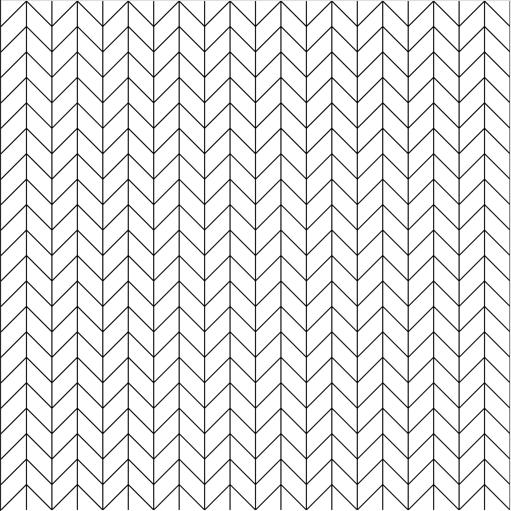

# Week 04

## Changing behaviours based on input


### Task 1 - Repetition

Here is the code for the while loop we saw in the lecture

```javascript
function setup() {
	createCanvas(500, 500);
  	background(0);
  	fill(0, 0, 255);
}

function draw() {
	let x = 25;
	while (x < width){
		ellipse(x,25,50,50);
		x = x+50;
	}
}
```

Which draws the following row of ellipses across the top on the canvas:

<p align="center">

</p>

Your task is to convert it into a for loop.  Do you remember the structure?

```javascript
for (initialise; test; update) {
    statements
}
```

### Task 2 - Repetition, Repetition

Now try and write a nested for loop so that ellipses are drawn across the whole of the canvas.

* Add random values to ```fill()``` to change the colour of the ellipse.  

* Move the location of ```fill()``` and see how it changes what's drawn to the canvas.

The end result of this task should look something like this:
<p align="center">

</p>

### Task 3 - Repetitive functions

Write a function that takes the x, y locations of your nested for loop as input.  Here is an example of my ```herringBone()``` function.  I used a unit value of 25. 

```javascript
function herringBone(xVal, yVal, unit) {
	stroke(255);
	strokeWeight(1);

	line(xVal, yVal, xVal - unit, yVal + unit);
	line(xVal, yVal, xVal + unit, yVal + unit);
	line(xVal, yVal - unit, xVal - unit, yVal);
	line(xVal, yVal - unit, xVal + unit, yVal);
	line(xVal, yVal - unit, xVal, yVal + unit);
	line(xVal + unit, yVal - unit, xVal + unit, yVal + unit);
} 
```

<p align="center">

</p>

Don't forget to call the function inside the for loop!

* Try making at least three more functions each with a different pattern.  If you're looking for inspiration for one of your patterns you could code along with [THIS](https://www.youtube.com/watch?v=bEyTZ5ZZxZs) coding challenge by Daniel Shiffman of the Coding Train.

* Try creating a new variable that increases/decreases on each frame which can also used as input to your function (e.g. to change the scale).

### Task 4 - Flip through functions

Finally, wrap it all up by using a switch/case statement which allows you to select which of the patterns you draw to the canvas.

```javascript
switch(key){
    case "1": 	
	function1(x,y,unit);
    break;
    case "2": 
    	function2(x,y,unit);
    break;
    case "3": 
    	function3(x,y,unit);
    break;
    case "4": 
    	function4(x,y,unit);
    break;
	    }
```

The end result of this task could look something like this:
<p align="center">

</p>
