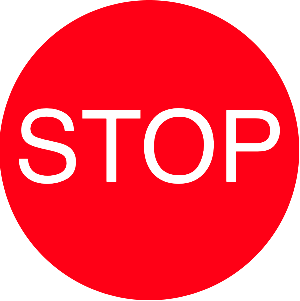

# Week 05

## Task 5 Code Challenge Answer

### Create a STOP / GO sign

- My sketch looks  like this:  



- My code looks like this

```javascript
  let myCommands = ["STOP", "GO"];
  let i = 0;

  function setup() {
    createCanvas(600, 600);
    background(color(200));
    frameRate(1);
  }

  function draw() {
    // runs every second 
    noStroke();
    background(color(0)); // set background
    fill(0, 255, 0);
    
    translate(width / 2, height / 2);
    rotate(0.6);
    rect(26, -200, 30, 302);
    rotate(-1.5);
    rect(-100, -90, 30, 150);
    rotate(0.9);
    translate(-width / 2, -height / 2);
    fill(255, 255, 255);
    i++;
    if (i >= myCommands.length) {
      background(color(255)); // set background
      noStroke();
      fill(255, 0, 0);
      ellipse(width/2, height/2, 600, 600);
      fill(255, 255, 255);
      i = 0;
    }
    textSize(200);
    textAlign(CENTER, CENTER);
    text(myCommands[i], 300, 300);

  }
```


### Alternating between values in an array.  

- To show each value in array your code should look like this

```javascript
  let myCommands = ["Hello", "Goodbye", "See You later"];
  let i = 0;

  function setup() {
    createCanvas(600, 600);
    background(color(200));
    frameRate(1);
  }

  function draw() {
    // runs every second 
    background(color(200)); // set background every second
    text(myCommands[i], 300, 300);
    i++;
    if (i > myCommands.length) {
      i = 0;
    }
  }
```