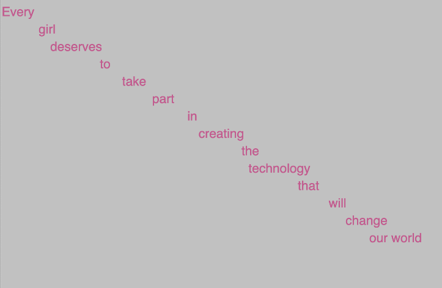

# Week 05

## Task 2 Second Code Challenge Answer

- Hopefully your sketch and console output now looks something like this:  

<p align="center">
  
</p>

- Your code should like this

```javascript
  // Global variables
  let myWords = ["Every", "girl", "deserves", "to", "take", "part", "in", "creating", "the", "technology", "that", "will", "change", "our world"];
  let xVal = 30;
  let yVal = 30;

  function setup() {
    console.log('hello world');
    createCanvas(1024, 500);
    background(color(200));
    fill(0, 0, 255);
    noLoop();
  }

  function draw() {
    for (var i = 0; i < myWords.length; i++) {
      console.log(myWords[i]);
      console.log(xVal);
      fill(200, 102, 153);
      textSize(22);
      textAlign(CENTER);
      //text(myWords[i], random(width), random(height));
      text(myWords[i], xVal, yVal);
      xVal += 50;
      yVal += 30;
    }
  }
```
