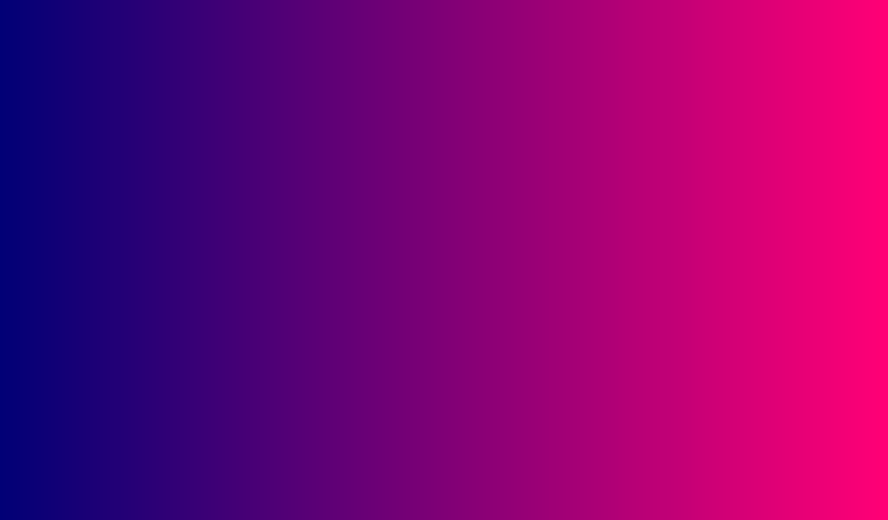
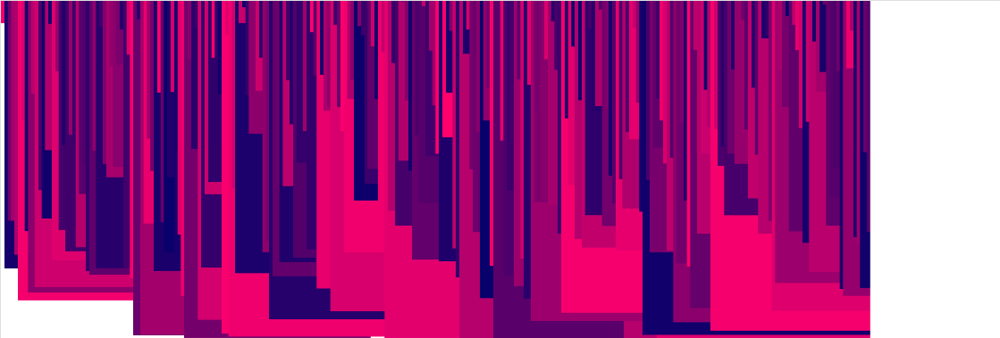

# Week 05

## Task 4 Code Challenge Answer

### Coloured Gradient Using RGB

- Hopefully your sketch looks something like this:  



- Your code should like this

```javascript
  let myColors = [];
  let xPos = 0;

  function setup() {
    createCanvas(1024, 400);
    background(color(100));
    noLoop();

    for (var i = 0; i < 256; i++) {
      myColors.push(i);
    }
    // show the array in the console
    console.log(myColors);
  }

  function draw() {
    noStroke();
    for (var i = 0; i < myColors.length; i++) {
      fill(myColors[i], 0, 120); // RGB color fill
      // rect x, y, w, h
      rect(xPos, 0, width/256, height); // new line
      xPos = xPos+(width/256); // new line
    }
  }
```

### Randomised and Shuffled Rects

- Your sketch looks something like this:  



- Your code should like this

```javascript
  let myColors = [];
  let xPos = 0;

  function setup() {
    createCanvas(1024, 400);
    background(color(255));
    noLoop();

    for (var i = 0; i < 256; i++) {
      myColors.push(i);
    }
    myColors = shuffle(myColors);

    console.log(myColors);
  }

  function draw() {
    noStroke();
    for (var i = 0; i < myColors.length; i++) {
      fill(myColors[i], 0, 120);
      // rect x, y, w, h
      rect(xPos, 0, random(width), random(height)); // new line
      xPos = xPos+(width/256); // new line
    }
  }
```
