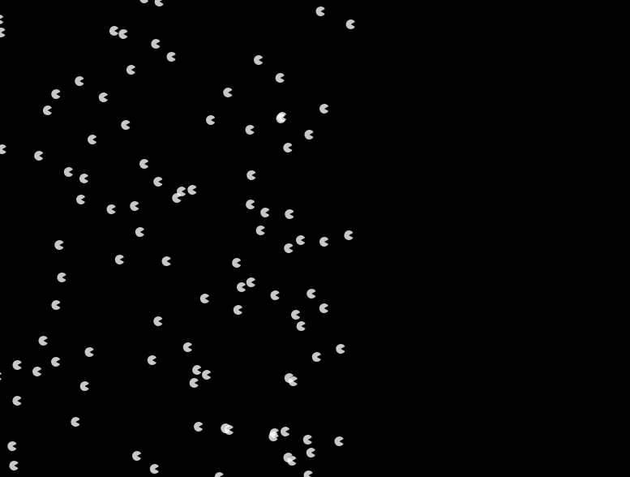

# Week 05

## More on Scope; Fun with Arrays...

*****
## Task 1 - Array Methods

This first task is designed to get you to explore how to use Arrays.  

For the first task work in pairs...  
One person reads and explains, the other person types in the code.  

Create a new "empty-example" folder with a blank sketch.js with ```setup()``` and ```draw()``` functions, what needs to be included in the folder? Is your new folder in the right place to find the p5.js library?

Remember what an array is? Take a look [here](https://www.w3schools.com/js/js_arrays.asp) to refresh your memory. Read down to the section "Access the Full Array".  

For this task we'll be using a quote from Malala Yousafzai, Nobel Peace Prize Winner, broken down into separate words. Each word will be a separate Array element.  

The quote is:  
*"Every girl deserves to take part in creating the technology that will change our world, and change who runs it."* 

In your sketch.js, create an array that can be accessed globally within the sketch. 
Work out where this here needs to go?

Add the quote, with each word as a separate element.

```javascript
let let myWords = ["Every", "girl", "deserves", "to", "take", "part", "in", "creating", "the", "technology", "that", "will", "change", "our world"];
```

In the ```setup()``` function, create a canvas that is 1024px wide and 400px high.

Set the background to a grey colour.  

Make it so that the sketch only executes the ```draw()``` function once. (What function do we need to do that?).

Now in ```draw()``` we will loop through the array using a 'For Loop' (that you explored last week).  
Do you remember the structure of  'For Loop'?

```javascript
for (init; test; update) {
    statements
}
```

The 'For Loop' outputs each element from the Array myWords  

```javascript
function draw() {
    for (var i = 0; i < myWords.length; i++) {
      console.log(myWords[i]);
    }
}
```  
Look in your console to see the output. You should see something like the image below.  
(Open the console in Chrome by right clicking on your sketch and selecting 'inspect')       

You've looped through every value in the Array and outputted it to the console.    

<p align="center">
  
</p>

*****
## Task 2 - Add the text from the array to the screen  

Now using the sketch you already have you will add the text from the Array to the screen using ```text()``` 

Find the text element using the P5 reference.  
p5 reference [https://p5js.org/reference/](https://p5js.org/reference/)   
p5 examples [https://p5js.org/examples/](https://p5js.org/examples/)  
We will use this in a moment...   

We will also use a a new global variable.  

Add ```let xVal = 20;``` to the top of your script.  

Inside ```draw()``` add 50px to the variable on every iteration of your loop.  

Output the result to the console.   

```draw()``` should look like this:  

```javascript
function draw() {
    for (var i = 0; i < myWords.length; i++) {
      console.log(myWords[i]);
      console.log(xVal);
      xVal += 50;
    }
  }
```

### &#x1F536; Task 2 first code challenge:

```diff
! Using the p5 reference find the entry for text()
! Add a couple of words of text to the screen in setup() just to test, 
! and to remember how text() works.  

! Now add text() to your loop so that it uses myWords[i] and xVal to print the quote on the screen.
! Use textAlign(CENTER) to space the text. 
! Your sketch should look like the image below.  
```
<p align="center">
  
</p>

### &#x1F536; Task 2 Second Code Challenge:

```diff
! Using the Let keyword add a new global variable for a y value to space the text vertically  
! Change the text size and colour   
! Tweak the values until it is spaced and reads nicely.  
! Use textAlign(CENTER) to space the text.   
! Completed that? 
! Replace the x and y text text values with random values   
! (but that still keep the text on the screen).     
```

*****
## Task 3 - Adding to an Array 

Now we will add the rest of the quote *"and change who runs it"* to the array and print it onto the screen with the rest of the text.

To add the word *and* to the Array add
```myWords.push("and");``` 
At bottom of ```setup()```  

To see the Array in the console also add ```console.log(myWords);``` 

```push()``` adds elements to the end of the array. The loop will now add *and* to the screen.  

```setup()```  should look like:  

```javascript
function setup() {
    createCanvas(1024, 500);
    background(color(200));
    noLoop();
    myWords.push("and");
    console.log(myWords);
}
```
 
### &#x1F536; Task 3 Code Challenge:

```diff
! Add the remaining words from the quote to the Array using push()  
! Tweak the position and text size to fit on the screen     
```

*****
## Task 4 - Adding lots of data to an Array 

It is very common to start with an empty Array and add data to it using a loop. The data is then  stored and accessed when required. 


In this task you'll create an empty array. Add data to it (numbers) with a For Loop. Then use a For Loop to retrieve the data and draw a gradient.    

- **Step 1**  

Create a new "empty-example" folder with a blank sketch.js with ```setup()``` and ```draw()``` functions.  

In the ```setup()``` function, create a canvas that is 1024px wide and 400px high.  
Include the ```noLoop()``` function.

At the top of your sketch.js (outside and above ```setup()```), create an empty array that can be accessed globally within the sketch. 

```javascript
let let myColors = [];
```

- **Step 2**  

In ```setup()``` create a 'For Loop' to add values to the array. Add numbers / integers from 0 to 255 using a 'For Loop':


We already have our empty array, use the same technique you used to push data into the loop.  

So, here we're going to fill an array using a for loop. We're going to use our new ```let``` declaration as we only need ```i``` whilst we're in the loop. Here is how we fill an array from 0 to 255, do NOT copy this code:  

```javascript
for (let i = 0; i < 256; i++) { // why 256?
    myColors.push(i); 
}
```

In ```setup()```, try printing ```myColors``` to the console using:

```javascript
console.log(myColors);
```
- **Step 3**

OK, now we're going to make a smooth gradient of thin rectangles across our canvas. In order to do this, we're going to need to create another global variable, called xPos. Let's initialise it to the value of 0.

```javascript
let xPos = 0;
```

We also need to stop p5 from drawing the edges round our rectangles, so we'll turn stroke off:

```javascript
function draw() {
    noStroke();

}
```

Still in the draw function, we now need to *iterate* through ```myColors``` and change the fill based on that. Why is the syntax ```myColors[i]```? What is ```i``` and how does it relate to ```myColors``` in this instance? 

```javascript

    for (let i = 0; i < myColors.length; i++) {
        fill(myColors[i]);
    }

```

We still haven't drawn anything yet though, right?! So, finally we need to add two more lines in our for loop. One to draw the rectangle (what is going on with the third argument 'height'?) and one to increase our xPos each time the loop is repeated (can you see what's going on here?):

```javascript
function draw() {
    noStroke();
    for (var i = 0; i < myColors.length; i++) {
      fill(myColors[i]);
      // add your comment here
      rect(xPos, 0, width/256, height); // new line
      xPos = xPos+(width/256); // new line
    }
}
```

How smooth is that gradient?  


The gradient is actually made of a series of rectangles that gradually change fill colour. (This is how they look spaced apart.)


What happens if you change the value 256 (on both lines) to a value greater or lesser than 256?  

Add a comment to your code above the ```rect()``` explaining what each element of the ```rect()``` parameters does.

### &#x1F536; Task 4 Code Challenge:

```diff
! At the moment the gradient is grayscale.  
! Change fill() to use an Red-Blue-Green (RGB) value.
! Experiment with the values to create something like the image below. 
! Add a shuffle() to randomise the array (see below) 
! and use random to change the width and height of each rectangle
```


Now we can try using one of the in built methods, in ```setup()```, beneath where you pushed all the values to the array, write the following line:

```javascript
myColors.reverse();
```
Can you guess what that's going to do?! This is a function that belongs to all Arrays. It is accessed by using the DOT Operator (a full stop). How are we supposed to know all the names of the functions that arrays can do to their data? Well, we can check on the [interplex.](https://www.w3schools.com/js/js_array_methods.asp) 

There's another one called ```sort()```, what do you think that one will do?

What happens if we want to randomise the array though? p5.js has a randomise method, it's called ```shuffle()```. 


```javascript

myColors = shuffle(myColors);

```

See what happens? Try also randomising the width and height of the ```rect()```  

*****
## Task 5 - Arrays and conditionals

In this last example we will alternate between values in an array.  

- **Step 1**  

Create a new "empty-example" folder with a blank sketch.js with ```setup()``` and ```draw()``` functions.  

In the ```setup()``` function, create a canvas that is 600px wide and 600px high.  
Include the ```frameRate(1);``` function so that the sketch redraws once per second.

At the top of your sketch.js (outside and above ```setup()```), create an  array that can be accessed globally within the sketch. We will also need a counter variable ```i```.

```javascript
let myCommands = ["Hello", "Goodbye", "See You later"];
let i = 0;
```

To access the items from an array you use its 'index', or its position in the array.  
In ```myCommands``` ```"Goodbye"``` is at position 1. (The first array element is always at position 0).  
We can access ```"Goodbye"``` with  ```myCommands[1]```  

Try outputting ```myCommands[1]``` to the console.  

In ```draw()``` we will use this to access each array item in turn.  
Add a background color so that the whole sketch redraws every frame (once a second).
Then we will access an array using i. ```myCommands[i]```
Finally we will increment (add 1) to ```i``` every frame.  

Output ```i``` to the console.   

```draw()``` should look like this.

```javascript
function draw() {
    // runs every second 
    background(color(200)); // set background
    text(myCommands[i], 300, 300);
    i++;
}
```

### &#x1F536; Task 5 Code Challenge: Design a STOP / GO sign:

```diff
! At the moment i increases infinitely so that the array items are only displayed once.  
! Use a conditional if statement to reset i so that the array items are shown again and again.

! Design a STOP / GO sign...
! Change the values of myCommands to STOP and GO
! Use any other techniques you have learnt to create a sign (sketch) that includes text & graphics
! It should alternate between Stop and Go. 
! And it should use appropriate shapes, colours and design elements
```


*****
## Extra Stretch Task... Task 6 - PacPerson (not to be included in your journal entry) 

The following is an example from the p5.js book. Give it a go (DO NOT COPY AND PASTE) and try changing some of the values, particularly x[i] and y in the draw() function for loop.

```javascript

let x = [];

function setup() {
    createCanvas(800,600);
    noStroke();
    fill(255,200);
    for(let i = 0; i < 300; i++) {
        x[i] = random(-1000,200); // different way of adding elements to an array
    }
}

function draw() {
    background(0);
    for(let i = 0; i < 300; i++) {
        x[i] += 0.5;
        let y = i * 0.4;
        arc(x[i],y,12,12,0.52,5.76);
    }
}

```

<p align="center">
  
</p>


### Task 7 - Independent Learning: Uploading to the Panel Server

- Head back to Blackboard and follow the tutorial by Tom on how to upload your work to the panel server.

- Use the STOP / GO you created in Task 5 as the content that you will be putting onto the panel server.

