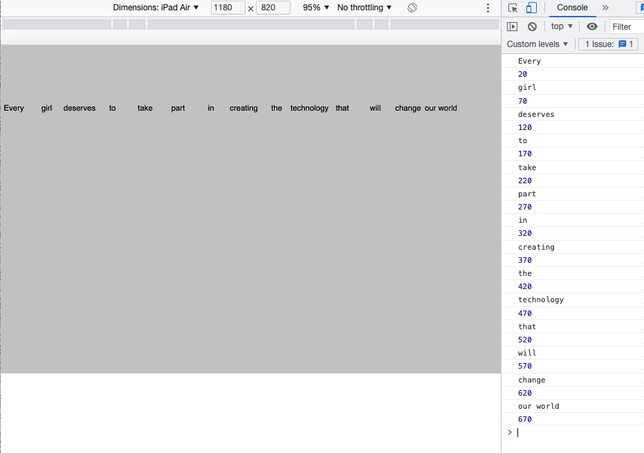

# Week 05

## More on Scope; Fun with Arrays...

Note: All the answers to each code challenge are in separate files in this week 05 folder. Only look at them if you get really stuck!   

*****
## Task 1 - Variable Refresher

Variables are containers that contain data such as words (strings) or numbers (integers).

Often variables will be created at the top of the script / sketch.js. This allows them to be accessed by any part of sketch.js and this is called a global variable. Or a variable with global scope.   

Download a new P5 Complete Library with "empty-example" folder with a blank sketch.js.     
Open sketch.js it contains ```setup()``` and ```draw()``` functions.   

Right at the top of the page create 4 new variables. Each variable must have a unique name.
declare the variable with ```let``` then give it a name ```myVariable```. Next assign it to a value ```= "Rod"```. 
```javascript
let nameOne = "Rod";
let nameTwo = "Simon";
let numOne = 10;
let numTwo = 30;
```
Remember words (strings) need to be in ```" "``` and numbers (integers) should not be.

Inside ```setup()``` try adding them together in various combinations and output the result to the console.  
(Open the console using the developer tools). What happens when you add strings and integers?

```javascript
function setup() {
    console.log(nameOne + nameTwo);
}
``` 


*****
## Task 2 - Array Methods

This next task is designed to get you to explore how to use Arrays.  

For this task work in pairs...  
Team up with someone and look ate ach others code

Remember what an array is? Take a look [here](https://www.w3schools.com/js/js_arrays.asp) to refresh your memory. Read down to the section "Access the Full Array".  

For this task we'll be using a quote from [Malala Yousafzai](https://malala.org/malalas-story), who became a Nobel Peace Prize Winner at aged 17 for championing girls rights. We will break her quote down into separate words. Each word will be a separate Array element.  

The quote is:  
*"Every girl deserves to take part in creating the technology that will change our world, and change who runs it."* 

In your sketch.js, create an array that can be accessed globally within the sketch. 
Work out where this here needs to go?

Add the quote, with each word as a separate element.

```javascript
let let myWords = ["Every", "girl", "deserves", "to", "take", "part", "in", "creating", "the", "technology", "that", "will", "change", "our world"];
```

In the ```setup()``` function, create a canvas that is 1024px wide and 400px high.

Set the background to a grey colour.  

Make it so that the sketch only executes the ```draw()``` function once. (What function do we need to do that?).

Now in ```draw()``` we will loop through the array using a 'For Loop' (that you explored last week).  
Do you remember the structure of  'For Loop'?

```javascript
for (init; test; update) {
    statements
}
```

The 'For Loop' outputs each element from the Array myWords  

```javascript
function draw() {
    for (var i = 0; i < myWords.length; i++) {
      console.log(myWords[i]);
    }
}
```  
Look in your console to see the output. You should see something like the image below.  
(Open the console in Chrome by right clicking on your sketch and selecting 'inspect').       


<p align="center">
  
</p>

You've looped through every value in the Array and outputted it to the console.    

NOTE: notice that ```myWords.length``` gets the number of items (words) in the array.
*****
## Task 3 - Add the text from the array to the screen  

Now using the sketch you already have you will add the text from the Array to the screen using ```text()``` 

Find the text element using the P5 reference.  
p5 reference [https://p5js.org/reference/](https://p5js.org/reference/)   
p5 examples [https://p5js.org/examples/](https://p5js.org/examples/)  
We will use this in a moment...   

We will also use a a new global variable.  

Add ```let xVal = 20;``` to the top of your script.  

Inside ```draw()``` add 50px to the variable on every iteration of your loop.  

Output the result to the console.   

```draw()``` should look like this:  

```javascript
function draw() {
    for (var i = 0; i < myWords.length; i++) {
      console.log(myWords[i]);
      console.log(xVal);
      xVal += 50;
    }
  }
```

### &#x1F536; Code challenge 1:

```diff
! Using the p5 reference find the entry for text()
! Add a couple of words of text to the screen in setup() just to test, 
! and to remember how text() works.  

! Now add text() to your loop so that it uses myWords[i] and xVal to print the quote on the screen.
! Use textAlign(CENTER) to space the text. 
! Your sketch should look like the image below.  
```
<p align="center">
  
</p>

### &#x1F536; Code Challenge 2:

```diff
! Using the Let keyword add a new global variable for a y value to space the text vertically  
! Change the text size and colour   
! Tweak the values until it is spaced and reads nicely.  
! Use textAlign(CENTER) to space the text.   
! Completed that? 
! Replace the x and y text text values with random values   
! (but that still keep the text on the screen).     
```

*****
## Task 4 - Adding to an Array 

Now we will add the rest of the quote *"and change who runs it"* to the array and print it onto the screen with the rest of the text.

To add the word *and* to the Array add
```myWords.push("and");``` 
At bottom of ```setup()```  

To see the Array in the console also add ```console.log(myWords);``` 

```push()``` adds elements to the end of the array. The loop will now add *and* to the screen.  

```setup()```  should look like:  

```javascript
function setup() {
    createCanvas(1024, 500);
    background(color(200));
    noLoop();
    myWords.push("and");
    console.log(myWords);
}
```
 
### &#x1F536; Code Challenge 3:

```diff
! Add the remaining words from the quote to the Array using push()  
! Tweak the position and text size to fit on the screen     
```

*****
## Task 5 - Adding lots of data to an Array (and making a gradient)

Lets imagine that we want array of numbers from 0 to 255.

We could just write it like this:

```javascript
let let myColors = [0,1,2,3,4,5,6,7,8,9,10,11,12,13,14,15,16,17,18,19,20,21,22,23,24,25,26,27,28,29,30,31,32,33,34,35,36,37,38,39,40,41,42,43,44,45,46,47,48,49,50,51,52,53,54,55,56,57,58,59,60,61,62,63,64,65,66,67,68,69,70,71,72,73,74,75,76,77,78,79,80,81,82,83,84,85,86,87,88,89,90,91,92,93,94,95,96,97,98,99,100,101,102,103,104,105,106,107,108,109,110,111,112,113,114,115,116,117,118,119,120,121,122,123,124,125,126,127,128,129,130,131,132,133,134,135,136,137,138,139,140,141,142,143,144,145,146,147,148,149,150,151,152,153,154,155,156,157,158,159,160,161,162,163,164,165,166,167,168,169,170,171,172,173,174,175,176,177,178,179,180,181,182,183,184,185,186,187,188,189,190,191,192,193,194,195,196,197,198,199,200,201,202,203,204,205,206,207,208,209,210,211,212,213,214,215,216,217,218,219,220,221,222,223,224,225,226,227,228,229,230,231,232,233,234,235,236,237,238,239,240,241,242,243,244,245,246,247,248,249,250,251,252,253,254,255];

```

(Notice the numbers are not in " " because they are numbers not strings)

But it also possible to generate the array with a ```for()``` loop adding +1 on very loop / iteration.

Let's do that: To make the array above with a loop start with an empty array. Then add data to it (numbers 0 to 255) with a For Loop. 

- **Step 1: create the empty array**  

Create a new "empty-example" folder with a blank sketch.js with ```setup()``` and ```draw()``` functions.  

In the ```setup()``` function, create a canvas that is 1024px wide and 400px high.  
Include the ```noLoop()``` function in ```setup()```.


```diff
! Discuss with person next to you what noLoop() does.  
```

At the top of your sketch.js (outside and above ```setup()```), create an empty array that can be accessed globally within the sketch. 

```javascript
let myColors = [];
```

- **Step 2: add the data / numbers to it**  

In ```setup()``` create a 'For Loop' to add values to the array. Add numbers / integers from 0 to 255 using a 'For Loop':


We already have our empty array, use ```push()``` to add the numbers into the loop.  

So, here we're going to fill an array using a for loop. We're going to use our new ```let``` declaration as we only need ```i``` whilst we're in the loop. Here is how we fill an array from 0 to 255, do NOT copy this code:  

```javascript
for (let i = 0; i < 256; i++) { // why 256?
    myColors.push(i); 
}
```
```diff
! Discuss with person next to you why  256? (Rather than 255). 
! Discuss what each part of the loop does. 
```

In ```setup()```, try printing ```myColors``` to the console using:

```javascript
console.log(myColors);
```
You should see this:


- **Step 3: use the array of numbers to create a gradient effect**

OK, so now we're going to use the array of numbers to generate a smooth gradient of thin rectangles across our canvas. In order to do this, we're going to need to create another global variable, called xPos at the top of sketch.js. Let's initialise it to the value of 0.

```javascript
let xPos = 0;
```

We also need to stop p5 from drawing the edges round our rectangles, so we'll turn stroke off:

```javascript
function draw() {
    noStroke();

}
```

Still in the ```draw()``` function, we now need to *iterate* through ```myColors``` and change the fill based on ```i``` the iterator. 
So add this inside ```draw()```.

```javascript

    for (let i = 0; i < myColors.length; i++) {
        fill(myColors[i]);
    }

```
```diff
! Discuss with person next to you: 
! Why is the syntax myColors[i]? 
! What is i and how does it relate to myColors in this instance?  
```

We still haven't drawn anything yet though, right?! So, finally we need to add two more lines in our for loop. One to draw the rectangle (what is going on with the third argument 'height'?) and one to increase our xPos each time the loop is repeated (can you see what's going on here?):

```javascript
function draw() {
    noStroke();
    for (var i = 0; i < myColors.length; i++) {
      fill(myColors[i]);
      // add your comment here
      rect(xPos, 0, width/256, height); // new line
      xPos = xPos+(width/256); // new line
    }
}
```

How smooth is that gradient?  


The gradient is actually made of a series of rectangles that gradually change fill colour. (This is how they look spaced apart.)


What happens if you change the value 256 (on both lines) to a value greater or lesser than 256?  

Add a comment to your code above the ```rect()``` explaining what each element of the ```rect()``` parameters does.

### &#x1F536; Code Challenge 4:

```diff
! At the moment the gradient is grayscale.  
! Change fill() to use an Red-Blue-Green (RGB) value.
! Experiment with the values to create something like the image below. 
! Add a shuffle() to randomise the array (see below) 
! and use random to change the width and height of each rectangle
```


Now we can try using one of the in built methods, in ```setup()```, beneath where you pushed all the values to the array, write the following line:

```javascript
myColors.reverse();
```
Can you guess what that's going to do?! This is a function that belongs to all Arrays. It is accessed by using the DOT Operator (a full stop). How are we supposed to know all the names of the functions that arrays can do to their data? Well, we can check on the [interplex.](https://www.w3schools.com/js/js_array_methods.asp) 

There's another one called ```sort()```, what do you think that one will do?

What happens if we want to randomise the array though? p5.js has a randomise method, it's called ```shuffle()```. 


```javascript

myColors = shuffle(myColors);

```

See what happens? Try also randomising the width and height of the ```rect()```  
*****
### Task 6 - Independent Learning: Uploading to the Panel Server

- Head back to Blackboard and follow the tutorial by Tom on how to upload your work to the panel server.

- Use the coloured gradient you have created in Task 5 as the content that you will be putting onto the panel server.   
<strong> Create a Journal entry in your Wordpress blog and add a description, screenshot and link to the coloured gradient sketch on the panel server.</strong>

*****
## Done all of that? Stretch goal Task 7 - Arrays and conditionals

In this last example we will alternate between values in an array.  

- **Step 1**  

Create a new "empty-example" folder with a blank sketch.js with ```setup()``` and ```draw()``` functions.  

In the ```setup()``` function, create a canvas that is 600px wide and 600px high.  
Include the ```frameRate(1);``` function so that the sketch redraws once per second.

At the top of your sketch.js (outside and above ```setup()```), create an  array that can be accessed globally within the sketch. We will also need a counter variable ```i```.

```javascript
let myCommands = ["Hello", "Goodbye", "See You later"];
let i = 0;
```

To access the items from an array you use its 'index', or its position in the array.  
In ```myCommands``` ```"Goodbye"``` is at position 1. (The first array element is always at position 0).  
We can access ```"Goodbye"``` with  ```myCommands[1]```  

Try outputting ```myCommands[1]``` to the console.  

In ```draw()``` we will use this to access each array item in turn.  
Add a background color so that the whole sketch redraws every frame (once a second).
Then we will access an array using i. ```myCommands[i]```
Finally we will increment (add 1) to ```i``` every frame.  

Output ```i``` to the console.   

```draw()``` should look like this.

```javascript
function draw() {
    // runs every second 
    background(color(200)); // set background
    text(myCommands[i], 300, 300);
    i++;
}
```

### &#x1F536; Stretch goal Code Challenge 5: Design a STOP / GO sign:

```diff
! At the moment i increases infinitely so that the array items are only displayed once.  
! Use a conditional if statement to reset i so that the array items are shown again and again.

! Design a STOP / GO sign...
! Change the values of myCommands to STOP and GO
! Use any other techniques you have learnt to create a sign (sketch) that includes text & graphics
! It should alternate between Stop and Go. 
! And it should use appropriate shapes, colours and design elements
```


