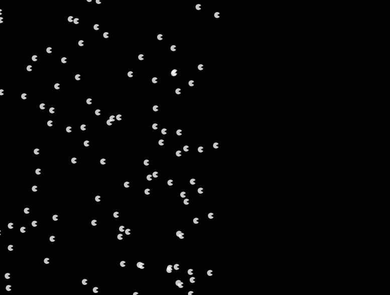

# Week 06

## More on Scope; Fun with Arrays...


### Task 1 - Array Methods

This first task is designed to get you to explore the different methods that Arrays have.

Create a new "empty-example" folder with a blank sketch.js with ```setup()``` and ```draw()``` functions, what needs to be included in the folder? Is your new folder in the right place to find the p5.js library?

Remember what an array is? Take a look [here](https://www.w3schools.com/js/js_arrays.asp) to refresh your memory. Read down to the section "Access the Full Array".

In your sketch.js, declare an empty array that can be accessed globally within the sketch, where does this need to go?

```javascript
let myArr = [];
```


Now, in the ```setup()``` function, create a canvas that is 1024px wide and 400px high.

Set the background to white.

Make it so that the sketch only executes the ```draw()``` function once. (What function do we need to do that?)

Fill the array values from zero to 255, all of the following has to happen in the ```setup()``` function:

Do you remember the structure?

```javascript
for (init; test; update) {
    statements
}
```
We already have our empty array, do you remember what in built array function we need to use to add elements to it? [HINT](https://www.youtube.com/watch?v=vCadcBR95oU) (sorrynotsorry)

So, here we're going to fill an array using a for loop. We're going to use our new ```let``` declaration as we only need ```i``` whilst we're in the loop. Here is how we fill an array from 0 to 255, please do NOT copy this code:

```javascript
for (let i = 0; i < 256; i++) { // why 256?
        myArr.push(i); 
    }
```

In ```setup()```, try printing ```myArr``` to the console using:

```javascript
console.log(myArr);
```

Now, how do you open the console? HINT it's cmd+option+j...

OK, now we're going to make a smooth gradient of thin rectangles across our canvas. In order to do this, we're going to need to create another global variable, called xPos. Let's initialise it to the value of 0.

We also need to stop p5 from drawing the edges round our rectangles, so we'll turn stroke off:

```javascript
function draw() {
    noStroke();

}
```

Still in the draw function, we now need to *iterate* through ```myArr``` and change the fill based on that. Why is the syntax ```myArr[i]```? What is ```i``` and how does it relate to ```myArr``` in this instance? 

```javascript

    for (let i = 0; i < myArr.length; i++) {
        fill(myArr[i]);
    }

```

We still haven't drawn anything yet though, right?! So, finally we need to add two more lines in our for loop. One to draw the rectangle (what is going on with the third argument?) and one to increase our xPos each time the loop is repeated (can you see what's going on here?):

```javascript

    for (let i = 0; i < myArr.length; i++) {
        fill(myArr[i]);
        rect(xPos,0,width/256,height);
        xPos = xPos+(width/256);
    }

```

How smooth is that gradient? What happens if you change the value 256 (on both lines) to a value greater or lesser than 256?

What happens if you change fill to be:

```javascript
fill(myArr[i],0, 120);
```

Try changing the values. Fill is now in Red-Blue-Green (RGB) mode.


Now we can try using one of the in built methods, in ```setup()```, beneath where you pushed all the values to the array, write the following line:

```javascript
myArr.reverse();
```
Can you guess what that's going to do?! This is a function that belongs to all Arrays. It is accessed by using the DOT Operator (a full stop). How are we supposed to know all the names of the functions that arrays can do to their data? Well, we can check on the [interplex.](https://www.w3schools.com/js/js_array_methods.asp) 

There's another one called ```sort()```, what do you reckon that one will do?

What happens if we want to randomise the array though? It doesn't seem as though there is such a function in built in JavaScript.

Thankfully, p5.js does in fact have its own function, it's called ```shuffle()```. 


```javascript

myArr = shuffle(myArr);

```

See what happens?

#### Super Extra Bonus Round - Shuffling the Array


So, what about writing our own randomisation algorithm? When I say "our own", I really mean let's find out how someone cleverer than me did it by searching on the internet. The [Fisher-Yates Shuffle](https://en.wikipedia.org/wiki/Fisher%E2%80%93Yates_shuffle#The_modern_algorithm) is not in fact a 1930s dance craze, but an algorithm for randomisation. And it goes a little something like this (below your draw function):


```javascript
function shuffler(array) {
    
    for (let i = array.length - 1; i > 0; i--) { // iterating backwards?!
        let j = Math.floor(Math.random() * (i + 1)); // Rounding down to the nearest integer, pick a random number and multiply it by i + 1, assign it to j
        let temp = array[i]; // declare a temporary variable called temp and assign it to the value of our old array element
        array[i] = array[j]; // the following two lines swap the new random element with the old one
        array[j] = temp; // we made a temporary copy the old array element, which we can now assign to index where we just moved our new one from
    }

    return array;
}
```
Now, underneath where you filled your array in ```setup()```, add this line"

```javascript

myArr = shuffler(myArr);

```

This is actually almost exactly the same way that p5 does it, but it's interesting to know what's going on under the hood.

### Task 2 - PacPerson

The following is an example from the p5.js book. Give it a go (DO NOT COPY AND PASTE) and try changing some of the values, particularly x[i] and y in the draw() function for loop.

```javascript

let x = [];

function setup() {
    createCanvas(800,600);
    noStroke();
    fill(255,200);
    for(let i = 0; i < 300; i++) {
        x[i] = random(-1000,200); // different way of adding elements to an array
    }
}

function draw() {
    background(0);
    for(let i = 0; i < 300; i++) {
        x[i] += 0.5;
        let y = i * 0.4;
        arc(x[i],y,12,12,0.52,5.76);
    }
}

```

<p align="center">
  
</p>

### Task 3 - Stringalingaling

This task is designed to demonstrate that Strings can be chopped up into arrays... 

New blank sketch with ```setup()``` and ```draw()``` functions.

Create a canvas of size 800px by 200px.

Set our frame rate to 2 frames per second:

```javascript
 frameRate(2);
```

Set the background to white in ```setup()```.

Declare a set of global variables (at the top of your sketch) as follows:

```javascript

let myArr = [];
let mySentence = "I like/love creative coding, so far";
let chopper;
let likeLove;

```

OK, now let's just check my sentence is working by drawing it in the draw function. Use the text function and set it be at 50px across and 100px down.

So, what we're going to do now is chop up our sentence into an array using an in built String function.

In ```setup()``` below where youve created the canvas, set the frame rate and background colour, write the following line:

```javascript
chopper = mySentence.split(" ");
```

This splits the String mySentence up at every point there is a space. The variable chopper is now an array. Trying printing it to the console in ```setup``` using:

```javascript
console.log(chopper);
```

Now let's try reversing the sentence!

```javascript
    chopper = chopper.reverse();
    chopper = chopper.join(" ");
```

Here, we're reversing the array like we did before. Then sticking it back together as a whole sentence into a String.

Try changing the variable in the text function in ```draw()``` to chopper...

What about shuffling the sentence?

```javascript
chopper = shuffle(chopper);
```
Make sure you comment out the following line:

```javascript
    //chopper = chopper.reverse();
```

OK, now we're going to have a play with chucking the words of our sentence all over the screen. In your ```draw()``` function, add the following:

```javascript
background(255);
 for (let i = 0; i < chopper.length; i++) {
        
        text(chopper[i],xPos,random(10,height));
        xPos = xPos+(width/1000);
        if(xPos > width) {
            xPos = 0;
        }
    }
```

What happens if you keep the following line in or take it out?

```javascript
    chopper = chopper.join(" ");
```

Can you see what's going on now?

Lastly, we're going to try manipulating our string based on whether we like or love creative coding(!). Comment out the line in ```setup()``` where we call the shuffle function on chopper.

Now, below the line where we split mySentence and assign it to chopper, add the following two lines:


```javascript
likeLove = chopper[1].split("/");
chopper[1] = likeLove[1];
```

Can you see what's happening here? What do you need to change the sentence to "like" instead of "love"?


<p align="center">
  
</p>

### Task 4 (Final Task) - Iterating backwards

This next code snippet is also another example from the book. Give it a shot - by typing it out, not copying and pasting - and comment the code (using //) on each line to explain what is happening...

```javascript

let num = 120;

let x = [];
let y = [];

function setup() {
    createCanvas(800,600);
    noStroke();
    fill(255,200);
    for(let i = 0; i < 300; i++) {
        x[i] = 0;
        y[i] = 0;
    }
}

function draw() {
    background(0);
    for(let i = num-1; i > 0; i--) {
        x[i] = x[i-1];
        y[i] = y[i-1];
    }

    x[0] = mouseX;
    y[0] = mouseY;

    for(let i = 0; i < num; i++) {
        fill(i * 0.94);
        ellipse(x[i],y[i],30,30);
    }
}
```

<p align="center">
  
</p>


### Stretch Task (not to be included in your journal entry) - Let it be

This is a very quick extra task to further test out how ```let``` and ```var``` work in their different ways...

Create another blank sketch, what needs to be included? Is your new folder in the right place?

Work through the examples given in the lecture regarding ```let``` and ```var```. 

Do [some more reading](https://stackoverflow.com/questions/762011/whats-the-difference-between-using-let-and-var-to-declare-a-variable) on this if you're still a bit unclear. The first answer on the stack overflow forum is very helpful.

```javascript
function setup() {
    console.log(x);
    //define x here...

    console.log(x);
}
```
Try defining x as a ```let``` or a ```var```. 

What happens when you create a block of code such as a for loop or if statement. Then, declare a ```let``` inside the block. Now, try and read variable ```let``` outside the block by trying to console.log() it?
