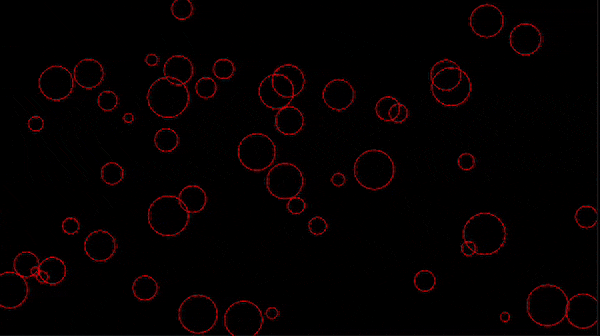

# Week 08

## Task 3 - Answer

- Hopefully your sketch and console output now looks something like this:  

<p align="center">
  
</p>

- Your code should like this

```javascript
let dotsArray = [];

function setup() {
  createCanvas(710, 400);
  let w = width;
  let h = height;
  noFill()
  stroke(255,0,0);
  // Create objects
  for (let i = 0; i < 50; i++) {
    // create a an object data type to store each dot values
    let ellipseObj = {
      x: random(w),
      y: random(h),
      diameter: random(10, 50),
      speedX: random(-2, 2), // Random horizontal speed
      speedY: random(-2, 2), // Random vertical speed
    };
    dotsArray.push(ellipseObj);
  }
  console.log(dotsArray);
}


function draw() {
  background(0);

  for (let i = 0; i < 50; i++) {
    let ellipseObj = dotsArray[i];

    // Move the ellipse
    ellipseObj.x += ellipseObj.speedX;
    ellipseObj.y += ellipseObj.speedY;

    // Check boundaries and bounce back
    if (ellipseObj.x < 0 || ellipseObj.x > width) {
      ellipseObj.speedX *= -1;
    }
    if (ellipseObj.y < 0 || ellipseObj.y > height) {
      ellipseObj.speedY *= -1;
    }

    // Draw the ellipse
    ellipse(ellipseObj.x, ellipseObj.y, ellipseObj.diameter, ellipseObj.diameter);
  }
}

```
