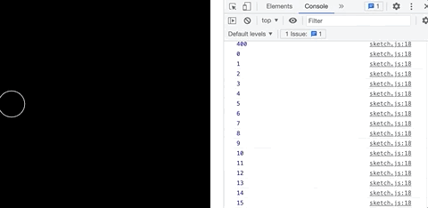
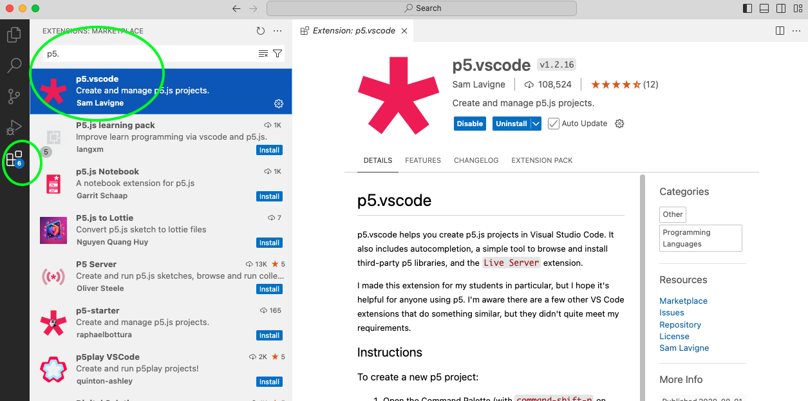
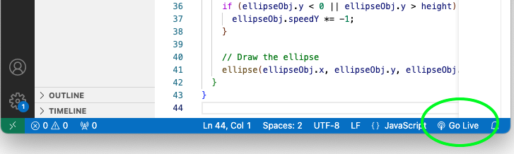
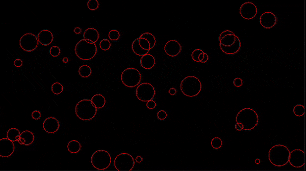

# Week 08

## Debugging and problem solving

### Task 1 - The console is your friend

You should now be pretty familiar with looking for errors in the console if something isn't working.  You can actually do some other cool things with the console.  Let's have a look.

Run the following code:

```javascript

let x = 0;

function setup() {
  createCanvas(400, 400);
  noFill()
  stroke(255);
}

function draw() {
    background(0);
    ellipse(x, height/2, 50);

    x = x + 1;
    if (x > width) {
      x = 0;
    }
    
    console.log(x);
}

```

Here we're moving an ellipse across the canvas horizontally.  If you look at the console you can see the x location for each frame.  

One of the main uses of the console is to track the value of variables so that you can see they are changing as expected (here ```x``` increases until it is the value of the ```width``` of the canvas then it starts from 0 again).  

<p align="center">

</p>

Comment out the ```console.log()``` function and we'll try writing some commands directly into the console.  Notice if you just write ```x``` and click return you get the value of ```x``` in real time.  You can also change the value of the variable, try writing ```x = 50;``` and see how it jumps to that location.  You can stop the draw function all together with the ```noLoop()``` function and start it again with the ```loop()``` function.

### Task 2 - Debugging challenge

As well as writing to the console there are also a few other ways of doing debugging in Chrome.  In particular you might want to use breakpoints to pause or stop the program at a specific location to explore the current state of the program.  

Edit your sketch code to include some more ```console.log()``` statements. As below:  

```javascript

let x = 0;

function setup() {
  console.log("setup() is running");
  // put setup code here
  createCanvas(400,600);
  noFill();
  stroke(255);
  console.log(x);
  x = x + 50;
  console.log(x);
}

function draw() {
  console.log("draw() is running");
  // put drawing code here
  background(100);
  ellipse(x, height/2, 50);

  x++;
  if (x > width) {
    x = 0;
  }
  //console.log(x);
}

```

To add a breakpoint and stop the code running before ```draw()```  navigate to sources in the developer tools panel. Open pages and sketch.js (as per the video below).  

To add a breakpoint click on the line number you want the code to stop running at.  

Now refresh the browser and navigate back to the console. The message ```"draw() is running"``` never appears in the console because the code stops running at the end of ```setup()```. 


Also please read the following tutorial on debugging in Chrome [HERE](https://javascript.info/debugging-chrome).   

### Task 3 - Debugging challenge  

Okay now you're nearly ready to try and fix some errors!   
Before you do that let's install the p5 autocomplete for Visual Studio Code.

Open the extensions panel in Visual Studio Code. (green hilite below) and search for "p5.vscode" and install p5.vscode.

<p align="center">

</p>

Download task-3-fix-errors.zip from blackboard > Learning Materials > Week 08 and load the folder into Visual Studio Code. 
Look at the following code in sketch.js

```javascript

function setup() {
  createCanvas(710, 400);
  noFill()
  stroke(255,0,);
  // Create objects
  for (let i = 0; i < 50; i++) {
    // create a an object data type to store each dot values
    let ellipseObj = {
      x: random(w),
      y: random(h),
      diameter: random(10, 50),
      speedX: random(-2, 2), // Random horizontal speed
      speedY: random(-2, 2), // Random vertical speed
    };
    dotsArray.push(ellipseObj);
  }
  console.log(dotsArray);
}


function draw() {
  background(0);
  // draw all the dots on each frame, moving there position
  for (let i = 0; i < 50; i++) {
    ellipseObj = dotsArray[i];

    // Move the ellipse
    ellipseObj.x += ellipseObj.speedX;
    ellipseObj.x += ellipseObj.speedY;

    // Check boundaries and bounce back
    if (ellipseObj.x < 0 || ellipseObj.x > width) {
      ellipseObj.speedX *= -1;
    }
    if (ellipseObj.y < 0 || ellipseObj.y > height) {
      ellipseObj.speedY *= -1;
    }

    // Draw the ellipse
    ellipse(ellipseObj.x, ellipseObj.y, ellipseObj.diameter);
  }
}


```

Try running it by using the "go live" Button at the bottom of Visual Studio Code. This will launch a new browser window using a local server with address of http://127.0.0.1:5500/ (or something similar).   
Note: If the window opens in Safari copy the local server address to Chrome and open the inspect > console.  

The page will automatically refresh when you edit and save your code.

<p align="center">

</p>

When you run this code you'll see (in the console) that it was written in a hurry and is littered with errors.  Your task is to use your programming knowledge and debugging skills to find and fix all the errors in the code so that it runs successfully.  

When finished it should look like this:
<p align="center">

</p>

### Task 4 - Final task for your WordPress journal
### EITHER Solve the Capitalise challenge below OR make a new sketch and glitch image / artwork using p5.glitch.me  

#### p5.glitch.me challenge
The Glitch me library and instructions can be found here:    
[https://p5.glitch.me/](https://p5.glitch.me/)   

#### Capitalise challenge:  

Making use of the following code

```javascript
 
function setup(){
    console.log(letterCapitalise("hello world"));
}

function letterCapitalise(str) { 

    // code goes here  
    
    return str;      
}
```
   
your challenge is to write some more code inside the ```letterCapitalise(str)``` function that takes the ```str``` parameter being passed and capitalises the first letter of each word.  For example if the input is "hello world" the output should be "Hello World".  You can assume that words will be separated by only one space.

There are a number of ways that you could complete this task but if you're really stuck see below for some links to the functions that you could use solution.  

#### How to start:  
Breakdown the task programmatically into steps. Then add each step as a comment inside ```letterCapitalise(str)```.

<details>
<summary>Want to see some hints?</summary>
  
  <p>https://www.w3schools.com/jsref/jsref_split.asp</p>
  <p>https://www.w3schools.com/jsref/jsref_substring.asp</p>
  <p>https://www.w3schools.com/jsref/jsref_touppercase.asp</p>
  <p>https://www.w3schools.com/jsref/jsref_join.asp</p>
  
</details>  


