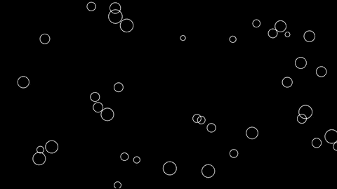

# Session 06

## Debugging and problem solving

### Task 1 - The console is your friend

You should now be pretty familiar with looking for errors in the console if something isn't working.  You can actually do some other cool things with the console.  Let's have a look.

Run the following code:

```javascript

let x = 0;

function setup() {
  createCanvas(400, 400);
  noFill()
  stroke(255);
}

function draw() {
    background(0);
    ellipse(x, height/2, 50);

    x = x + 1;
    if (x > width) {
      x = 0;
    }
    
    console.log(x);
}

```

Here we're moving an ellipse across the canvas horizontally.  If you look at the console you can see the x location for each frame.  
<p align="center">

</p>

Comment out the ```console.log()``` function and we'll try writing some commands directly into the console.  Notice if you just write ```x``` and click return you get the value of ```x``` in real time.  You can also change the value of the variable, try writing ```x = 50;``` and see how it jumps to that location.  You can stop the draw function all together with the ```noLoop()``` function and start it again with the ```loop()``` function.

### Task 2 - Debugging challenge

As well as writing to the console there are also a few other ways of doing debugging in Chrome.  In particular you might want to use breakpoints to pause or stop the program at a specific location to explore the current state of the program. Please read the following tutorial on debugging in Chrome [HERE](https://javascript.info/debugging-chrome).  Okay now you're ready to try and fix some errors!

Look at the following code

```javascript

function setup() {
  let dots = []; // array of Jitter objects
  createcanvas(710, 400);
  noFill()
  Stroke(255);
  // Create objects
  for (let i = 0; i < 50; i++) {
    dots.push(new Jitter(random(w), random(h), random(10, 30)));
  }
}

// create new object when mouse is pressed
function mousepressed() {
  let r = random(10, 30)
  let b = new Jitter(mouseX, mouseY, r);
  dots.push(b);
}

function draw() {
  background(0);
  // move and display all the objects
  for (let i = 0; i < dots.length; i++) {
    dots[i].move();
    dots[i].display();
  }
}

// Jitter class
class Jitter {

  constructor(x_, y_, r_) {
    x = x;
    y = y;
    diameter = r;
    speed = 2;
  }

  move() {
    x += random(-speed, speed);
    y += random(-speed, speed)
  }

  display() {
    ellipse(x, y, diameter, diameter);
  }
}

```

If you try running this code you'll see that it was written in a hurry and is littered with errors.  Your task is to use your programming knowledge and debugging skills to find and fix all the errors in the code so that is runs successfully.  

When finished you should be able to create a new object each time you press the mouse like this:
<p align="center">

</p>

### Task 3 - Problem solving challenge

Making use of the following code

```javascript
 
function setup(){
    console.log(letterCapitalise("hello world"));
}

function letterCapitalise(str) { 

    // code goes here  
    
    return str;      
}
```
   
your challange is to write some more code inside the ```letterCapitalise(str)``` function that takes the ```str``` parameter being passed and capitalises the first letter of each word.  For example if the input is "hello world" the output should be "Hello World".  You can assume that words will be separated by only one space.

There are a number of ways that you could complete this task but if you're really stuck see below for some links to the functions that I made use of in my solution.

<details>
<summary>Want to see some hints?</summary>
  
  <p>https://www.w3schools.com/jsref/jsref_split.asp</p>
  <p>https://www.w3schools.com/jsref/jsref_substring.asp</p>
  <p>https://www.w3schools.com/jsref/jsref_touppercase.asp</p>
  <p>https://www.w3schools.com/jsref/jsref_join.asp</p>
  
</details>  


