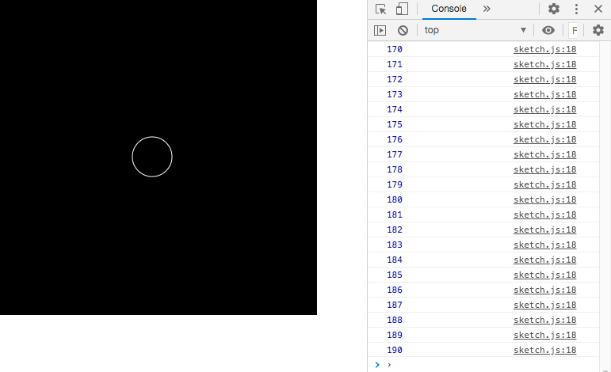

# Week 08

## Transformations

### Task 1 - Rotating rects

For this first task we're taking some inspiration from [Victor Vasarely's Pavo II](https://en.vasarely.hu/artworks/15379/) which shows a sequence of squares that increasingly get smaller and rotate more. 

To start with create a new sketch and run the following code:

```javascript
function setup(){
	createCanvas(600,600);

	angleMode(DEGREES);  // using degrees rather than the default radians
	rectMode(CENTER); // draw from the centre of the rectangle rather than the default top left corner

	background(0); // black background
	stroke(255); // white stroke
	strokeWeight(4); // strokeWeight of 4
	noFill(0); // no fill to shape

	rect(0,0,width,height); // draw a rect at the point of origin with width and height the same size as the canvas
}
```

As this will be a static image we're just using the ```setup()``` function so that all the code runs just once.  

You should notice that you can only see the bottom right corner of your square. As we're using the ```rectMode(CENTER)``` command we are drawing the ```rect()``` from the centre of the rectangle rather than the default top left corner. Can you write a line a code that moves the point of origin from the top left corner of the canvas to the centre of the canvas?  

<details>
<summary>See here for a hint</summary>
  
  <p>https://p5js.org/reference/#/p5/translate</p>
  
</details>

We still can't really see our square as it's the same size as our canvas.  Let's use the [```scale()```](https://p5js.org/reference/#/p5/scale) function with an input value of 0.9 to reduce the size of our square.  Don't forget you need to call ```scale()``` before you call the shape function i.e. ```rect()```. 

Great now we can see the square!

Next let's write a for loop that iterates from 0 to 20 with our ```scale()``` and ```rect()``` functions inside. You should now be able to see 20 squares each getting smaller. Notice that each time ```scale()``` gets called it adds to the previous ```scale()``` call.

Finally we want to rotate each of the squares where the rotation amount increases as they get smaller.  To start with create a new variable called ```angle``` and initialise it with a value of 0 e.g. ```let angle = 0;```. Next on each iteration of the for loop call the ```rotate()``` function with the ```angle``` variable as input e.g. ```rotate(angle);```, then on a new line also inside the for loop add a small value to the angle variable on each iteration of the for loop e.g.  ```angle += 0.45;```

The end result of this task should look something like this:

<p align="center">
  
</p>

### Task 2 - Rotating ellipses

For the following tasks we're going to be creating some Op Art inspired animations.  These tasks are based on a work by [thedotisblack](https://thedotisblack.com/post/694283304192671744/thedotisblack-2020511231320frame0093).

Create a new sketch and run the following code:

```javascript
let angle = 0;

function setup(){
	createCanvas(600,600);
	angleMode(DEGREES);
	noStroke();
	fill(0, 15, 30, 220);
}

function draw() {
	background(255);

	translate(width/2, height/2);

	for(let i = 0; i < 100; i++){
		scale(0.95);
		rotate(angle);
		ellipse(width, 0, 50, 50);
	}

	angle += 0.01;

}
```

You should be able to see a line of rotating ellipses that gradually get smaller towards the centre of the canvas.  Alot of the code is very similar to Task 1 but we're now using the ```draw()``` function so the values are updated on each frame.  

If you leave it running for a while the rotation creates some interesting patterns but let's try and make it even more interesting.  

We're going to make multiple instances of our line of rotating ellipses by putting the existing for loop inside another for loop where each iteration of the new outer for loop is rotated around 360 degrees.  We don't want the new ```rotate()``` function to impact the previous one so we need to isolate the inner for loop by calling two functions, one before the for loop and one after it.  Do you remember from the lecture the names of these functions?

<details>
<summary>See here for a hint</summary>
  
  <p>https://p5js.org/reference/#/p5/push</p>
  
</details>

Next let's create our new outer for loop that will iterate from 0 to 360, with 22.5 added to the iterator on each loop.  Make sure to use a different variable name from the inner for loop!  We will then call the ```rotate()``` function inside the outer for loop with the iterated variable as input to ```rotate()```: 
```javascript
for (let a = 0; a < 360; a += 22.5){
	rotate(a);
}
```

The result of this task should look something like this:

<p align="center">
  
</p>


### Task 3 - Prepare to be mesmerised

This is already looking pretty mermerising but let's add one more thing to take things up a notch.  For this task all we need to do is make another copy of our first for loop together with our ```push()``` and ```pop()``` functions.  The whole of our ```draw()``` function should now look like this:
```javascript
function draw() {
	background(255);
	
	translate(width/2, height/2);

	for (let a = 0; a < 360; a += 22.5){
		rotate(a)
		push();
			for(let i = 0; i < 100; i++){
				scale(0.95);
				rotate(angle);
				ellipse(width, 0, 120);
			}
		pop();

		push();
			for(let i = 0; i < 100; i++){
				scale(0.95);
				rotate(-angle);
				ellipse(width, 0, 100);
			}
		pop();
	}

	angle += 0.01;

}
```

The result of this task should look something like this:

<p align="center">
  
</p>

Going further:

* Try playing around with the various parameters and see what impact these changes have.

* Try using different shapes or lines.

* Add some colour.


### Stretch task

* Find an example of Op Art from the internet that you would like to draw with code.  

* Next with paper and a pen draw the image and make notes on the types of shapes and the input values you will need to use.  

* Try your best to code the image.  Please ask for help if you get stuck.
