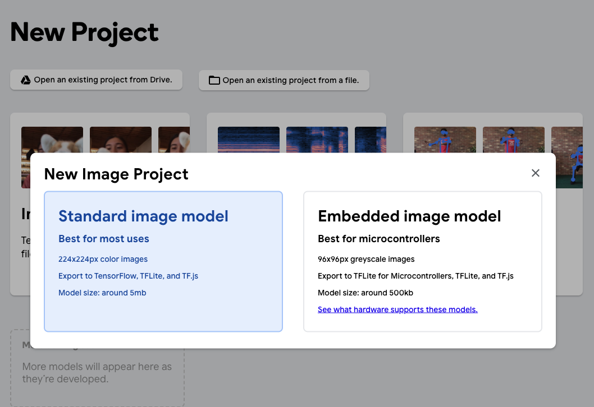
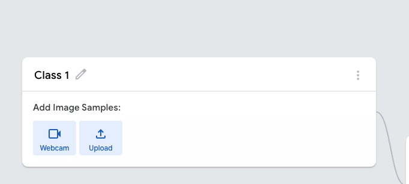
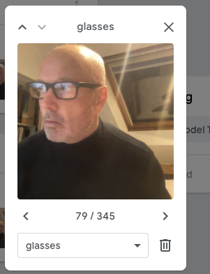
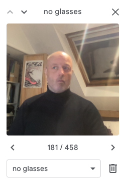
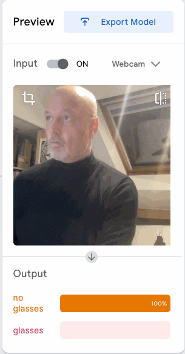
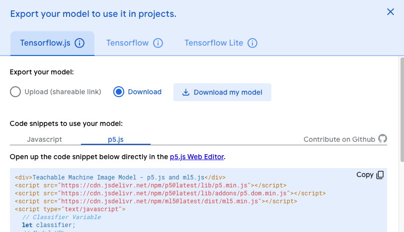
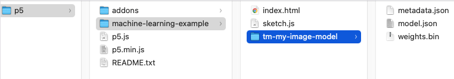
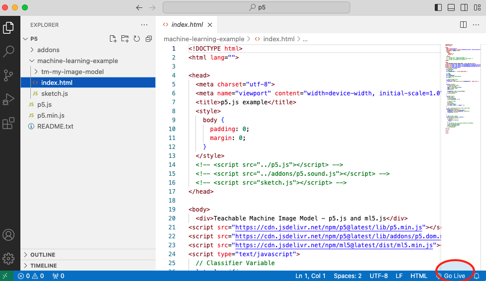
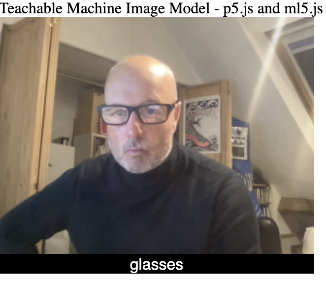
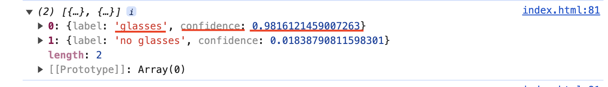

# Week 12

## AI and Machine Learning pt 1

This week and next week we are focusing on AI and Machine Learning (ML) for p5.  

To start with we will see how ML works using Google's Teachable Machine platform.  
Then we will move onto implement ML with P5 using the ml5.js library.  

You will need a webcam for this workshop.  

Team up with someone and help each other with these tasks. (Help each other capture images for the dataset).    

### Task 1 - Teachable Machine - Creating a model from dataset with classes

- We are going to create a dataset and classifier with https://teachablemachine.withgoogle.com/ 

- We will be teaching our machines to recognise an object (choose something distinctive, a pen, bottle, laptop, your hand, glasses etc) 

- Click to get started with teachable machine and choose 'Image Project' https://teachablemachine.withgoogle.com/train 

- Initially we will create a data set of images of our chosen object using the teachable machine platform and following the instructions on the teachable machine web page.  

- choose a new Image project and Standard image model.   

<p align="center">

</p>

- Use the webcam to record image samples of your chosen object. Rotate your object so that there images of every angle close and far. Aim for about 300 images.  

- Edit the name of the class.  

- Repeat this for two or three classes.  

<p align="center">

</p>

- I used my face with and without glasses.    

<p align="center">

</p>

- Then click 'train the model' and preview and test it. **Don't close the webpage!** 

<p align="center">

</p>

### Task 2 - Teachable Machine - Deploying your model into a web page

Download a new P5 empty example onto your machine. Rename the ```empty-example```  directory.  
Export your model from the Teachable Machine page. Select **Tensorflow.js** and **Download**.   
**Don't close the webpage!**  

<p align="center">

</p>

Copy the P5.js code and paste into the body of your ```index.html``` page.

```html
<body
    <div>Teachable Machine Image Model - p5.js and ml5.js</div>
    ...
    <!-- rest of the copied teachable machine code -->
    ...
    classifyVideo();
  }
</script>

</body>
```
Add the downloaded and unzipped model folder into your renamed empty example directory.


Now change the following line so that ```'./my_model/'``` is the name of your model folder.  

```javascript
  let imageModelURL = './my_model/';
```    
You will also need to comment out the ```<scripts>``` that are included in the ```empty-example/index.html``` file as they are included with p5 code you have copied.

```html
<!-- <script src="../p5.js"></script> -->
<!-- <script src="../addons/p5.sound.js"></script> --> 
<!-- <script src="sketch.js"></script> -->
```
### Task 3 - Teachable Machine - Testing your model and web page with a local server
To test and run your model and web page you will need **to run it as a local server**

Visual studio code provides this as part of its code environment.  
Open the p5 folder in Visual studio code. Accept the propmpts to 'trust the author'.
Click Go live at the bottom right of the window. A new window will open with a view of your html file which uses ```http://127.0.0.1/``` or ```localhost```



From now on you should **ALWAYS** run any web pages as a local server. **Whatever the project**
You can also create a local server using the python programming language.
<details>
<summary>How to create a local server using python</summary>

```python
$ python3 -m http.server
```
More here:  
https://developer.mozilla.org/en-US/docs/Learn/Common_questions/Tools_and_setup/set_up_a_local_testing_server
</details>

Once the page is running you should see a web cam view with the classification of the image below

<p align="center">

</p>

## &#x1F536; Code Challenge 1:

```diff
! Display the video image in index.html so it is much bigger.
```

Before we move on let's look at how the classifier works. In the ```function gotResult()``` at the bottom of the script change the commented out console message to:

```javascript
// The results are in an array ordered by confidence.
console.log(results);
```
Run the page with the local server and look at the output in the console (in the developer tools). As the webcam runs and the image is classified the model returns a prediction about the likelihood of each classifier.

When I have glasses on the prediction has high (0.98) confidence in glasses:
<p align="center">

</p>

In machine learning confidence is always expressed as a value between 0 and 1.  
In machine learning the system does not 'know' that I am wearing glasses it makes a prediction about the likelhood that I might be. This prediction is a confidence value.  

### Task 4 - P5 - Using the classifier to trigger other code to run  

Instead of displaying a video image from the webcam we will use classifier and model we have created to change an image on the web page.    
We will use the confidence value of the prediction to change what we see on the screen. 


