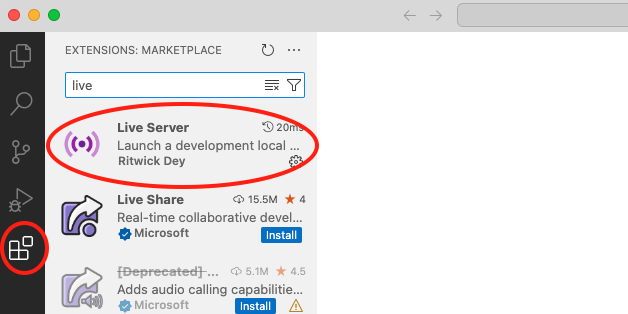
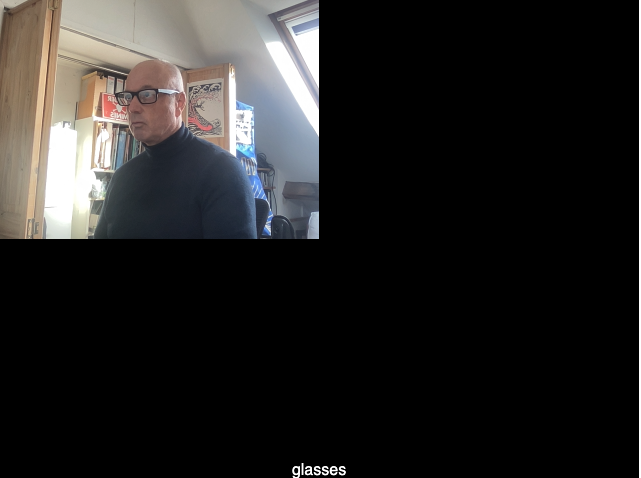
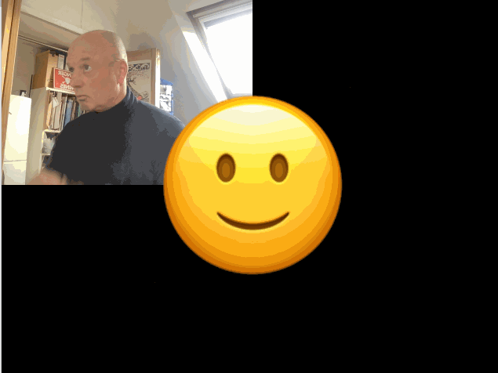
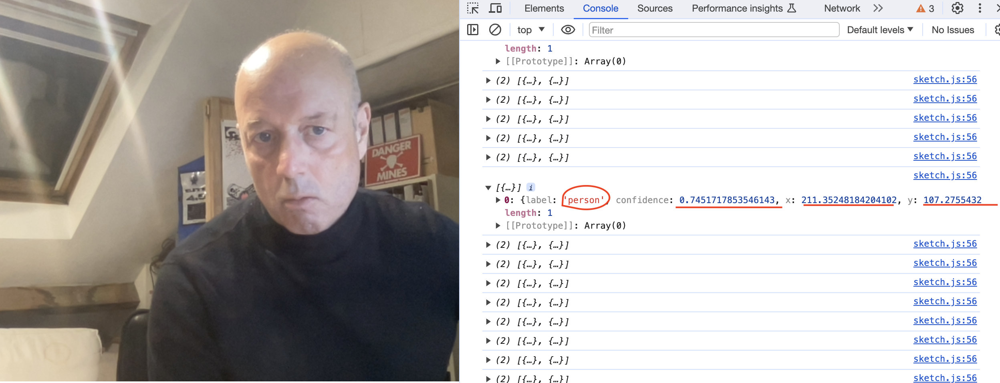
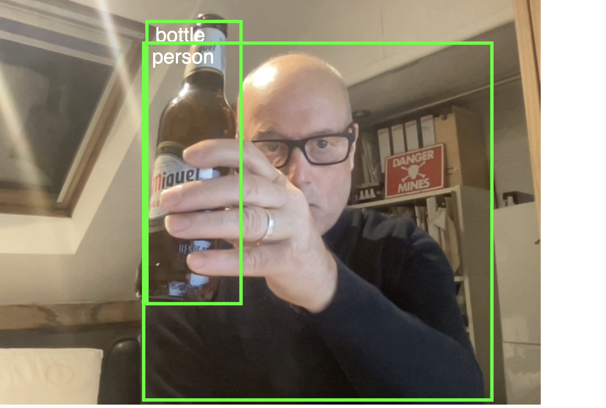

# Week 12

## AI and Machine Learning pt 1

This week and next week we are focusing on AI and Machine Learning (ML) for p5.  
This week we will focus on machine vision and object recognition.  

To start with we will see how ML works using Google's Teachable Machine platform.  
Then we will move onto implement ML with P5 using the ml5.js library.  

You will need a webcam for this workshop.  

Team up with someone and help each other with these tasks. (Help each other capture images for the dataset).    

## Task 1 - Teachable Machine - Creating a model from dataset with classes

- We are going to create a dataset and classifier with https://teachablemachine.withgoogle.com/ 

- We will be teaching our machines to recognise an object (choose something distinctive, a pen, bottle, laptop, your hand, glasses etc) 

- Click to get started with teachable machine and choose 'Image Project' https://teachablemachine.withgoogle.com/train 

- Initially we will create a dataset of images of our chosen object using the teachable machine platform and following the instructions on the teachable machine web page.  

- choose a new Image project and Standard image model.   

<p align="center">

</p>

- Use the webcam to record image samples of your chosen object. Rotate your object so that there images of every angle close and far. Aim for about 300 images.  

- Edit the name of the class. This will be label for the classifier. 

- Repeat this for two or three classes.  

<p align="center">

</p>

- I used my face with and without glasses.    

<p align="center">

</p>

- Then click 'train the model' and preview and test it. **Don't close the webpage!** 
- Hopefully it works like mine below. You have now created a machine learning **model** and **classifier**.

<p align="center">

</p>

## Task 2 - Teachable Machine - Deploying your model into a web page

Export your model from the Teachable Machine page. Select **Tensorflow.js** and **Download**.   
**Don't close the webpage!** (it will download as a .zip file). 

Download a new P5 empty example onto your machine. Rename the ```empty-example```  directory.  


<p align="center">

</p>

Copy the P5.js code and paste into the ```<body>``` of your ```index.html``` page.

```html
<body
    <div>Teachable Machine Image Model - p5.js and ml5.js</div>
    ...
    <!-- rest of the copied teachable machine code -->
    ...
    classifyVideo();
  }
</script>

</body>
```

<details>
<summary>Note:</summary>

Notice that you are using javascript inside the ```index.html``` file rather than in ```sketch.js```. For this to work the Javascript has to be included in ```<script> ... </script>``` tags. It should also be at the bottom of your ```<body>``` tag so the ```html``` in the page loads first.
</details>


Add the downloaded and unzipped model folder into your renamed empty example directory.


Now change the following line so that ```'./my_model/'``` is the name of your model folder.  

```javascript
  let imageModelURL = './my_model/';
```    
You will also need to comment out the P5 ```<scripts>``` that are included in the ```empty-example/index.html``` file as they are included with p5 code you have copied.

```html
<!-- <script src="../p5.js"></script> -->
<!-- <script src="../addons/p5.sound.js"></script> --> 
<script src="sketch.js"></script>
```
## Task 3 - Teachable Machine - Testing your model and web page with a local server
To test and run your model and web page you will need **to run it as a local server**

<details>
<summary>Find out what a local server is:</summary>
https://developer.mozilla.org/en-US/docs/Learn/Common_questions/Tools_and_setup/set_up_a_local_testing_server
</details>


Visual studio code provides a local server as part of its code environment.  
You will first need to install this in Visual studio code.  
Click on the blocks icon in the left hand nav.  
Search for 'live' and install the 'Live Server'.

<p align="center">

</p>

Once installed open the **whole p5 folder** in Visual studio code. Accept the prompts to 'trust the author'.
Click on ```index.html``` and then 'Go live' at the bottom right of the window. A new window will open with a view of your html file which uses ```http://127.0.0.1/``` or ```localhost```


From now on you should **ALWAYS** run any web pages as a local server **whatever the project**.

<details>
<summary>Other ways to create a local server</summary>
You can also create a local server using the python programming language in the terminal or command line, or by installing a Chrome extension.   


More here:  
https://developer.mozilla.org/en-US/docs/Learn/Common_questions/Tools_and_setup/set_up_a_local_testing_server  
And here:  
https://github.com/processing/p5.js/wiki/Local-server  
</details>

Once the page is running you should see a web cam view with the classification of the image below

<p align="center">

</p>

## &#x1F536; Code Challenge 1:

```diff
! Display the video image in index.html so it is much bigger.
```

Before we move on let's look at how the classifier works. In the ```function gotResult()``` at the bottom of the script change the commented out console message to:

```javascript
// The results are in an array ordered by confidence.
console.log(results);
```
Run the page with the local server and look at the output in the console (in the developer tools). As the webcam runs and the image is classified the model returns a prediction about the likelihood of each classifier.

When I have glasses on the prediction has high (0.98) confidence in the 'glasses' classifier:
<p align="center">

</p>

In machine learning confidence is always expressed as a value between 0 and 1.  
In machine learning the system does not 'know' that I am wearing glasses it makes a prediction about the likelhood that I might be. This prediction is a confidence value.  

## Task 4 - P5 - Using the classifier to trigger other code to run  

We will use the classifier and model we have created to change an image on the web page.    
We will use the confidence value of the prediction to change what we see on the screen. 

Before we do this duplicate your folder / make a new folder with all your existing code in it. 
- Delete the ```setup()``` and ```draw()``` functions in ```sketch.js```. So ```sketch.js``` is completely empty.  
- Move the javascript inside the ```<script type="text/javascript"> ... </script>``` tag in ```index.html``` into ```sketch.js```.   
- Move everything from:

```javascript
// Classifier Variable
let classifier;

...

// Classifiy again!
  classifyVideo();
}
```
(Don't move the ```<script type="text/javascript"> ... </script>``` tags. You can delete these).  
So now your ```index.html``` does not have any Javascript in it.  
- Check everything still runs (run ```index.html``` as a local server / localhost).  

Make the P5 canvas bigger and video image smaller:  

```javascript
function setup() {
  console.log("running setup");
  createCanvas(640, 480); // make the canvas bigger
  // Create the video
  video = createCapture(VIDEO);
  video.size(320, 240); // and make the image small
  video.hide();

  flippedVideo = ml5.flipImage(video);
  // Start classifying
  classifyVideo();
}
```

<p align="center">

</p>

## &#x1F536; Code Challenge 2:

```diff
! Find and download two images to use to represent each classifier.
! Add them to your example folder.
! Use P5 to add one of the images onto the center of the canvas 
! (I'm using an emoji but you can use what you like).
! If you aren't sure how to do this search the P5 reference to how to add an image.
```

Now we will add another image and swap them based on the classifiers 'glasses' / 'no glasses'.  

<p align="center">

</p>

Add another image variable at the top of the sketch. 
```javascript
let img_2;
```
and preload it in the ```preload()``` function (note this runs before ```setup()```. 

```javascript
function preload() {
  classifier = ml5.imageClassifier(imageModelURL + 'model.json');
  img_1 = loadImage('smiling-face.png'); // NEW
  img_2 = loadImage('nerdface.png'); // NEW
}
```

To swap each image to display depending on the classifier we can use the ```label``` variable in ```draw()```.  

In ```draw()``` add:

```javascript
if (label == "glasses") {
  image(img_2, width/2, height/2, 250, 250); // NEW
}
else {
  image(img_1, width/2, height/2, 250, 250); // NEW
}
```

You will need to change ```label == "<your classifier name>"``` and use the name of your classifier.  

Your sketch should now work something like this:

<p align="center">

</p>

## Task 5 - P5 - Using an existing trained model for object recognition  

It is common to use pretrained models to undertake various classification tasks.  
ml5.js implements a variety of these models for image recognition, pose recognition, sentiment analysis and so on.  
Explore them here https://learn.ml5js.org/#/  

We will use an object recognition model called COCOSSD to recognise objects. COCOSSD has been pretrained to recognise hundreds of everyday objects.  

You will need to download a new P5 'empty example'.

#### Configure index.html:

In the ```<head>``` of ```index.html``` add a link to the ml5.js libray

```html
<script src="https://cdn.jsdelivr.net/npm/ml5@latest/dist/ml5.min.js"></script>
```

<details>
<summary>Note:</summary>
Notice that you are using a link to ml5.js library rather than downloading into your example folder.  
This is a common way to include script files for libraries and modules.  
The ml5.js script file is hosted on a Content Delivery Network (cdn).  
</details>

#### Step 1. Configure sketch.js:  

First of all we are going to capture the video from our webcam and draw it onto the canvas.  
In ```sketch.js``` create a video variable at the top of the script.  

```javascript
let video;
```

in ```setup()``` create a canvas for the video.

```javascript
function setup() {
  createCanvas(640, 480);
  video = createCapture(VIDEO);
  video.size(640, 480);
  video.hide();
}
```

in ```draw()``` draw the video image.

```javascript
function draw() {
  image(video, 0, 0);
}
```

Test your sketch **using a local server**, you should see your webcam image on the canvas.  
Now we can add the object detection model and detection functions. 

Still in ```sketch.js``` add 2 more variables at the top of the script.   

```javascript
let video; // we already have this
let detector;
let detections = [];
```

#### Step 2. Load the COCOSSD model and detect objects: 
Next we will add some functions to start the machine learning detection and load the COCOSSD model.  

These functions are chained together using 'callbacks'. (With the person sitting next to you look up and discuss what a callback is).  

Underneath ```draw()``` at the bottom ```sketch.js``` add the following functions: 


```javascript
// video capture is ready and working
function videoReady() {
  // Models available are 'cocossd', 'yolo'
  detector = ml5.objectDetector('cocossd', modelReady);
}

// model has loaded
function modelReady() {
  detector.detect(video, gotDetections);
}

// got object detections
function gotDetections(error, results) {
  if (error) {
    console.error(error);
  }
  detections = results;
  console.log(detections);
  detector.detect(video, gotDetections);
}
```

In ```setup()``` amend ```createCapture(VIDEO);``` to include a callback to ```videoReady()```  

```javascript
function setup() {
  createCanvas(640, 480);
  video = createCapture(VIDEO, videoReady); 
  video.size(640, 480);
  video.hide();
}
```

Run your sketch **using a local server**, you should see ouput in the console.  Labelling whatever is in front of the camera (in my case 'person'). You should also be able to see a confidence value and some coordinates (we will use these in a moment).  

<p align="center">

</p>

Let's take a moment to understand how all these functions are working.  

Read the following whilst looking at your ```sketch.js``` file:  
The functions are chained together and work like this...  

- When the video starts working it calls ```videoReady()``` from ```video = createCapture(VIDEO, videoReady);```

- ```videoReady()``` loads the 'cocossd' model and when that is complete it calls ```modelReady()```

- ```modelReady()``` starts the object detections and when it detects an object calls ```gotDetections()```

- ```gotDetections()``` contains the results that you see in the console (in the image above). ```gotDetections()``` runs in an endless loop returning detections on every frame of the video. ```console.log(detections);``` sends the detections to the console so we can see them.  


#### Step 3. Last step - draw the detections onto the video image:  

Now in the last step we will draw the detections onto the video image... Like this (Cheers)...

<p align="center">

</p>


Inside ```draw()``` add the following code to draw the bounding box of the detection and add the label as text.  

```javascript
function draw() {
  image(video, 0, 0);

  for (let i = 0; i < detections.length; i += 1) {
    const object = detections[i];
    stroke(0, 255, 0);
    strokeWeight(4);
    noFill();
    rect(object.x, object.y, object.width, object.height);
    noStroke();
    fill(255);
    textSize(24);
    text(object.label, object.x + 10, object.y + 24);
  }
}
```
How does this work? Write some comments in your code explaining how this draws the bounding boxes.  

Run your sketch **using a local server**, you should see the bounding box and label on the video.

## &#x1F536; Code Challenge 3:

```diff
! Change the colour of the bounding box.
```

<details>
<summary>Hint:</summary>
You can find the answers to the code challenges including the final sketch.js code above at the top of the page.
</details>


