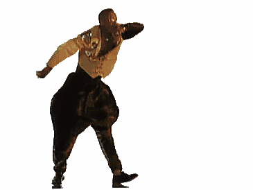
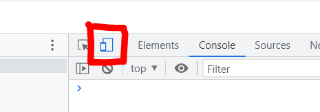
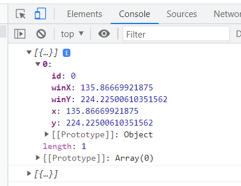

# Week 12

## Mobile Devices - Touch and Rotation

### Task 1 - Get Started

Create a new p5.js project as normal ([Download P5 here](https://p5js.org/download/))

You can access the [documentation for p5.js here](https://p5js.org/reference/) ,You will need to use this to refresh your memory and find the code you need to complete this worksheet.

Create a new canvas in your setup function and make it the size of the window.

Make the background White and set the stroke Weight to 5;

<details>
<summary>Hint</summary>

[createCanvas](https://p5js.org/reference/#/p5/createCanvas)</br>
[windowWidth](https://p5js.org/reference/#/p5/windowWidth)</br>
[background](https://p5js.org/reference/#/p5/background)</br>
[strokeWeight](https://p5js.org/reference/#/p5/strokeWeight)
</details>

<details>
<summary>Solution</summary>

```javascript
function setup(){
  createCanvas(windowWidth,windowHeight);
  background('white');
  strokeWeight(5);
}
```
</details>

Test your project in Chrome

### Task 2 - Touch this 



P5.js has a few different ways to capture touch events.

the TouchStarted function is called when a user touches anywhere on the screen.

the following function will create a circle where you touch the screen, read it and then add it to the bottom of your script file:

```javascript
function touchStarted() {
  noStroke();
  // chooses a random RGB colour to fill
  fill(random(0,255),random(0,255),random(0,255)); 
  // creates an ellipse where the user touched with a random radius.
  ellipse(mouseX,mouseY, random(20,100));  
}
```

You can see that although we are now using touch, for single interactions mouseX and mouseY are still used to get the location of the touch.

Additionally, if your device does not have a touch screen the touchStarted function will be called when you press the mouse instead.

Therefore you are able to test the code you have written on your computer even if it does not have a touch screen.

Test your code in Chrome on your computer.

### Task 3 - Simulating touch events

You now need to test your code with actual touch events. Helpfully, Chrome allows you to simulate them using the developer tools.

In Chrome, right click and select 'inspect' to open up the developer tools.

Now change the device by clicking the tablet button in the top left of the developer panel.



Test your project again, you should see a difference.

<details>
<summary>Answer</summary>

When in normal mode a circle is only created when you press the mouse button, but in touch mode, they are created when you press and release the mouse.
</details>

To fix this issues, the function just needs to 'return false'

Your function should now look like this:

```javascript
function touchStarted() {
  fill(random(0,255),random(0,255),random(0,255)); // chooses a random RGB colour to fill
  ellipse(mouseX,mouseY, random(20,100));  // creates an ellipse where the user touched with a random radius.
  return false;
}
```

### Task 4 - Touch Ended

P5 has a separate function which calls when you stop touching the screen ([touchEnded documentation](https://p5js.org/reference/#/p5/touchEnded)).

Add the function to the bottom of your script:

```javaScript
function touchEnded(){
	
}
```
Now add some code to that function to create a rectangle  50px wide and positioni ig where you release your finger.

<details>
<summary>Hint</summary>

[rect](https://p5js.org/reference/#/p5/rect)</br>
[recMode](https://p5js.org/reference/#/p5/rectMode)</br>
[mouseX](https://p5js.org/reference/#/p5/mouseX)
</details>

<details>
<summary>Solution</summary>

```javascript
function touchEnded(){
   rectMode(CENTER);
   rect(mouseX, mouseY,50); 
}
```
</details>

You should note that you can press then drag and release in a different location.

### Task 5 - TouchMoved 

The final touch method available in P5.js is Touch Moved

Add the following to the bottom of your script file

```javascript

function touchMoved() {
  line(mouseX, mouseY, pmouseX,pmouseY);
  return false;
}

```

This function will be called whenever your finger moves on the screen.

Test this now you should have a line connecting your shapes.

### Task 6 - Multiple Touches

So far we have seen that Touches have worked in a very similar way to mousePressed, mouseReleased and mouseMoved.

But, while a mouse is limited to one pointer. With touch we can have multiple touch points.

Create a new p5 project and create a canvas the size of the window as before.

turn off strokes.

Add a background colour in your draw function.

<details>
<summary>Hint</summary>

[CreateCanvas](https://p5js.org/reference/#/p5/createCanvas)</br>
[windowWidth](https://p5js.org/reference/#/p5/windowWidth)</br>
[noStroke](https://p5js.org/reference/#/p5/noStroke)

</details>

<details>
<summary>Solution</summary>

```javascript
function setup(){
   createCanvas(windowWidth,windowHeight);
   noStroke();   
}

function draw(){
   background(220,20); // transparent grey
}
```
</details>

To access multiple touches on the screen we can use the touches property.

This is an array so we can find out how many items it has by just doing.

```javascript
touches.length
```
We want to show a circle in the middle of the screen that grows depending on how many fingers are touching the screen. 

In your Draw function create an ellipse at the centre of the screen. 

Set the radius to be the number of touches multiplied by 20.

Lastly, change the fill colour so that it changes based on the number of touches.

<details>
<summary>Hint</summary>

[ellipse](https://p5js.org/reference/#/p5/ellipse)</br>
[touches](https://p5js.org/reference/#/p5/touches)</br>
[fill](https://p5js.org/reference/#/p5/fill)

</details>


<details>
<summary>Solution</summary>

```javascript
function draw(){
   background(220,20);
   // use map to convert the number of touches to a number between 0 and 255. 
   let redValue = map(touches.length, 1, 10,255,0);
   //set the colour
   fill(redValue,0,0);
   //draw and ellipse in the center of the screen
   ellipse(width/2,height/2,touches.length * 20);
}
```
[map documentation](https://p5js.org/reference/#/p5/map)

</details>

Now try testing this out in Chrome on your computer. If your screen is not a touch screen you may run into an issue.


### Task 7 - Test it out on the Panel server.

You can test individual touches on your computer by simulating it though the developer tools as we did earlier.

But to test multiple touches you need to be on an actual touch screen.

The best way to do that is to upload your code to your panel server space and then open the page on your phone.

If you have forgot how to do this, there is a guide on Blackboard under "learning Materials > Additional support"

If you are struggling to get this working ask for help.

Once it is on the panel server, test it out on your phone and see if it works. 

#### Optional Extra challenge - Remote debugging

An issue with testing on your phone is that you cannot access the developer tools to help debug your code.

One solution to this on Android devices is to use remove debugging.  If this is something you are interested in you can follow this guide t o set it up 

[https://developer.chrome.com/docs/devtools/remote-debugging/](https://developer.chrome.com/docs/devtools/remote-debugging/)

This will not work on IOS, but you may be able to view the console log by going to "chrome://inspect" [https://blog.chromium.org/2019/03/debugging-websites-in-chrome-for-ios.html](https://blog.chromium.org/2019/03/debugging-websites-in-chrome-for-ios.html)

### Task 8 - Multi Touch locations

Now that we can access multiple touches, we can use the locations of those touches.

Create a new project, or comment out your setup and draw functions and make new blank ones.

In the setup function create a new canvas that fills the window and in the draw assign a background colour. 

Lastly, we want to console log touches so that we can look in our console and see what the array contains.

<details>
<summary>Soluton</summary>

```javascript
function setup(){
	createCanvas(windowWidth,windowHeight);
}

function draw(){
	background(220); // grey	
	
	//first check if there are any touches
	if(touches.length > 0){
	   console.log(touches); //log out any touches to the console.
	}
	
}
```
</details>

Test this on your computer and if you open up your developer tools you will see in your console that the touches array contains an id, and an x and y property.



We can use these in our code to position elements on screen.

Add a for loop in your draw function that loops thought all the elements of the touches array.

<details>
<summary>Hint</summary>

[for](https://p5js.org/reference/#/p5/for)</br>
[looping though an array](https://www.w3docs.com/snippets/javascript/how-to-loop-through-an-array-in-javascript.html)

</details>


<details>
<summary>Solution</summary>

```javascript
function draw(){
  background(220);
  
  if(touches.length > 0){
    for(let i = 0; i< touches.length; i++){
     
    }
  }
}
```
</details>

Inside the for loop create an ellipse and position it at the x and y co-ordinates of each touch.

<details>
<summary>Hint</summary>

You can access the x location of the first touch using
```javascript
	touches[0].x
```
		
</details>


<details>
<summary>Solution</summary>

```javascript
function draw(){
  background(220);
  
  if(touches.length > 0){
    for(let i = 0; i< touches.length; i++){
       ellipse(touches[i].x, touches[i].y, 50); 
    }
  }
}
```
</details>

Create a text box above each ellipse that shows the ID for that touch. 

</detatils>


<details>
<summary>Solution</summary>

```javascript
function draw(){
  background(220);
  
  if(touches.length > 0){
    for(let i = 0; i< touches.length; i++){
       ellipse(touches[i].x, touches[i].y, 100); 
       textAlign(CENTER,CENTER);
       textSize(30);
       text(touches[i].id, touches[i].x,touches[i].y - 90)
    }
  }
}
```
</details>

Finally, upload this to your panel server and test it out.

### Task 9 - More Multi Touch

Now that we have a basic demo working we can build on it.

Try using the touch locations to draw shapes 

```javascript

function setup() {
  createCanvas(windowWidth, windowHeight);
}

function draw(){

  background('black');
    
  //this nested for loop creates a grid of ellipses as a background
  for(let i =0; i< width; i+= 10){
  	for(let j = 0; j<height; j+=10){
  		ellipse(i,j,10,10);
  	}
  }
  
  
  beginShape(); //start a shape
  
  if(touches.length > 0){
    for(let i = 0; i< touches.length; i++){
        vertex(touches[i].x,touches[i].y); // add a corner to the shape
    }  
  }
  
  endShape(CLOSE); //close the shape
}

```

When you test this on your phone do you come across any issues?

The browser on touch devices uses multi touch gestures to scroll and zoom pages. 

Luckily you can turn these off.

Open up your index.html page.

In the head you should see the following meta tag


```html
 <meta name="viewport" content="width=device-width, initial-scale=1.0">
```

We need to add some properties to this tag to turn off scaling

```html
<meta content="width=device-width, initial-scale=1.0, maximum-scale=1.0, user-scalable=0" name="viewport">
```

we also need to add some css to the page

replace the contents of your style tag with this:

```css
  body {
      padding: 0;
      margin: 0;
      background-color: #1b1b1b;
      /*new lines to stop zoom an mobile*/
      height:100%;
      touch-action: none;
      overscroll-behaviour:none;
      /* */
    }

    html, body {
      /*hide scroll bars*/
      overflow:hidden;
    }
```

Test your code on your touch device again.

finally, comment out all your code an paste in the code below to use lines instead of shapes:


```javascript
function setup() {
  createCanvas(windowWidth, windowHeight);
}

function draw(){
  background(220);
  
  if(touches.length > 0){
    for(let i = 0; i< touches.length; i++){
       for(let j = 0; j< touches.length; j++){
           line(touches[i].x,touches[i].y,touches[j].x,touches[j].y) 
       }
    }
  }
}
```


### Task 10 - Rotation

Most mobile devices have an accelerometer built in to them, we can access that to find the rotation and use that in our code.

In P5.js, you access the rotation through

```javascript
rotationX
rotationY
rotationZ
```

For this next project we want to control a shape on screen using the rotation of the device.

First make a new project or comment out your existing code.

In the setup function create a canvas the size of the window.

Then create 3 global variables x,y and size;

in the setup function, set x and y to the middle of the screen, and set the radius to 25;

lastly, add a background colour to the draw function.

<details>
<summary>Solution</summary>
 
 ```javascript
 let x;
 let y;
 let radius;
 
 function setup(){
    createCanvas(windowWidth, windowHeight);
    
    x = width/2;
    y = height/2;
    radius = 25;
    
 }
 
 function draw(){
    
 }
 
 ```
</details>


Now, in the draw function, add the following code to change x and y based on the rotation of the device:

```javascript

x += rotationX/10;
y += rotationY/10

ellipse(x,y,radius*2);
```

Now, same this and test it on your PC to make sure you do not have any bugs.


Before we test this on the panel server, and your device we have one more thing to do.

### Task 11 - IOS Permissions

IOS will not let you use the accelerometer to see the rotation of the device until you have given it permission.

First, we need to check if we are on an IOS device. copy the function bellow into the bottom of your scrips.

```javascript

//returns true if on an IOS device.
function iOS() {
  return [
    'iPad Simulator',
    'iPhone Simulator',
    'iPod Simulator',
    'iPad',
    'iPhone',
    'iPod'
  ].includes(navigator.platform)
  // iPad on iOS 13 detection
  || (navigator.userAgent.includes("Mac") && "ontouchend" in document)
}


```

reference:[](https://stackoverflow.com/questions/9038625/detect-if-device-is-ios)

Next we want to add a global variable at the top of our script:

```javascript

let permission = false;

```

lastly, we want to add a touchEnded function, to detect when the user touches the screen, we can then get IOS to ask permission to access the rotation

Add the following to the bottom of your script.


```javascript

function touchEnded(){

	//change the fill colour so we can see that the touch has worked
  fill(random(0,255),random(0,255),random(0,255));
  
  //check if permission has not already been granted and we are on an IOS device
  if(!permission && iOS()){
		
	  //ask IOS to request permission to use the rotation, 
      DeviceMotionEvent.requestPermission().then(response => {
        if (response == 'granted') {
            console.log("accelerometer permission granted");
            permission = true;
        }
    });

  }
  
  return true;
}

```

You can now test your code on your computer to check for any bugs, then upload to the panel server. 

Yon can now add extra code to stop of falling off the edge;

Add extra code before you draw the ellipse to stop it falling off the edge of the screen.

<details>
<summary>Solution</summary>

```javascript
//stop the ellipse falling off the top and bottom
if(y<radius){
   y = radius;
} else if(y>(height-radius)){
   y = height-radius;
}
 
//stop the ellipse falling off the sides.
if( x< radius){
   x = radius;
}else if(x> (width-radius)){
   x = width-radius;
}
```
</details>

### Extra Challenge

Use deviceMoved or device shaken to detect movement and change the colour or other visual element on screen.

<details>
<summary>Hint</summary>

[deviceShaken](https://p5js.org/reference/#/p5/deviceShaken)</br>
[deviceMoved](https://p5js.org/reference/#/p5/deviceMoved)

</details>


