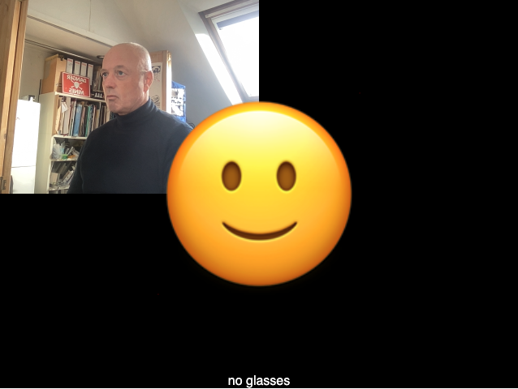

# Week 12

## Code Challenge 2 - Answer

- Use P5 to add one of the images onto the center of the canvas.   
- Hopefully your sketch now looks something like this: 
- Note the use of ```imageMode()``` to position the video and emoji image. 

<p align="center">

</p>

- Your code should like this

```javascript
// Classifier Variable
let classifier;
// Model URL
let imageModelURL = './tm-my-image-model/';

let img_1; /// MAKE AN IMAGE VARIABLE

// Video
let video;
let flippedVideo;
// To store the classification
let label = "";

// Load the model first
function preload() {
  classifier = ml5.imageClassifier(imageModelURL + 'model.json');
  img_1 = loadImage('smiling-face.png'); // PRELOAD IMAGE
}

function setup() {
  console.log("running setup");
  createCanvas(640, 480);
  // Create the video
  video = createCapture(VIDEO);
  video.size(320, 240);
  video.hide();

  flippedVideo = ml5.flipImage(video);
  // Start classifying
  classifyVideo();
}

function draw() {
  background(0);
  // Draw the video
  imageMode(CORNER); /// POSITION VIDEO IN THE CORNER
  image(flippedVideo, 0, 0);
  imageMode(CENTER); /// POSITION IMAGE IN THE CENTER
  image(img_1, width/2, height/2, 250, 250); // LOAD IMAGE

  // Draw the label
  fill(255);
  textSize(16);
  textAlign(CENTER);
  text(label, width / 2, height - 4);
}

// Get a prediction for the current video frame
function classifyVideo() {
  flippedVideo = ml5.flipImage(video)
  classifier.classify(flippedVideo, gotResult);
  flippedVideo.remove();

}

// When we get a result
function gotResult(error, results) {
  // If there is an error
  if (error) {
    console.error(error);
    return;
  }
  // The results are in an array ordered by confidence.
  //console.log(results);
  label = results[0].label;
  // Classifiy again!
  classifyVideo();
}
```
