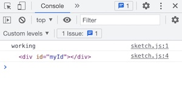
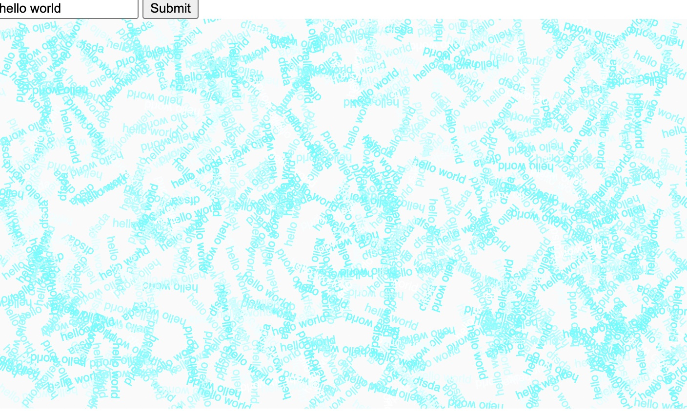
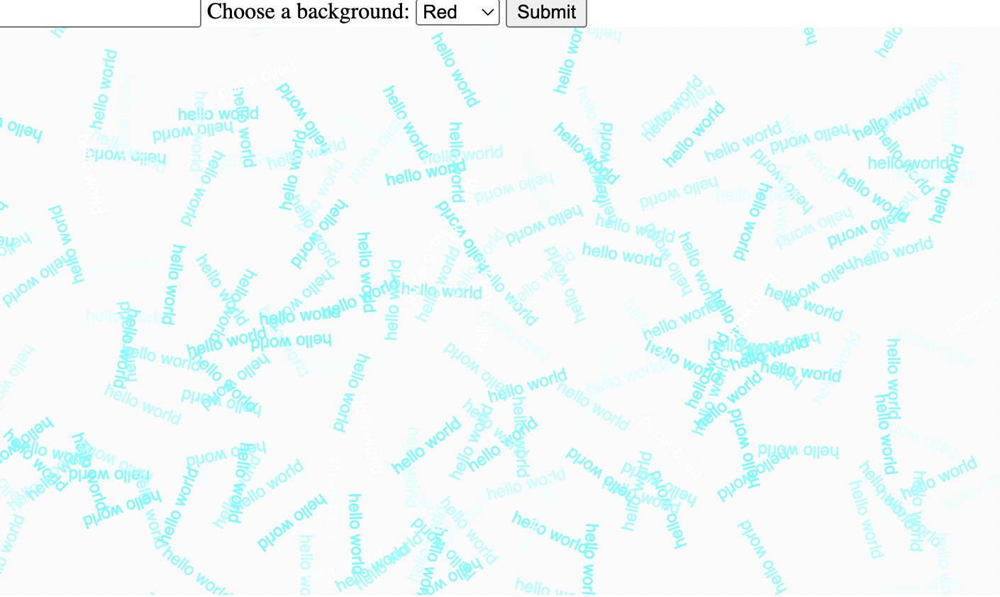
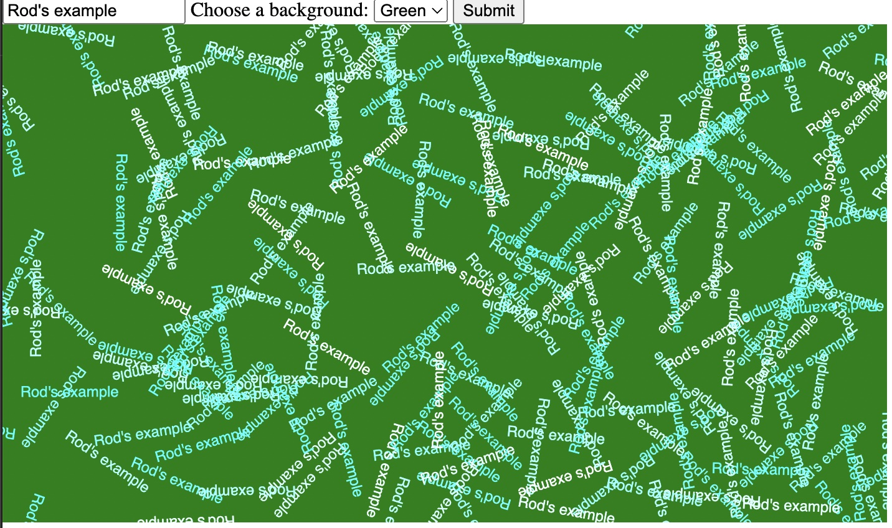
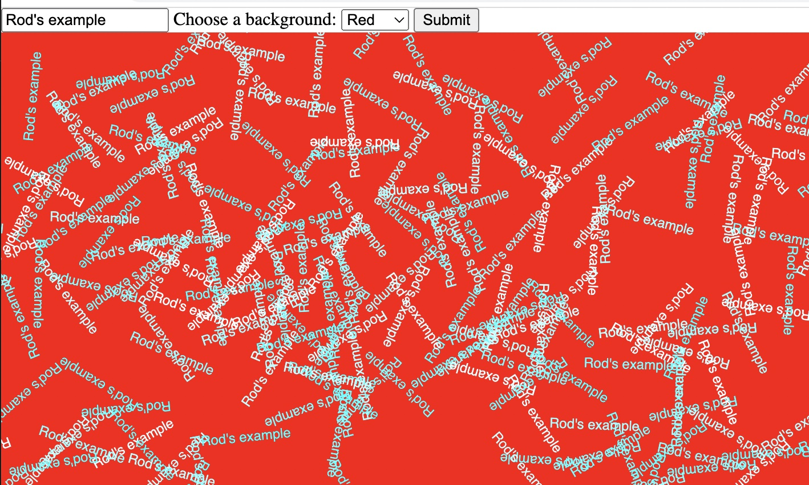
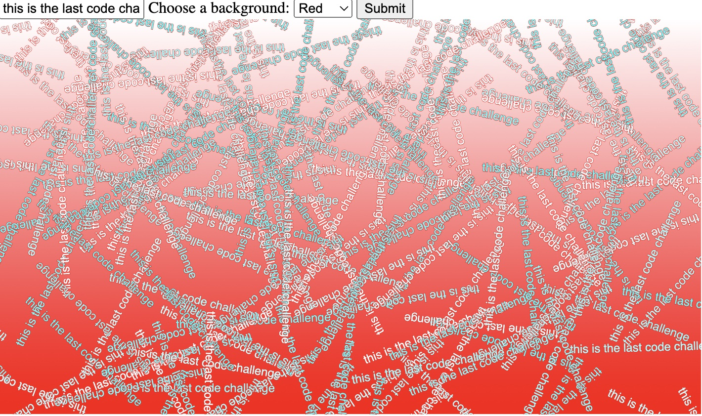

# Week 14

## HTML, Pure JavaScript and Interaction with the DOM

### Task 1 - writing data to an HTML Page

Create a new p5 empty example folder on your machine called DOM_DEMO_01 or something that is in line with your previous naming system.

In index.html move the script tag for sketch.js to the bottom of the body so your html ```<body``` taglooks like this.

```html
<body>
  <script src="sketch.js"></script>
</body>
```

Delete everything in sketch.js and add

```javascript 
console.log("working");
```

Open your index.html page and open the console. you should see "working", telling you the JavaScript file and HTML file are correctly linked together.

You are all set up. 

Now in your HTML page add a div tag in the ```<body>``` tag and give it an id attribute.

```html
<body>
  <div id="myId"></div>
  <script src="sketch.js"></script>
</body>
```

We are going to inject some text into the ```<div>```

First 'find' the ```<div>``` using JavaScript

in sketch.js make a new variable and assign it. Output the variable to the console.  


```javascript 
let myDiv = document.querySelector("#myId");
console.log(myDiv);
```

You should see the output as the html ```<div>```.



```document.querySelector()``` allows you to target any html block by using its ```id``` or ```class```. It's worth knowing about!!!

Now we will use JavaScript to inject some text into the ```<div>```.  

set the ```innerHTML``` of your variable to a string.

```javascript 
let myDiv = document.querySelector("#myId");
console.log(myDiv);
myDiv.innerHTML = "This message has been added by JavaScript";
```

Refresh index.html to see the result.  

*****
### Task 2 - using an event listener to listen to a click in an HTML Page. 

Now we'll use an html link to trigger a JavaScript function.  

Add a ```<a>```link to your index.html page.  

```html
<body>
  <div id="myId"></div>
  <a class="myClass" href="#">Click me</a>
   <script src="sketch.js"></script>
</body>
```

In your sketch.js underneath your existing code create a function.  

```javascript 
function outputToConsole() {
  console.log("This was triggered by JS");
}
```

target the link and add an event listener that triggers the function.  
Look up event listeners, what other events can they monitor / litsen too?  

```javascript 
let myLink = document.querySelector('.myClass');
myLink.addEventListener('click', outputToConsole);

function outputToConsole() {
  console.log("This was triggered by JS");
}
```
Click the link to see the result in the console.  

*****
### &#x1F536; Task 3 first code challenge:  

```diff
! Edit the code in sketch.js so that your event listener 'click' triggers the message: 
! "This message has been added by JavaScript" to appear on the page.    
! Tip: create a new function that contains the code that injects the text into myDiv
! Use the event listener to trigger that function
```

Although the result looks a bit boring triggering functions with clickable links in HTML is the foundation of most interactive content on the web.  

*****
### Task 4 - using p5 to interact with your web page.  

These techniques can be combined with P5.  

Find the DOM section in the P5 examples https://p5js.org/examples/ browse it for 10 minutes.  

Create a new p5 empty example folder on your machine. Rename it. (naming things logically so you remember what they mean is important!).  

We'll use a text input and event listener to add text to the p5 canvas.  

. 

First we will create a form element with a submit button that prints the value of the submitted text to the console.  Then we will add the text to the P5 canvas.  

Set up the HTML index page by adding a form element,  input and submit button.  

In index.html move the script tag for sketch.js to the bottom of the body so your html ```<body``` tag looks like this.  

```html
<body>
  <!-- add a form element with text input and submit button -->
  <div>
    <form>
      <input type="text" id="myInput">
      <input type="submit" id="mySubmit" value="Submit">
    </form>
  </div>

  <!-- the P5 canvas is injected into main when you run the sketch -->
  <main>
  </main>

  <!-- add the javascript file at the bottom of the body tag -->
   <script src="sketch.js"></script>
</body>
```

The JavaScript sketch.js file will catch the the input text and output it to the console.   

Above ```setup()``` add new variables for your input and and submit button using ```document.querySelector()```.  

```javascript 
let inputTxt = document.querySelector('#myInput');
let submitBtn = document.querySelector('#mySubmit');
```

Next add an event listener to your submit button and output the result to the ```console.log()```.  

You will need to include the  ```preventdefault()``` function  so that the page does not refresh.  

```javascript 
submitBtn.addEventListener('click', function(e) {
  e.preventDefault();
  console.log(inputTxt.value);
});
```
Input some text and press the submit button with your console open to see the result.  

I am also using an inline 'anonymous' (without a name) function in the event listener. This is slightly different to the technique we used  earlier when we called the function by its name from the event listener.   

Once you've got this block of code to work, stop what you are doing for a moment  and compare and discuss the differences in these approaches with the event listeners, with named and anonymous functions.   

*****
### &#x1F536; Task 5 second code challenge:  

```diff
! Edit the code in index.html and sketch.js add an HTML form 'select' element to your html page.
! Tip: look up how to add and create a 'select' 
! https://www.w3schools.com/tags/tag_select.asp
! Tip: create a new variable for the select and 
! add the output value from the select to your event listener. 
```

Your web page should look this:  

. 

*****
### Task 6 - add some P5

Underneath ```draw()``` at the bottom of your sketch.js file write a new function called greet which displays  text on the canvas.  

```javascript 
function greet(name) {
  for (let i = 0; i < 200; i++) {
    push();
    fill(random(255), 255, 255);
    translate(random(width), random(height));
    rotate(random(2 * PI));
    text(name, 0, 0);
    pop();
  }
}
```

Try out this function by calling it in ```setup()```

```javascript 
function setup() {
  console.log("everything is working");
  createCanvas(710, 400);
  background(250);
  greet("hello world");
}
```

It should look like this:  

. 


*****
### &#x1F536; Task 7 third code challenge:  

```diff
! Edit the code in sketch.js so that the input text from your form is 
! displayed by the greet() function.

! Tip: use the event listener...
```

*****
### &#x1F536; Task 8 fourth code challenge:  

```diff
! Edit the code in sketch.js 
! Create a new function called setBg() that uses the colour in your 'select' to 
! change the background colour of your sketch.

! Tip: use the event listener...
```

Task 7 & 8 should look like this:  

.

Or this depending on the colour selected in the ```<select>```:  

. 

*****
### &#x1F536; Extra Stretch Task 9 final code challenge:  

```diff
! Well done if you have managed all of that
! Finally edit the code in sketch.js 
! Change the function setBg() so that it displays a gradient background.

! Tip: We made gradients in week 5... 
! but you could also find an example of a P5 gradient in the examples and documentation.
```

Task 9 should look like this:  

.


