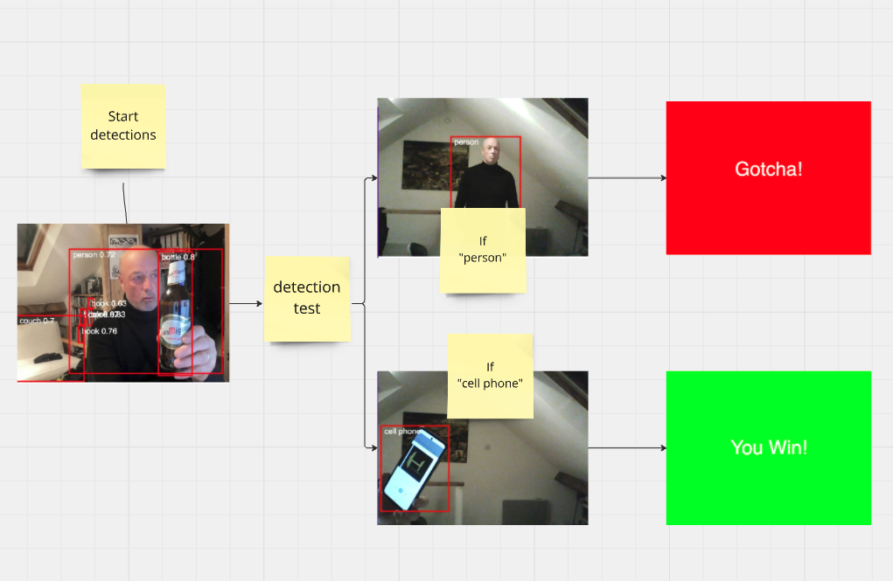

# Week 13

## AI and Machine Learning pt 2

This week we will continue our focus on machine vision and object recognition and implement Machine Learning with P5 using the ml5.js library.  
https://ml5js.org/  

It is common to use pretrained **models** to undertake various **classification** tasks.  ml5.js implements a variety of these models for image recognition, pose recognition, sentiment analysis and so on.  
Explore them here https://learn.ml5js.org/#/  

We will use an object recognition model called COCOSSD to recognise objects. COCOSSD has been pretrained to recognise hundreds of everyday objects.  

Ultimately we will make a game that uses Machine Learning & COCOSSD, where your objective is to trick the Machine Learning model into **NOT** recognising you as a person...  

You will need a webcam for this workshop.  

Team up with someone and help each other with these tasks. (You will need two people to test the game).  

#### Steps / Tasks:  

There are 3 steps or tasks for the session today:  
- **Task 1:** Get P5 to capture and display the video from your webcam  
- **Task 2:** Use the webcam image and a pretrained **model** to undertake **classifications**  
- **Task 3:** Use the classifications to make a simple **classification** avoidance game     

## Task 1 - Get P5 to capture and display the video from your webcam  


You will need to download a new P5 'empty example'.

#### Configure index.html:

In the ```<head>``` of ```index.html``` add a link to the ml5.js library. Notice we are using version 0.50  

```html
<script src="https://cdn.jsdelivr.net/npm/ml5@0.5.0/dist/ml5.min.js"></script>
```

<details>
<summary>Note:</summary>
Notice that you are using a link to ml5.js library rather than downloading into your example folder.  
This is a common way to include script files for libraries and modules.  
The ml5.js script file is hosted on a Content Delivery Network (cdn).  
</details>

#### Step 1. Configure sketch.js:  

First of all we are going to capture the video from our webcam and draw it onto the canvas.  
Setup ```sketch.js``` as follows.  

```javascript
let video;

function setup() {
  createCanvas(640, 480);
  video = createCapture(VIDEO);
  video.size(640, 480);
  video.hide();
}

function draw() {
  image(video, 0, 0);
}
```

Test your sketch **using a local server**, you should see your webcam image on the canvas.  
Now we can add the object detection model and detection functions. 
<details>
<summary>Hint:</summary>
If you are not sure how to set up Visual Studio Code to run a local server see last week's worksheet.
</details>  


## Task 2 - Use the webcam image and a pretrained model to undertake classifications  

Next we will add some functions to load the COCOSSD model and start the machine learning detection. 

In ```sketch.js``` add 2 more variables at the top of the script.   

```javascript
let video; // we already have this
let detector;
let detections = [];
``` 

These functions are chained together using 'callbacks'. (With the person sitting next to you look up and discuss what a callback is).  

Underneath ```draw()``` at the bottom ```sketch.js``` add the following functions: 


```javascript
// video capture is ready and working
function videoReady() {
  // Models available are 'cocossd', 'yolo'
  detector = ml5.objectDetector('cocossd', modelReady);
}

// model has loaded
function modelReady() {
  detector.detect(video, gotDetections);
}

// got object detections
function gotDetections(error, results) {
  if (error) {
    console.error(error);
  }
  detections = results;
  console.log(detections);
  detector.detect(video, gotDetections);
}
```

In ```setup()``` amend ```createCapture(VIDEO);``` to include a callback to ```videoReady()```  

```javascript
function setup() {
  createCanvas(640, 480);
  video = createCapture(VIDEO, videoReady); // add videoReady
  video.size(640, 480);
  video.hide();
}
```

Run your sketch **using a local server**, you should see ouput in the console.  Labelling whatever is in front of the camera (in my case 'person'). You should also be able to see a confidence value and some coordinates (we will use these in a moment).  

<p align="center">

</p>

Let's take a moment to understand how all these functions are working.  

Read the following whilst looking at your ```sketch.js``` file:  
The functions are chained together and work like this...  

- When the video starts working it calls ```videoReady()``` from ```video = createCapture(VIDEO, videoReady);```

- ```videoReady()``` loads the 'cocossd' model and when that is complete it calls ```modelReady()```

- ```modelReady()``` starts the object detections and when it detects an object calls ```gotDetections()```

- ```gotDetections()``` contains the results that you see in the console (in the image above). ```gotDetections()``` runs in an endless loop returning detections on every frame of the video. ```console.log(detections);``` sends the detections to the console so we can see them.  


#### Draw the detections onto the video image:  

Now we will draw the detections onto the video image... Like this (Cheers)...

<p align="center">

</p>


Inside ```draw()``` add the following code to draw the bounding box of the detection and add the label as text.  

```javascript
function draw() {
  image(video, 0, 0);

  for (let i = 0; i < detections.length; i += 1) {
    const object = detections[i];
    stroke(0, 255, 0);
    strokeWeight(4);
    noFill();
    rect(object.x, object.y, object.width, object.height);
    noStroke();
    fill(255);
    textSize(24);
    text(object.label +" "+ object.confidence, object.x + 10, object.y + 24);
  }
}
```
How does this work? Write some comments in your code explaining how this draws the bounding boxes.  

Run your sketch **using a local server**, you should see the bounding box and label on the video.

## &#x1F536; Code Challenge 1:

```diff
! Change the colour of the bounding box.
! Round the confidence value to two decimal places (so it looks like my photo above).
```

<details>
<summary>Hint:</summary>
You can find the answers to the code challenges including the final sketch.js code above at the top of the page.
</details>  

## Task 3 - Use the classifications to make a simple classification avoidance game  

We will now use all the sketch to make a simple game. 

#### How to play
A single player starts in the field of vision of the camera disguised or camouflaged and a few metres away. They have to show their phone to the camera before they are detected as a person.  

If they are detected as a person a 'Gotcha!' screen will appear.  
To succeed players will have to disguise themselves or move fast, or even hide behind objects... 

#### How the game works:   
If a 'person' is detected then they have been caught and the 'Gotcha!' screen displays. 
If a 'cell phone' is detected they have won and tricked the system to not recognise them as they approached the camera. The 'You Win!' screen displays.   

The game can be retarted by refreshing the browser page.   

<p align="center">

</p> 


 
#### Lets get started: 
We are going to need to make 3 screens:  
- The detection screen (we've mostly made this already)  
- The Gotcha screen  
- The You Win screen  

Then we will switch between them using the ```switch (state)``` function (from week 4).  

To begin with we will move all the code from ```draw()``` into a function called ```videoUI()```
And run ```videoUI()``` from draw.  
Everything should work the same, but ```draw()``` will only have one line of code in it.   

```javascript
function draw() {
  videoUI();
}

// show video detections
function videoUI() {
  image(video, 0, 0);
  for (let i = 0; i < detections.length; i += 1) {
    const object = detections[i];
    stroke(255, 0, 0);
    strokeWeight(4);
    noFill();
    rect(object.x, object.y, object.width, object.height);
    noStroke();
    fill(255);
    textSize(24);
    text(object.label +" "+ object.confidence, object.x + 10, object.y + 24);
  }
}
```
#### Testing for a "person" or "cell phone": 
Next we need to see whether the detection results contain a label that is a 'person' or 'cell phone'.  

Detections are already being logged here:
```javascript
function gotDetections(error, results) {
  if (error) {
    console.error(error);
  }
  detections = results;
  console.log(detections); // shows the results as an array of objects
  detector.detect(video, gotDetections);
}
```

These results are logged as an array, as below, each result has a label and confidence value as well as  x / y co-ordinates to plot the bounding box:  

<p align="left">

</p>


We can loop through the results and test whether the results contain a label that is a 'person' or 'cell phone'.  
In addition we can test if the result has a high confidence value.  
For now we will output the result to the console.  

Amend the ```gotDetections()``` function as follows:  

```javascript
function gotDetections(error, results) {
  if (error) {
    console.error(error);
  }
  detections = results;
 
  // Loop through the detections array [] and test the results for "person" and "cell phone"
  for (let i = 0; i < detections.length; i++) {
    //console.log(detections[i]["label"]);
    // label is 0.8 person or greater
    if(detections[i]["label"] == "person" && detections[i]["confidence"] > 0.8) {
      // you were caught
      console.log("caught");
    }
    else if(detections[i]["label"] == "cell phone" && detections[i]["confidence"] > 0.3) {
      // you won 
      console.log("success");
    }
  }
  detector.detect(video, gotDetections);
}
```
Try changing the confidence value to 0.99 to see if you can be detected as a person and "caught" so easily.  


#### Gotcha and You Win screens
Now we will make 2 screens that you will switch between: A 'Gotcha!' screen, a 'You Win' screen.  

<p align="left">

</p>

We will write a function to create each screen. (Then switch between them).  

Write the following functions beneath your ```videoUI()``` function.   
The Gotcha function:
```
// Gotcha 
function gotcha(){
  background(255,0,0);
  // Set up text properties
  textAlign(CENTER, CENTER);
  textSize(60);
  fill(255); // White text
  text("Gotcha!", width/2, height/2);
}
```
The You Win function
```
// you win
function youWin(){
  background(0,255,0);
  // Set up text properties
  textAlign(CENTER, CENTER);
  textSize(60);
  fill(255); // White text
  text("You Win!", width/2, height/2);
}
```


Test and run ```gotcha()``` and ```youWin()``` from inside  ```draw()``` by commenting / uncommenting each in turn.

```javascript
function draw() {
  //videoUI(); //uncomment this line to test

  //youWin(); //uncomment this line to test
  
  //gotcha(); //uncomment this line to test
}
```

Uncomment each one to see it in turn.    

#### Set up the switch statement
Now let's use the object detections to switch between the screens so that when a person is detected the 'Gotcha' screen displays and when a cell phone is detected a the 'Success' screen is displayed.

We will replace everything in ```draw()```  with a switch statement to switch between our Video, Gotcha and Success screens.  

Then we will switch between the these states depending on the results from the object detection.  


Add a global variable at the top of your ```sketch.js```
```javascript
let state = "video";
```

Add the switch statement to ```draw()``` 
```javascript
function draw() { 
  switch (state) {
    case "video":
      videoUI();
      break;
    
    case "caught":
      gotcha();
      break;

    case "success":
      youWin();
      break; 
  } 
}
```


#### Use the switch statement
Now we need to set the ```state``` variable to ```"caught"``` or ```"success"``` depending on the result of the detections in the ```gotDetections()``` function.  

Add ```state = "caught";``` and ```state = "success";``` to ```gotDetections()```   

<details>
<summary>Solution:</summary>

```javascript
function gotDetections(error, results) {
  if (error) {
    console.error(error);
  }
  detections = results;
 
  // Loop through the detections array [] and test the results for "person" and "cell phone"
  for (let i = 0; i < detections.length; i++) {
    //console.log(detections[i]["label"]);
    // label is 0.9 person
    if(detections[i]["label"] == "person" && detections[i]["confidence"] > 0.6) {
      // you were caught
      console.log("caught");
      state = "caught"; // change the 'state' variable to caught
    }
    else if(detections[i]["label"] == "cell phone" && detections[i]["confidence"] > 0.3) {
      // you won 
      console.log("success");
      state = "success"; //change the 'state' variable to success
    }
  }
  detector.detect(video, gotDetections);
}
```
</details> 


Test your project. The game should now work (you'll need to refresh the page to reset).  


## &#x1F536; Code Challenge 2 (stretch goal):
To improve the whole experience add a start screen that switches to the video, on a key press, to start the game.   

In a bit more detail:  


```diff
! Create a start() function which creates a start screen.  
! Use a key press to switch state / case to 'video'.
! Change the initial starting state to 'start'.
```

Done that? Add a restart function (on a keypress).  

<details>
<summary>Hint:</summary>
You can find the answers to the code challenges including the final whole sketch.js code above at the top of the page.
</details>  


