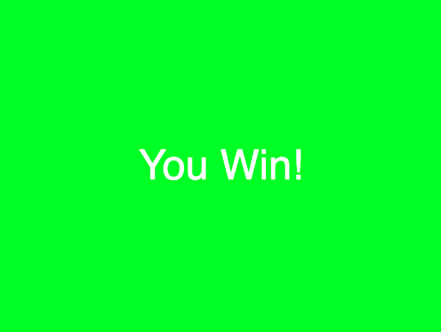

# Week 13

## AI and Machine Learning pt 2

This week we will continue our focus on machine vision and object recognition and implement Machine Learning with P5 using the ml5.js library.  
https://ml5js.org/  

It is common to use pretrained **models** to undertake various **classification** tasks.  ml5.js implements a variety of these models for image recognition, pose recognition, sentiment analysis and so on.  
Explore them here https://learn.ml5js.org/#/  

We will use an object recognition model called COCOSSD to recognise objects. COCOSSD has been pretrained to recognise hundreds of everyday objects.  

Ultimately we will make a game that uses Machine Learning & COCOSSD, where your objective is to trick the Machine Learning model into **NOT** recognising you as a person...  

You will need a webcam for this workshop.  

Team up with someone and help each other with these tasks. (You will need two people to test the game).  

#### Steps / Tasks:  

There are 3 steps or tasks for the session today:  
- **Task 1:** Get P5 to capture and display the video from your webcam  
- **Task 2:** Use the webcam image and a pretrained **model** to undertake **classifications**  
- **Task 3:** Use the classifications to make a simple **classification** avoidance game     

## Task 1 - Get P5 to capture and display the video from your webcam  


You will need to download a new P5 'empty example'.

#### Configure index.html:

In the ```<head>``` of ```index.html``` add a link to the ml5.js libray

```html
<script src="https://cdn.jsdelivr.net/npm/ml5@latest/dist/ml5.min.js"></script>
```

<details>
<summary>Note:</summary>
Notice that you are using a link to ml5.js library rather than downloading into your example folder.  
This is a common way to include script files for libraries and modules.  
The ml5.js script file is hosted on a Content Delivery Network (cdn).  
</details>

#### Step 1. Configure sketch.js:  

First of all we are going to capture the video from our webcam and draw it onto the canvas.  
Setup ```sketch.js``` as follows.  

```javascript
let video;

function setup() {
  createCanvas(640, 480);
  video = createCapture(VIDEO);
  video.size(640, 480);
  video.hide();
}

function draw() {
  image(video, 0, 0);
}
```

Test your sketch **using a local server**, you should see your webcam image on the canvas.  
Now we can add the object detection model and detection functions. 
<details>
<summary>Hint:</summary>
If you are not sure how to set up Visual Studio Code to run a local server see last week's worksheet.
</details>  


## Task 2 - Use the webcam image and a pretrained model to undertake classifications  

Next we will add some functions to load the COCOSSD model and start the machine learning detection. 

In ```sketch.js``` add 2 more variables at the top of the script.   

```javascript
let video; // we already have this
let detector;
let detections = [];
``` 

These functions are chained together using 'callbacks'. (With the person sitting next to you look up and discuss what a callback is).  

Underneath ```draw()``` at the bottom ```sketch.js``` add the following functions: 


```javascript
// video capture is ready and working
function videoReady() {
  // Models available are 'cocossd', 'yolo'
  detector = ml5.objectDetector('cocossd', modelReady);
}

// model has loaded
function modelReady() {
  detector.detect(video, gotDetections);
}

// got object detections
function gotDetections(error, results) {
  if (error) {
    console.error(error);
  }
  detections = results;
  console.log(detections);
  detector.detect(video, gotDetections);
}
```

In ```setup()``` amend ```createCapture(VIDEO);``` to include a callback to ```videoReady()```  

```javascript
function setup() {
  createCanvas(640, 480);
  video = createCapture(VIDEO, videoReady); // add videoReady
  video.size(640, 480);
  video.hide();
}
```

Run your sketch **using a local server**, you should see ouput in the console.  Labelling whatever is in front of the camera (in my case 'person'). You should also be able to see a confidence value and some coordinates (we will use these in a moment).  

<p align="center">

</p>

Let's take a moment to understand how all these functions are working.  

Read the following whilst looking at your ```sketch.js``` file:  
The functions are chained together and work like this...  

- When the video starts working it calls ```videoReady()``` from ```video = createCapture(VIDEO, videoReady);```

- ```videoReady()``` loads the 'cocossd' model and when that is complete it calls ```modelReady()```

- ```modelReady()``` starts the object detections and when it detects an object calls ```gotDetections()```

- ```gotDetections()``` contains the results that you see in the console (in the image above). ```gotDetections()``` runs in an endless loop returning detections on every frame of the video. ```console.log(detections);``` sends the detections to the console so we can see them.  


#### Draw the detections onto the video image:  

Now we will draw the detections onto the video image... Like this (Cheers)...

<p align="center">

</p>


Inside ```draw()``` add the following code to draw the bounding box of the detection and add the label as text.  

```javascript
function draw() {
  image(video, 0, 0);

  for (let i = 0; i < detections.length; i += 1) {
    const object = detections[i];
    stroke(0, 255, 0);
    strokeWeight(4);
    noFill();
    rect(object.x, object.y, object.width, object.height);
    noStroke();
    fill(255);
    textSize(24);
    text(object.label, object.x + 10, object.y + 24);
  }
}
```
How does this work? Write some comments in your code explaining how this draws the bounding boxes.  

Run your sketch **using a local server**, you should see the bounding box and label on the video.

## &#x1F536; Code Challenge 1:

```diff
! Change the colour of the bounding box.
```

<details>
<summary>Hint:</summary>
You can find the answers to the code challenges including the final sketch.js code above at the top of the page.
</details>  

## Task 3 - Use the classifications to make a simple classification avoidance game  

We will now use all the sketch to make a simple game. The game will work as follows:  

#### How to play
A single player starts in the field of vision of the camera hiding behind something (a chair or table). They have to get close enough to the camera without being detected as a person to show the camera their phone. 
If they are detected as a person a 'Gotcha!' screen will appear.  
To succeed players will have to disguise themselves, move fast, crawl or hide behind objects...  

To begin with we will move all the code from ```draw()``` into a function called ```videoUI()```
And run ```videoUI()``` from draw.  
Everything should work the same, but ```draw()``` will only have one line of code in it.   

```javascript
function draw() {
  videoUI();
}

// show video detections
function videoUI() {
  image(video, 0, 0);
  for (let i = 0; i < detections.length; i += 1) {
    const object = detections[i];
    stroke(255, 0, 0);
    strokeWeight(4);
    noFill();
    rect(object.x, object.y, object.width, object.height);
    noStroke();
    fill(255);
    textSize(24);
    text(object.label, object.x + 10, object.y + 24);
  }
}
```

Now you need to make 3 screens that you will switch between: A 'Start' Screen, a 'Gotcha!' screen, a 'Success' screen.  

<p align="left">

</p>

The game will work as follows, if a 'person' is detected then you have been caught and lose. And is 'cell phone' is detected you've won and tricked the system to not recognise you as you approached the camera.   

<p align="center">

</p>

The 3 screens will be generated from one new function ```textUI()```, passing different parameters to it to style each screen. 

Create some new global variables* for the width and height of the 'Start Again' button.  
```javascript
let rectWidth = 150;
let rectHeight = 60;
```

*Where should these two global variables be declared? 


Add the ```textUI()``` function at the bottom of ```sketch.js```.  


```javascript
function textUI(r,g,b, btnText) {
  background(r,g,b);
  let rectX = (width - rectWidth) / 2;
  let rectY = (height - rectHeight) / 2;

  // Draw the centered button rectangle
  strokeWeight(1);
  stroke(255);
  fill(r,g,b);
  rect(rectX, rectY, rectWidth, rectHeight);

  // Set up text properties
  textAlign(CENTER, CENTER);
  textSize(20);
  fill(255); // White text

  // Calculate the position for the centered text
  let textX = width / 2;
  let textY = height / 2;

  // Draw centered button text
  text(btnText, textX, textY);
  // Draw alert text
  textSize(60);
  text("my message", textX, textY-100);
}
```

Style the background colour and button text by passing parameters to ```textUI()```.  
E.G. ```textUI(0,255,0, "Start Again");``` will produce a green background screen and text in the button that says "Start Again".  

Test and run ```textUI()``` from  ```draw()``` by commenting out each ```textUI()``` line in turn.

```javascript
function draw() {
  //videoUI();

  //textUI(200,200,200, "Start"); //uncomment this line to test

  textUI(0,255,0, "Start Again");
  
  //textUI(255,0,0, "Start Again"); //uncomment this line to test
}
```

You should see the screen colour change and text in the rectangular button.  

## &#x1F536; Code Challenge 2:

```diff
! Now change the text in each of the screens to 'Start Here', 'Gotcha' and 'Success'.
! Tip: You will need to pass the text (string) to the textUI() function as a parameter...
```

<details>
<summary>Hint:</summary>
You can find the answers to the code challenges including the whole sketch.js code above at the top of the page.
</details>  

Now let's use the object detections to switch between the screens so that when a person is detected the 'Gotcha' screen displays and when a cell phone is detected a the 'Success' screen is displayed.

We will add a switch statement to ```draw()``` to switch between our Start, Video, Gotcha and Success screens.  

Then we will switch between the these states depending on the result from the object detection.  


#### Set up the switch statement

Add a global variable
```javascript
let state = "video";
```

Add the switch statement to ```draw()``` 
```javascript
function draw() {
  
  switch (state) {
    case "video":
      videoUI();
      break;
    
    case "start":
      textUI("Start Here", 200,200,200, "Start");
      break;
    
    case "caught":
      textUI("Gotcha!", 255,0,0, "Start Again");
      break;

    case "success":
      textUI("Success!", 0,255,0, "Start Again");
      break;
    
  }
}
```


#### Use the the switch statement based on detections

Now we need to use the detections that the Machine Learning system detects to trigger the switch statement.  

We are already detecting and logging results in
```javascript
function gotDetections(error, results) {
  if (error) {
    console.error(error);
  }
  detections = results;
  console.log(detections); // shows the results as an array of objects
  detector.detect(video, gotDetections);
}
```

These results are logged as an array, as below, each result has a label and confidence value as well as  x / y co-ordinates to plot the bounding box:  

<p align="left">

</p>


We can loop through the results and test whether the results contain a label that is a 'person' or 'cell phone'.  
In addition we can test if the result has a high confidence value.  
Amend the ```gotDetections()``` function as follows:  

```javascript
function gotDetections(error, results) {
  if (error) {
    console.error(error);
  }
  detections = results;
  console.log(detections);

  // new : loop through the array of detections
  for (let i = 0; i < detections.length; i++) {
    // if label is 0.9 person
    if(detections[i]["label"] == "person" && detections[i]["confidence"] > 0.9) {
      // you were caught - change the 'state' variable to caught
      state = "caught";
    }
    // if label is 0.8 cell phone
    else if(detections[i]["label"] == "cell phone" && detections[i]["confidence"] > 0.8) {
      // you won - change the 'state' variable to success
      state = "success";
    }
    
  }
  detector.detect(video, gotDetections);
}
```
Test your project. A basic version of the game should now work (you'll need to refresh the page to reset).  

The last thing to do is register a mousePressed click on the 'Start Again' button to do the reset and set the ```state = "video";``` to reset the video feed.

## &#x1F536; Code Challenge 3:

```diff
! Create a new mousePressed() function.  
! Use the mousePressed() function to detect a click on the 'Start again' button / rectangle.
! Tip: use rectWidth & rectHeight
! Tip: detect the mouseX and MouseY position on mousePressed()
```

<details>
<summary>Hint:</summary>
You can find the answers to the code challenges including the final whole sketch.js code above at the top of the page.
</details>  

Finally change the value of the variable ```state``` at the top of ```sketch.js``` to ```let state = "start";``` so that the 'Start' screen loads initally.  


