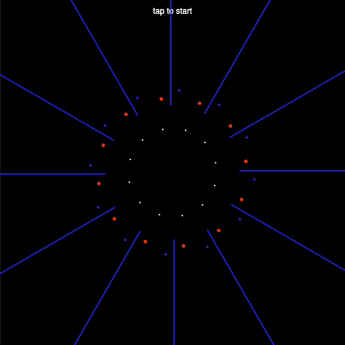

# Week 14

## Interaction beyond keyboard and mouse

For this week's task we're going to make an interactive audio-visualiser.  This worksheet is inspired by Yannis Yannakopoulos' [audio-visualisers](https://tympanus.net/Development/AudioVisualizers) so spend a bit of time playing with them first.  You'll notice that the location of the mouse cursor on the canvas allows you to interact with them, we'll also see how we can use input from the microphone and camera as other ways to interact with our audio-visualisers.

### Task 1 - Microphone input

If you are using a recent version of p5 you'll need to run a local server for this worksheet.  If you've forgotten how to do that you can check [here](https://github.com/processing/p5.js/wiki/Local-server).  When using a local server you may find that any changes you mkae to the code do not show up in the browser, this may be due to the browser cache and can be remedied with a hard refresh (Cmd+Shift+R on a Mac, and Ctrl+F5 on a PC).

Have a look at the [`p5.AudioIn`](https://p5js.org/reference/#/p5.AudioIn) example and get it working on your machine. You might want to make the canvas bigger as on this example it's really tiny. At the time of writing there was an issue with `p5.AudioIn` (in the latest version of p5.sound) and Firefox, so please use Chrome or Safari.

Notice in this example you are required to press the mouse cursor on the canvas before it starts working.  If you are using Chrome you'll notice there is a warning in the console about the AudioContext not being allowed to start.  This is to force developers to include a play button or such like so that users can choose to play a sound rather than it just blasting as soon as you open a webpage.  You can read more about it [here](https://developers.google.com/web/updates/2017/09/autoplay-policy-changes#webaudio).  One way to get around this is to call the [`userStartAudio()`](https://p5js.org/reference/#/p5/userStartAudio) function inside the `setup()` function.  In this example pressing the mouse cursor on the canvas calls `userStartAudio()`.

If you don't have a microphone on your computer you could instead just use an audio track for the audio input.  If this is what you're doing you can start from the code of this [`getLevel()` example](https://p5js.org/reference/#/p5.Amplitude/getLevel).

I'm going to base my audio-visualiser off of [Demo 3](https://tympanus.net/Development/AudioVisualizers/index3.html).  This example consists on rotating points and lines that move in time to the music.  

Notice that they all rotate around the centre of the canvas, so we need to change our point of origin using the `translate()` function.  Now let's use a for loop and the `rotate()` function to draw some [points](https://p5js.org/reference/#/p5/point) in a circle shape.  This is the code that I added to my `draw() function`:

```javascript
translate(width / 2, height / 2);

let noOfPoints = 12;

for (let i = 0; i < noOfPoints; i++) {
  rotate(TWO_PI / noOfPoints);

  strokeWeight(4);
  stroke(255);
  point(0, height/4);
}
```

Now I want to use the values coming in from the micrphone to move the points.  If you look at the code you'll see that the `getLevel()` function is being used to access the volume level (amplitude) coming into the microphone.  `console.log()` the values in the `micLevel` variable to the console while making some noises and see how they change.  Note that you'll have to tap on the canvas to start the audio before you see these values.  In particular look for the extremes. What are the values when there is only background ambience? What are the values when you make a loud clapping noise?

Next you'll need to use the `map()` function to map the minimum and maximum values from the microphone to the minimum and maximum values that you want the points to move to.

Your `draw()` function should now look something like the following:

```javascript
function draw(){
  background(0);
  fill(255);
  noStroke(); // so that the text below doesn't have a large stroke value
  text('tap to start', width/2, 20);

  let micLevel = mic.getLevel();
  let mappedMicLevel = map(micLevel, 0, 0.1, 0, 200); // map micLevel to desirable range

  translate(width / 2, height / 2); // move point of origin to centre of canvas

  let noOfPoints = 12; // total number of points to draw

  for (let i = 0; i < noOfPoints; i++) { // for all of the points
    rotate(TWO_PI / noOfPoints); // rotate around a circle - default for p5 is radians

    strokeWeight(4);
    stroke(255);
    point(mappedMicLevel, height/4);
  }

}
```

Now put some music on and watch those points dance!  You might need to adjust the values inside the map function depending on how loud your music is.  

Here is a screenshot of my end of Task 1 and a [link](https://simonemberton.panel.uwe.ac.uk/Week14/Task1/) to see it working.

<p align="center">
  
</p>


### Task 2 - Frequency Analysis

Let's try and develop this a bit further by applying some audio analysis to the incoming signal so that we can isolate the high, mid and low frequency bands rather than just overall amplitude.  The method of audio analysis we'll be using is the Fast Fourier Transform [FFT](https://p5js.org/reference/#/p5.FFT).  

First we need to create a new global variable called `fft` at the top of the `sketch.js` file.  Remember it's a global variable so it's outside of the `setup()` function.  Next at the end of the `setup()` function we'll make our `fft` variable equal to a new `p5.FFT` object and then set the input to `fft` to be the `mic` variable from the `p5.AudioIn` object using the following code:
```javascript
fft = new p5.FFT();
fft.setInput(mic);
```
Then inside the `draw()` function instead of calling `mic.getLevel()` we'll use the following code to get the frequency spectrum of the microphone signal:
```javascript
let spectrum = fft.analyze();
```
Now `console.log` the `spectrum` variable and see the output in the console. You'll need to comment out the rest of the code so that errors don't prevent the code from running.  You'll see in the console that the `spectrum` variable contains an array of length 1024 where each location in the array has a value between 0-255 which represents the amplitude at that slice of the frequency spectrum.

We could use the data from `fft.analyze()` to create some interesting visuals but instead I want to make use of fft's [`getEnergy()`](https://p5js.org/reference/#/p5.FFT/getEnergy) function to get the average values from predefined frequencies ranges, in particular the treble, mid and bass frequencies.  FYI we always have to use `fft.analyze()` before using `fft.getEnergy()`.  Add the following code:
```javascript
let treble = fft.getEnergy("treble");
let mid = fft.getEnergy("mid");
let bass = fft.getEnergy("bass");
```
Now print the values from the `treble`, `mid` and `bass` variables to the console. You'll see that we now have a value between 0-255 for each of the three frequency bands.  Let's draw circles of points for each of these frequency bands.  We need to use `map()` functions for each of the bands to map the values within appropriate ranges.  Here are what my `map()` functions look like:
```javascript
let mappedTreble = map(treble, 0, 50, 0, 200); 
let mappedMid = map(mid, 0, 255, -100, 100); 
let mappedBass = map(bass, 0, 255, -200, 0);
```
Next inside the for loop add more `point()` functions so that we've got one for each frequency band, where the `x` location of each `point()` takes a mapped frequency band as the input. I've made mine a different colour too so that you can see the difference:
```javascript
// treble
strokeWeight(6);
stroke(255,0,0);
point(mappedTreble, height/4);

// mid
strokeWeight(4);
stroke(0,0,255);
point(mappedMid, height/4);

// bass
strokeWeight(6);
stroke(255);
point(mappedBass, height/4);
```
Now you should be able to see each of the points reacting slightly differently to different parts of the music.  If you can't see all three points try adjusting the map function values so that it works well for you.

Let's make those differences a bit more pronounced by adding a scaling factor to each of the circles of points.  We'll create some more `map()` functions so that we have a bit more control over the exact values to use.
```javascript
let scaleTreble = map(treble, 0, 50, 0.8, 1.2); 
let scaleMid = map(mid, 0, 255, -0.9, 0.9); 
let scaleBass = map(bass, 0, 255, -1, 1);
```

We'll then use these mapped scaling variables as input to the [`scale()`](https://p5js.org/reference/#/p5/scale) function for each of the circles of points.  This function scales from the point of origin, so moves the points further from the centre.  We need to isolate the scaling and point functions for each of the frequency bands so that they don't interfere with each other, for that we'll use `push()` and `pop()` to make the drawing of each circle of points self contained.  For example:
```javascript
// treble
push();
  strokeWeight(2);
  stroke(255,0,0);
  scale(scaleTreble);
  point(mappedTreble, height/4);
pop();

// mid
push();
  strokeWeight(3);
  stroke(0,0,255);
  scale(scaleMid);
  point(mappedMid, height/4);
pop();

// bass
push();
  strokeWeight(4);
  stroke(255);
  scale(scaleBass);
  point(mappedBass, height/4);
pop();
```
Now we're getting somewhere.

Here is a screenshot of my end of Task 2 and a [link](https://simonemberton.panel.uwe.ac.uk/Week14/Task2/) to see it working.

<p align="center">
  
</p>

### Task 3 - Camera input

At the moment we've got some visual elements reacting to the audio input but it would be good to make the piece a bit more interactive to the user.  For this task we'll use input from your web camera to capture movement and then use this data to influence parameters of the visualisation.  If you don't have a web camera feel free to skip this task and try and use the location of your mouse cursor (e.g. `mouseX`, `mouseY`) to influence some parameters instead.

To start with we're going to make use of an external library for p5 to get some extra functionality.  If you go to [this](https://p5js.org/libraries/) page you'll see that quite a few external libraries have been written by the p5 community.  The library we want to use is called [Vida](https://www.tetoki.eu/vida/) (it's near the bottom of the page).  Vida is a simple library that adds camera (or video) based motion detection and blob tracking functionality to p5js.  The library allows motion detection based on a static or progressive background.  We're going to be making use of the motion detection based on a progressive background.  You can see the example working [here](https://www.tetoki.eu/vida/progressive_background_camera.html).  Notice in the bottom right threshold image any pixels that change between frames are displayed in white and any that don't change are black.  We're going to use the number of white pixels in each frame as an indication of movement and as an input to our visualisation.

First let's start off by creating a new p5 project (e.g. by copy pasting the empty example folder).

To make this library work we need to add a link to the code in our `index.html` file.  Specifcially add the following line after the link to the p5.js file:
```html
<script src="https://tetoki.eu/vida/vida/p5.vida.min.js"></script>
```

Now copy paste the following code to replace the content of your `sketch.js` file:
```javascript
let myCapture; // camera
let myVida;    // VIDA

function setup() {
  createCanvas(320, 240);
  myCapture = createCapture(VIDEO);
  myCapture.size(32, 24);
  myCapture.hide();
    
  myVida = new Vida(this); // create the vida object
  myVida.progressiveBackgroundFlag = true; // Turn on the progressive background mode.
  
  // The value of the feedback for the procedure that calculates the background
  // image in progressive mode. The value should be in the range from 0.0 to 1.0
  // (float). Typical values of this variable are in the range between ~0.9 and
  // ~0.98.
  myVida.imageFilterFeedback = 0.92;
    
  // The value of the threshold for the procedure that calculates the threshold
  // image. The value should be in the range from 0.0 to 1.0 (float).
  myVida.imageFilterThreshold = 0.15;

  frameRate(30); // set framerate
}

function draw() {
  background(120);
  myVida.update(myCapture);
  image(myVida.thresholdImage, 0, 0);

  // count the number of pixels that change on each frame
  let whiteCount = 0;
  for (let i = 0; i < myVida.thresholdImage.pixels.length; i++){
    if(myVida.thresholdImage.pixels[i] == 255){
      whiteCount = whiteCount+1;
    }
  }
    
  // console.log(whiteCount);
  let mappedMovement = map(whiteCount, 768, 1400, 0, width);
  // console.log(mappedMovement);
  ellipse(mappedMovement, height/2, 10);

}
```

If you run this code you should see a very small thresholded image in the top left corner of the canvas (I've made it this size so that we don't have to process too many pixels, which can be quite processor intensive).  In the for loop we're going through all the pixels in the thresholded image, counting the ones that are white in the `whiteCount` variable.  If you `console.log()` `whiteCount` you'll get an idea of the minimum and maximum values to expect when there is little movement versus a lot of movement.  You might need to change the `myVida.imageFilterThreshold` value in the `setup()` if you need to change the sensitivity of your thresholded image.  

`whiteCount` is calculated for each frame (notice that `frameRate` is set to 30fps) and then we use the `map()` function to map the values in `whiteCount` to be between zero and the width of the canvas.  This mapped value `mappedMovement` is then used to draw an ellipse.

Here is a screenshot of this code running and a [link](https://simonemberton.panel.uwe.ac.uk/Week14/Task3_1/) to see it working.

<p align="center">
  
</p>

Now try and incorporate the Vida code into your audio-visualiser.  Once you've copied over all the code that you need (don't forget to link to the Vida library in the `index.html file`) try using the `mappedMovement` variable to draw new shapes in the scene.  In my example I've used it to draw lines using the following code:
```javascript
strokeWeight(2);
line(mappedMovement, height/4, mappedMovement, height);
```

Here is a screenshot of the end of Task 3 and a [link](https://simonemberton.panel.uwe.ac.uk/Week14/Task3_2/) to see it working.

<p align="center">
  
</p>

### Task 4 - Finishing touches

The audio-visualiser is nearly there but I want to add a few finishing touches as it still feels a bit static.  

First I'm going to add rotations to each of the frequency band shapes which uses the constantly increasing `frameCount` value to drive the rotation.  Then I'll use values from the scaled frequency bands to modify the rotation speed of the shapes.  I'm also going to use values directly from frequency bands to change the colour of the points.  For this I've taken the value from 255 so that the value stays high as the default.

The code for drawing the shapes now looks like this:
```javascript
// treble
push();
  strokeWeight(6);
  stroke(255-treble,0,0);
  scale(scaleTreble);
  rotate(-frameCount * scaleTreble/100);
  point(mappedTreble, height/4);
pop();

// mid
push();
  strokeWeight(4);
  stroke(0,0,255-mid);
  scale(scaleMid);
  rotate(frameCount * scaleMid/100);
  point(mappedMid, height/4);
  strokeWeight(2);
  line(mappedMovement, height/4, mappedMovement, height);
pop();

// bass
push();
  strokeWeight(6);
  stroke(255-bass);
  scale(scaleBass);
  rotate(-frameCount * scaleBass/100);
  point(mappedBass, height/4);
pop();
```

Finally I'm adding slight trails to the whole visualisation by putting some transparency on the `background()` function at the top of `draw()` like this:
```javascript
background(0,150);
```

Here is a screenshot of the end of Task 4 and a [link](https://simonemberton.panel.uwe.ac.uk/Week14/Task4/) to see it working.

<p align="center">
  
</p>
