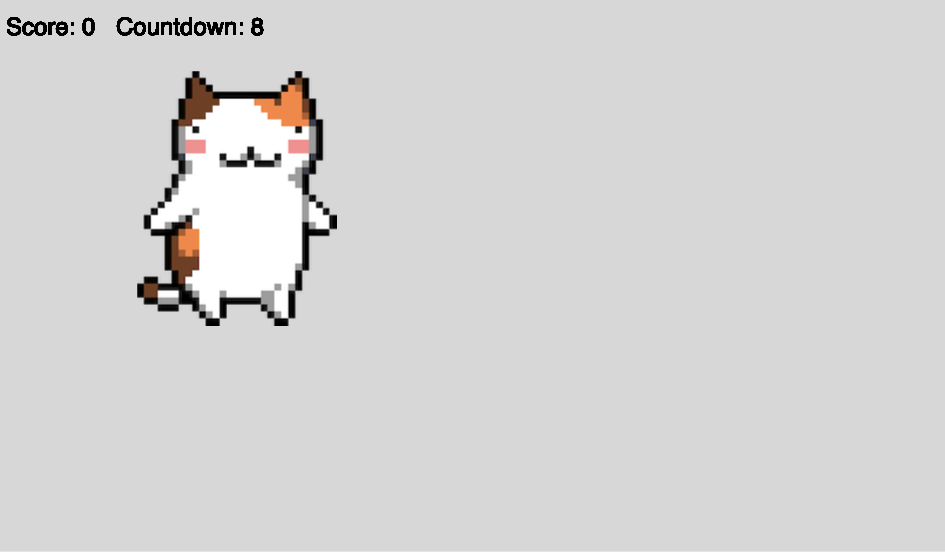

# Week 15

## Simple Game Exercise

This exercise leans heavily on [this tutorial](https://kellylougheed.medium.com/make-your-first-game-with-p5-js-38bfb308a671) by Kelly Lougheed. So credit goes to her for the idea and most of the implementation!

We're going to be creating a game where we have to click on randomly appearing circles. It's basically a minimal geometric version of whackamole.

[This](https://roddickinson.net/code-test/whackamole/) is what we're going to be making. 

  

Please use your flow chart to work out how to break down the tasks.

**Where code is provided, please write it out and do not copy and paste.**

*****
### Task 1 - Creating The Scene and  Drawing a Random Circle

Initially we will use a circle rather than an image - first of all we're going to draw a random circle on the screen every second, as that is our main game mechanic here. 

Create a new empty sketch with correct folder structure so that it has the p5 libraries and functions properly when you open index.html.

Open the sketch.js file in your newly created project and declare some global variables at the top:

```javascript
let x, y;
let radius = 100;
let r,g,b;
let timer = 10;
let interval = 60;
```

Now let's update our setup function so that our canvas will fill our entire browser window (using windowWidth and windowHeight refer to).   

We'll also choose our first random position (x, y) and first random colour (rgb), which will take the form of RGB values. We will also set the background colour.

```javascript
function setup() {
  createCanvas(windowWidth, windowHeight);
  background(220);
  x = random(windowWidth);
  y = random(windowHeight);
  r = random(255);
  g = random(255);
  b = random(255);
}
```


In the draw function ensure we are drawing a new circle every second. Take some time to look at frameCount and the modulus (%) operator, how they are functioning in this code block. More information about the modulus operator can be found [here](https://blog.mattclemente.com/2019/07/12/modulus-operator-modulo-operation.html).

```javascript
function draw() {
  fill(r, g, b); // create a colour fill with out random rgb values
  if (frameCount % interval == 0) { // if the frameCount is divisible by the interval, then the interval (in seconds) has passed and we can draw a new circle
    console.log("new circle!");
    background(220); // set background 
    ellipse(x, y, radius*2, radius*2); // draw a circle
  }
}
```
*****
### &#x1F536; Task 2 first code challenge:  

```diff
! Add a function in sketch.js underneath the draw function so that your circle is drawn:  
! 1. With a different colour (rgb)
! 2. And in a different location (x, y)  
! Call your function newValues() 
! Call / execute the function before the ellipse / circle is drawn.  
! Tip: set the global variables in the function
```


*****
### Task 3 - Mouse Interaction / Collision Detection

Well done, now we have a circle being drawn every second in a different place. What happens if you change the interval variable to 120? What happens if you change the interval variable to 30?

So we have our basic operation timing drawing a random circle around our canvas. Now we need a way of knowing whether we've actually successfully clicked on the circle.

In order to that we can use the handy [dist() function](https://p5js.org/reference/#/p5/dist) to help us calculate the distance between two points. Those points (the location of the mouse and the location of the cirle) both have X and Y values, so dist() takes four arguments.

Then all we need to do is check whether our variable d which holds the distance between those points, is less than the radius variable and hey presto, we know whether our mouse has collided with our circle.

So, **underneath the draw function but above the newValues function** add our mousePressed function:

```javascript
function mousePressed() {
  let d = dist(mouseX, mouseY, x, y); // find the distance between where the mouse is when pressed and our x and y values
  if (d < radius) { // is the distance smaller than the radius of the circe?
    newValues(); // create a new circle
    console.log("Score!"); // log that we've been successful - we'll update this bit later.
  }
}
```
*****
### Task 4 - Keeping Score

Now let's add scoring, as this is going to be useful to see how well we're doing when we're playing the game. 

At the top our sketch, just beneath our other global variables, let's add a score variable:

```javascript
let score = 0;
```


Now let's show our score on screen. In our draw function **just underneath where we set the fill** let's add some text to show the score in the top left hand corner:
```javascript
textSize(24);
textAlign(LEFT, CENTER);
text("Score: " + score, 10, 30);
```

Now let's update the if statement in our mousePressed function, so that it increments the score each time we manage to click on a circle. Not that all we are doing here is replacing our 
<code>console.log("Scored!")</code> statement with <code>score++;</code>

```javascript
if (d < radius) { // is the distance smaller than the radius of the circe?
    newValues(); // create a new values for the next circle
    score++; // log that we've been successful - we'll update this bit later.
}
```
Cool, now we have an increasing score!

*****
### Task 4 - Countdown Timer


Now let's add the countdown timer text next to our score in the top left hand corner.   
You have already created a global variable called ```timer```   

Let's add some text so that the value of the ```timer``` variable is hown on the screen.  
Add this **just underneath where we have the text showing score in the draw function**:

```javascript
text("Countdown: " + timer, 120, 30);
```

Now, **still in the draw function**, let's add to the if statement so we decrease the timer each time our interval has passed:

```javascript
if (frameCount % interval == 0) { // if the frameCount is divisible by the interval, then the interval (in seconds) has passed and we can decrement timer 
    timer --;
    background(220); // set background to grey
    newValues();
    ellipse(x, y, radius*2, radius*2); // draw a circle
}

```
You should now be able to see your timer count down. And the circles will stop being drawn once the timer reaches 0.

*****
### &#x1F536; Task 5 - Game Flow / Game Over - Second code challenge

Now, here's a bit of a tricksy bit. And there is where we want you to get thinking about the logic of how to create a simple flow of the game. Our desired outcome is that we:

- Count down from 10 to 0 (we're already doing this bit).
- When we reach 0 on the timer, we set a **boolean flag** called <code>gameOver</code> to true.
- If <code>gameOver</code> is true, then we stop drawing circles and display some text saying "Game Over" **in the centre of the screen**. [Hint](https://p5js.org/reference/#/p5/textAlign)

So, all we're going to give you for now, is the fact that we need to declare a global variable at the top of the sketch called <code>gameOver</code>:

```javascript
let gameOver = false;
```
```diff
! Have a think. Try some things out. I guess you're going to need some if statements.   
! Where would they go? What conditions do they need to test?  

! You should aim to spend approximately 20-30 minutes on this challenge. 
! It's tricky! ask us for some help if you want to talk your ideas over.   
! Do this before looking at the solution!
```

See the Answer / solution for the final code.  

*****
### Task 6 - Restart

As you'll see, once we get to our "Game Over" screen. There's currently no way back to start the game again other than to refresh the page, which isn't so great.

That means we also need to update our mousePressed function with a similar if statement structure to our draw function.

So we want to:

- test if our game is over or not.
- If it isn't, we want to increment the score.
- Also redraw the background so that the text / numbers don't overlay and that the circle dissapears when you click it.  

- If the game is over, we want to be able to click near the centre of the canvas, where the "Game Over" text is, to reset the timer, score and <code>gameOver</code> boolean flag.

You should be spending around 15 minutes on this before checking our solution. Same goes again if you are doing this worksheet in the timetabled session, ask for some help or to talk your ideas over. Only look at the dropdown after you have spent time trying to work out the problem using your logic skills.

<details>
<summary>Want to see the code?</summary>
<br>
This is what our mousePressed function looks like:
<br><br>
<p>
  
```javascript
function mousePressed() {
  if (!gameOver) {
    let d = dist(mouseX, mouseY, x, y); // find the distance between where the mouse is when pressed and our x and y values
    if (d < radius) { // is the distance smaller than the radius of the circle?
      console.log("Score!"); // log that we've been successful 
      score++; // log that we've been successful - we'll update this bit later.
      background(220);
    }
  }
  else {
    let d = dist(mouseX, mouseY, windowWidth/2,  windowHeight/2);
    if (d < radius*2) {
      gameOver = false;
      timer = 10;
      score = 0;
      background(220);
    }
  }
  
}
```
</p>
</details>

Woohoo well done, you've got a super simple minimal geometric game structure now!

### &#x1F536; Task 7 - Using images - Third Code Challenge

```diff
! Replace the circle with an image (like my 8 bit cat)   
```

### &#x1F536; Task 8 - Playability - Fouth Code Challenge

```diff
! Can you make the game harder to play the more the score increases?  
! Can you make the game harder to play over time? Perhaps look at the interval variable?  
! Pick one of these to implement.  
! Test out your code in the console.  
```

### &#x1F536; Task 9 - Playability - Fifth Code Challenge

```diff
! Can you make the game incrementally harder to play on restart after 'Game Over'?  
! Perhaps change the background colour to indicate a 'new round'.   
! Can you make the game harder to play over time? Perhaps look at the interval variable?  
```

### &#x1F536; Task 10 - Complexity - Sixth Code Challenge

```diff
! Can you add another shape image that loses you points if you click it by mistake?  
```

