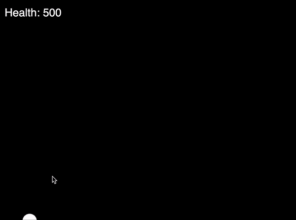
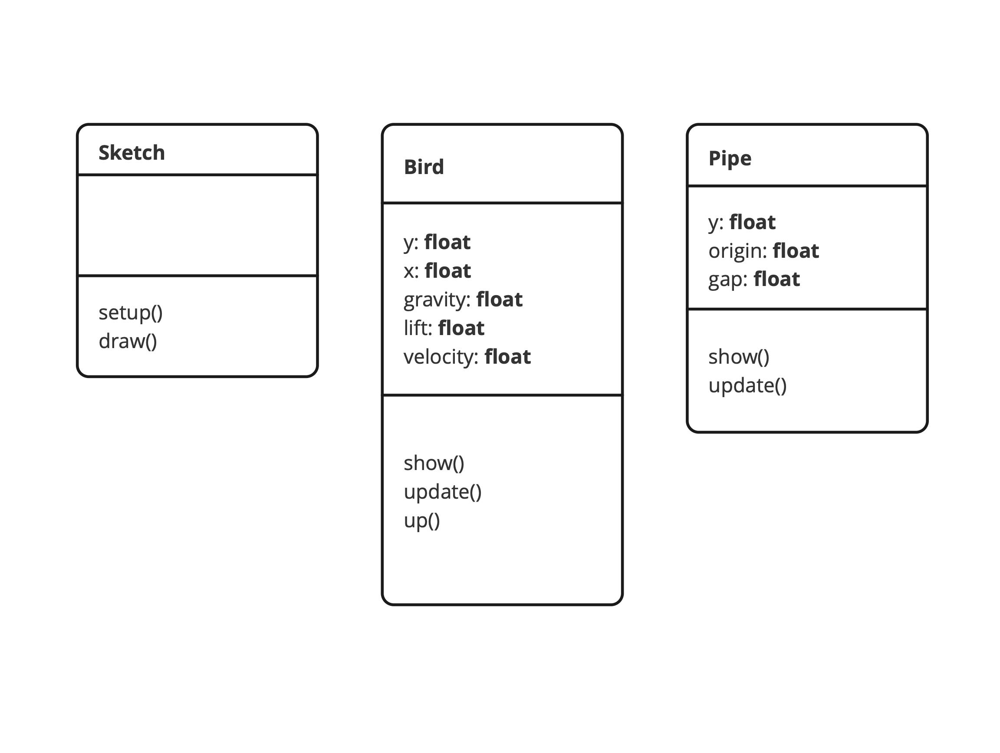
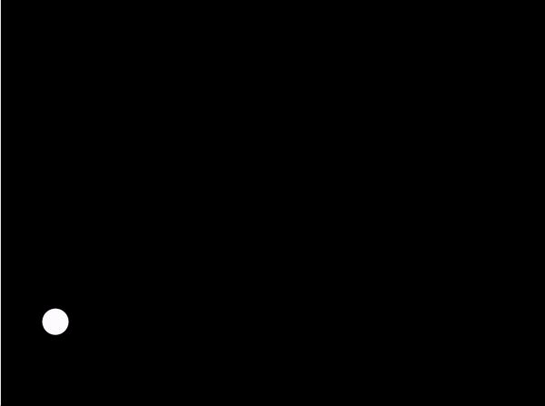
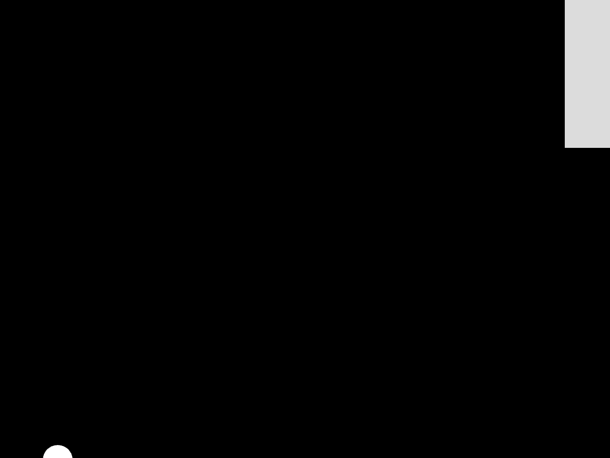
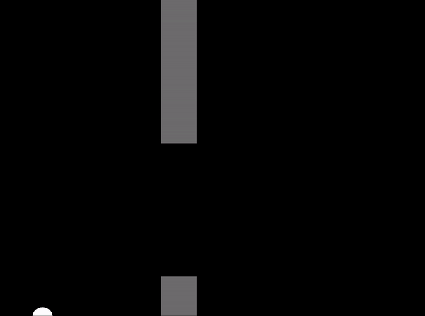
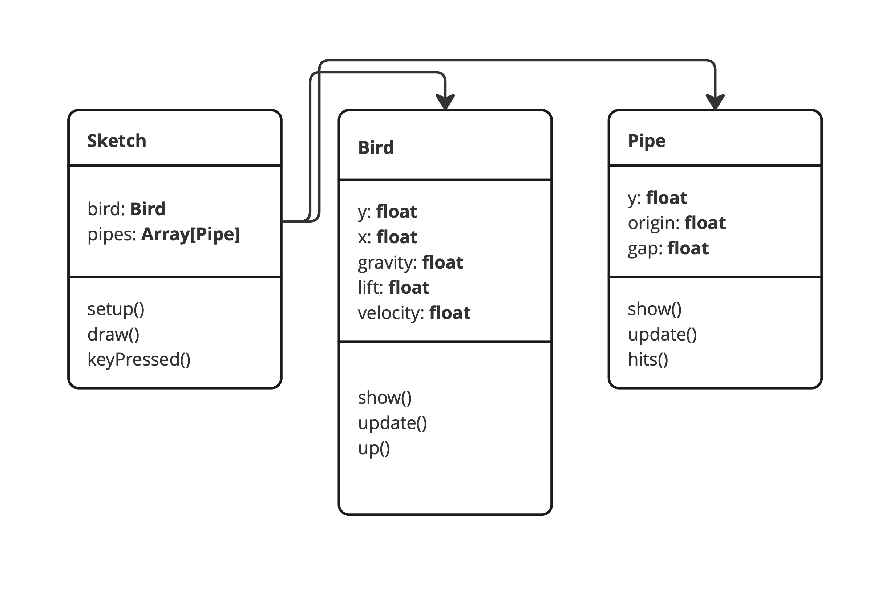

# Week 16

## A More Complex Game Exercise

This exercise leans heavily on [this tutorial](https://thecodingtrain.com/tracks/games/31-flappy-bird) by Dan Shiffman. So credit goes to him for the idea and most of the implementation! Our aim for this session is to demonstrate how we can use simple interaction design (a single spacebar key press) to create an engaging experience with multiple "states". 

We're going to create a very simple minimal version of [Flappy Bird](https://flappybird.io/), but our version is going to:

 - Have a health value that decreases when you hit a pipe. 
 - (Possibly) have an interaction mechanic changes increases the level of difficulty over time.

  

For this week's tutorial, we are going to work with some starter code. This is because we want to demonstrate a few particular concepts. If you would like to understand more about how all the code works, please do watch the Shiffman tutorial linked above after you've followed this worksheet. 

Please download and work from the Flappy-Bird-handout-code.zip file in the Blackboard Learning Materials section for this week. Unzip the folder and place it in new P5 empty example folder. Save it with all your other Introduction to Creative Coding materials.

*****
### Task 0 - Familiarisation

The files here shouldn't be new to you by now. It's our standard empty example. But you'll see that there are some extra files here. 

  

As we learned about UML Class diagrams two weeks ago, based on the image above, this could help you quickly understand the current structure of the project.

If you take a deeper look in ```index.html``` and see that we're using the script tags to include the ```pipe.js``` and ```bird.js``` files. Please be aware! When the web browser is loading JavaScript. It will load in the exact order of how you code them. If you load the ```sketch.js``` before loading the ```pipe.js```, the Web Inspector will complains something is not found.

Now also open the bird.js file. Take a look through the code and see what's going on, can you work out what they are going to do? And how we're going to use them? Try adding comments to explain the parts that you do understand. 

No worries if it's a bit unclear right now though, all will be revealed as we get making our game...

*****
### Task 1 - The Bird

#### Setting Up
First we are going to make the bird (which is just a circle / ellipse) using the ```Bird()``` constructor in bird.js.   

Open your sketch.js file. This is just a blank sketch with our setup() and draw() functions. add ```bird``` variable and use the ```Bird()``` constructor to make a ```new Bird()```:

```javascript
let bird;

function setup() {
  createCanvas(640, 480);
  bird = new Bird();
}

function draw(){
  background(0);
  bird.show();
  bird.update();
}
```
You should have a bird / ellipse on your screen.  

Now you need to make the bird jump on a press of the space bar.  
To do this you will use ```bird.up()``` one of the functions in the bird constructor.  

*****
### &#x1F536; Task 1 first code challenge:  

```diff
! Add a function in sketch.js underneath the draw function that catches the space bar being pressed:  
! Output a message to the console every time the space bar is pressed
! Add bird.up() to the function to make the bird / ellipse jump.
! Tip: search for mouse pressed in the p5 reference
``` 

Your bird / ellipse should now jump up and down.

  


*****
### Task 2 - Create a single Pipe

Next we will create the first pipes.  
in pipe.js I have made the first part of the constructor for you.  

We will start by making one set of Pipes that move across the screen. Then we will make multiple pipes.  

#### Draw the pipe

To draw the first pipe make a new pipe variable, and use the constructor make a ```new Pipe()``` show it and update it.  

Sketch.js should look like this:

```javascript
let bird;
let pipe; // create a new variable

function setup() {
  createCanvas(640, 480);
  bird = new Bird();
  pipe = new Pipe(); // use the constructor to make a new Pipe() & assign to the pipe variable
}

function draw(){
  background(0);
  bird.show();
  bird.update();
  pipe.show(); // show the pipe
  pipe.update(); // update the pipe
}


function keyPressed() {
  if (key == ' ') {
    console.log("pressed space");
    bird.up();
  }
}
```
Your sketch should show the first two pipes with hard coded values.   

  

*****
### &#x1F536; Task 2 second code challenge:  

```diff
! In pipe.js
! Make the Pipe move across the screen using the update() function in pipe.js
``` 

*****
### &#x1F536; Task 2 third code challenge:  

```diff
! In pipe.js
! Randomnly generate the two heights of the two pipes.
! Make sure there is a still a gap between them...
! Tip: make use of the variables this.x, this.origin, this.gap
! Tip there are lots of ways to do this!
``` 

Your bars should move across the screen! (look at the answer if you are stuck).   

*****
### Task 3 - Create a Pipe every 400 frames

Now we have a pipe being created by the ```Pipe()``` constructor we need to create pipes constantly so that there is a flow of them moving across the scene.  

The easiest way to do this is to make an array of pipes in sketch.js and add to it as the game progresses.

```let pipes = [];```

We will create a pipe every 400 frames using the modulus operator (we used it last week).  
Then we will ```show()``` and ```update()``` each pipe.  

All of this will happen in sketch.js in draw()  
I've commented out the earlier lines ```pipe.show()``` and ```pipe.update()``` because these are now handled by the ```for`` loop.   

```javascript
function draw() {
  background(0);
  bird.show();
  bird.update();
  i++
  if (frameCount % 400 == 0) {
    //console.log(frameCount);
    pipes.push(new Pipe());

  }

  for (var i = 0; i < pipes.length; i++) {
    pipes[i].show();
    pipes[i].update();
  }

  //pipe.show();
  //pipe.update();

}
```


At this point you should have a version of Flappy bird that almost works and you can hop through the gaps between bars...   


  


Spend some time tweaking the variables in ```Bird()``` bird.js to make it more playable...   
Especially:

```javascript
this.gravity = 0.6;
this.velocity = 0;
this.lift = -8;
```

*****
### Task 4 - The hit area

To make the game playable we need to see when collide with a bar...  

To do this we need to add quite a bit to pipe.js...   

Determine the top and bottom of the gap.  
Check if the bird is within top or bottom AND  with the width of the bar.  

For now we will ```console.log()``` a hit.  

Amend pipe.js and sketch.js as following.  

pipe.js should look this - read my comments *very* carefully:

```javascript
class Pipe
{
  constructor()
  {
    // Initialse a Pipe Object
    this.x = width-50;
    this.origin = random(height-100);
    this.gap = 200;
    // add a width for your bars
    this.w = 55;
    // add the top of the gap
    this.top = this.origin - (this.gap/2);
    // add the bottom of the gap
    this.bottom = this.origin + (this.gap/2);
    // set a boolean for a hit
    this.highlight = false;
  }

  // Detect if the bird hits the pipe
  hits(bird)
  {
    if (bird.y < this.top || bird.y > this.bottom) {
      if (bird.x > this.x && bird.x < this.x + this.w) {
        this.highlight = true;
        return true;
      }
    }
    this.highlight = false;
    return false;
  }

  // Show the pipe
  show()
  {
    fill(220);
    // rect(x, y, w, h);
    fill(120);
    // top bar with this.w and this.top
    rect(this.x, 0, this.w, this.top);
    // bottom bar with this.w and this.bottom 
    rect(this.x, this.bottom, this.w, height);
  }

  // Update the pipe to move to the left
  update()
  {
    this.x --;
  }
}
```
In sketch.js you only need to add an if statement to test if the pipe has been hit.  
```javascript
if (pipes[i].hits(bird)) {
  console.log("HIT");
}
```

sketch.js should look this - read my comments *very* carefully:

```javascript
let bird;
let pipe;
let pipes = [];

function setup() {
  createCanvas(640, 480);
  bird = new Bird();
  pipe = new Pipe();
}

function draw() {
  background(0);
  bird.show();
  bird.update();
  if (frameCount % 400 == 0) {
    //console.log(frameCount);
    pipes.push(new Pipe());
  }

  for (var i = 0; i < pipes.length; i++) {
    pipes[i].show();
    pipes[i].update();

    // if the current pipe hits the bird using hits() in pipe.js
    if (pipes[i].hits(bird)) {
      console.log("HIT");
    }
  }
  // commented out the old use of pipe.show() and pipe.update()
  //pipe.show();
  //pipe.update();

}


function keyPressed() {
  if (key == ' ') {
    console.log("pressed space");
    bird.up();
  }
}
```

Since we had made a few changes of the code. The updated UML diagram below will help us understand the current structure of our project.

  

*****
### Task 5 - Add a 'health' coefficient

Now lets add a score or 'health' coefficient for our bird.  
Perhaps it starts with 500 points and loses one for every hit (each bar could result in 55 hits).  

This can all be done in sketch.js with a new health variable...

```let health = 500;```  

*****
### &#x1F536; Task 5 fourth code challenge:  

```diff
! In sketch.js
! Add a health variable that counts down from 500.
! Add text on the screen to display health.
! Tip: Look at the way we displayed and incremented score last week...
``` 

If you got this far well done!

*****
### Task 6 - Add a switch statement or finite state machine

The final task is to switch functions based on the health variable.  

We'll make two functions in sketch.js.   
```runGame()``` that contains all our current code in ```draw()```.   
```gameOver()``` that contains a Game over screen when health is less than 1.  

Then make a level variable  
```let level = 1;```   
The initial level (1) will run the game.  

Using a ```switch()``` statement we will run either function.   

So ```draw()``` will look like this:

```javascript
function draw() {
  if (health < 1) {
    level = 0;
  }
  // switch statement
  switch(level) {
    case 0:
      gameOver();
      break;

    case 1:
      runGame();
      break;
  }
}
```

The whole of your sketch.js should now look like this:

```javascript
let bird;
let pipe;
let pipes = [];
let health = 500;
let level = 1;

function setup() {
  //frameRate(2);
  createCanvas(640, 480);
  bird = new Bird();
  pipe = new Pipe();
}

function draw() {
  if (health < 1) {
    level = 0; // change levels
  }
  // switch statement
  switch(level) {
    case 0:
      gameOver();
      break;

    case 1:
      runGame();
      break;
  }
}

// run the game function
function runGame() {
  background(0);
  bird.show();
  bird.update();
  if (frameCount % 400 == 0) {
    //console.log(frameCount);
    pipes.push(new Pipe());

  }

  for (var i = 0; i < pipes.length; i++) {
    pipes[i].show();
    pipes[i].update();

    if (pipes[i].hits(bird)) {
      console.log("HIT");
      health --;
    }
  }
  // add the health text
  fill(255);
  textSize(24);
  textAlign(LEFT, CENTER);
  text("Health: "+health, 10, 30);
}

// game over function
function gameOver() {
  console.log("gameOver");
  background(0);
  fill(255);
  textSize(100);
  textAlign(CENTER, CENTER);
  text("GAME OVER", width/2, height/2);
}

// press space bar
function keyPressed() {
  if (key == ' ') {
    bird.up();
  }
}
```

*****
### &#x1F536; Task 7 fifth code challenge:  

```diff
! Change the circle / ellipse to an icon (it might not be a bird).
! Change the background to an image.
! Add a restart to game over, the resets the health and other relevant variables
! Add another level that increaseses the difficulty
! Fix my bug in hits() !!!!
``` 


