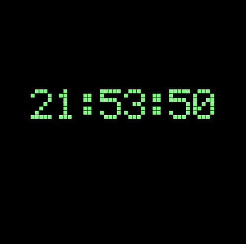
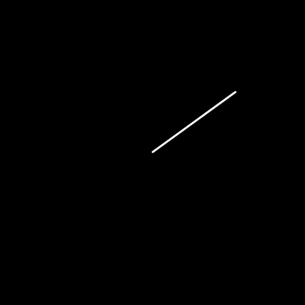

# Week 16

## Recap week

This week we're going to revisit some of the key principles that you have explored over the last weeks with a series of code challenges that use principles we have already covered...  

In these exercises you will generate the code from scratch.  

Team up with someone and discuss your approach. Share your solutions as you progress.  
Be resourceful, find solutions from multiple sources (your own knowledge, previous sessions, online etc)

Create a new p5 sketch. Structure your ```sketch.js``` as follows: 

```javascript
function setup() {
  createCanvas(500, 500);
}

function draw() {
  timer();
}
```
**DO NOT** add anything else to  ```setup()``` or ```draw()``` (But you may add as many variables and functions as you need) 

*****
### &#x1F536; Code challenge 1: Using states, switch statements, modulus and functions  

```diff
! Create a new p5 sketch that displays a countdown from 45 to 0.
! Countdown 1 digit every 60 frames.
! Use a switch statement to switch to a different state at 0.
```
<details>
<summary>Tip:</summary>
The modulus operator may help you with this task.
</details>  

*****
### &#x1F536; Code challenge 2: Using states, switch statements, time and functions  

```diff
! Amend your countdown so that it uses seconds.
! Countdown 1 digit at every second (not every 60 frames).
! Use a switch statement to switch to a different state at 0.
```

To get the current second use ``second()``  
<details>
<summary>Tip:</summary>
https://p5js.org/reference/#/p5/second  
</details>  

*****
### &#x1F536; Code challenge 3: Create a digital clock / Using functions and time
<p align="center">

</p>

Create another new p5 sketch. Structure your ```sketch.js``` as follows: 

```javascript
let myCustomFont;

function preload() {
  myCustomFont = loadFont('electronic-highway-sign.TTF');
}

function setup() {
  createCanvas(500, 500);
}

function draw() {
  clock();
}
```
**DO NOT** add anything else to ```preload()``` ,  ```setup()``` or ```draw()``` (But you may add as many other variables and functions as you need) 

### The challenge 
```diff
! Create a function that displays the time in text.
! Hours Minutes Seconds.
! Like a digital clock.
! Use an appropriate font.
```

To get the current minutes and hours use ``minute()`` and ```hour()```  

<details>
<summary>Tip:</summary>
I used a font that looks like it is made of pixels...    

here:  
https://www.dafont.com/electronic-highway-sign.font  
You can use whichever font you like. 
</details>  

*****
### &#x1F536; Code challenge 4: Create an alarm for your digital clock / Using switch and conditionals  

```diff
! Use a switch statement to visually change the clock to a different state at a set time.
! If... hour, minute and second.
! Like an alarm clock.
```

*****
### &#x1F536; Code challenge 5: Create the minute hand of a clock / Using rotation and angles

<p align="center">

</p>

```diff
! Create a line that rotates around the centre of your canvas every second.
! Like the minute hand of a clock.
```

<details>
<summary>Tip:</summary>
Use map() and rotate()  

Be ruthless, find the answer in any way you can...   

</details> 
