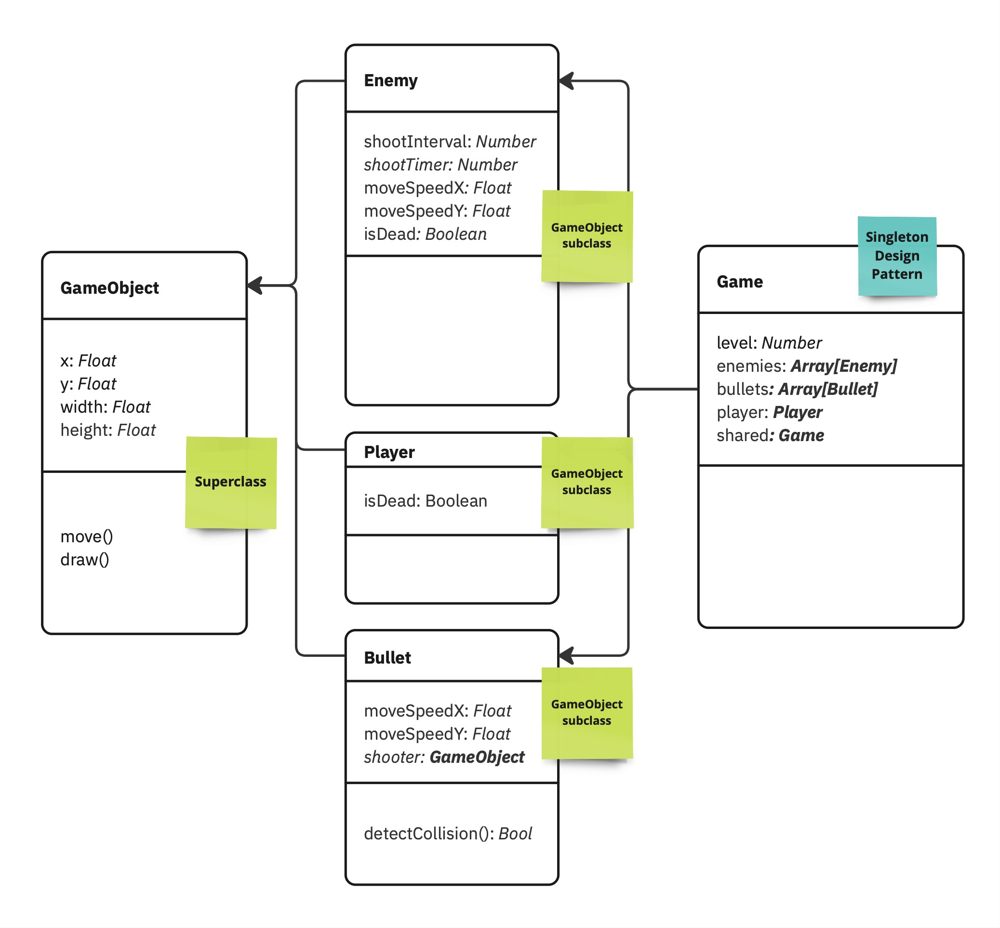
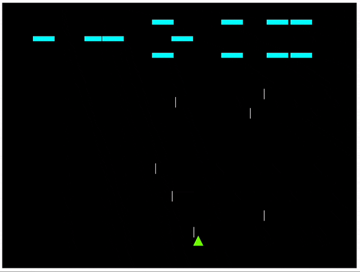
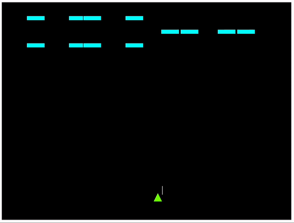

# Week 17 - Object-Oriented Programming with Space Invaders!

Since we learned **Object-Oriented Programming** in the previous three weeks. Let's put our new knowledge into practice! This week, we are going to create a simplified game with p5.js, inspired by one of the most iconic video games in history: [Space Invaders](https://en.wikipedia.org/wiki/Space_Invaders)

  

*****
### Task 0 - Familiar with the Class Diagram of our game project

As you are now more comfortable to work with the Class Diagram. Before we start coding, let's take a few minutes to **look** at the Class Diagram below, to understand the structure of our game project. To complete this project, you need to create 5 classes, including:



- `Game`, a **singleton** Class where we stored data, including `level`, `health`, `enemies`, `bullets` and `player`.
- `GameObject`, is a **superclass** where we store, `x`, `y`, `width`, and `height` properties.
- `Enemy`, `Player` and `Bullet` are **subclass**es of `GameObject`, they share the same properties as `GameObject`. However, the implementation of their `move()` and `draw()` are different.

If you fully understand the game structure, let's move to the next step!

*****
### Task 1 - Bootstrapping your project

#### 1. Download the template

1. Firstly, let's download and extract our [space invaders template](./space_invaders_template.zip).
2. Next, let's drag and drop the extracted folder into Visual Studio Code
3. Use [Live Server](https://marketplace.visualstudio.com/items?itemName=ritwickdey.LiveServer) to open your sketch in a web browser.

#### 2. Creating `GameObject.js`

Before we start coding the `sketch.js`, let's focus on creating the Superclass `GameObject.js`!


According to the Class Diagram above, the `GameObject` needs to keep 4 properties and 2 functions. Please open the `gameObject.js` file and complete it with the code as follows:

```javascript
class GameObject
{
  constructor(x, y, width, height)
  {
    this.x = x;
    this.y = y;
    this.width = width;
    this.height = height;
  }

  move()
  {
    // The GameObject will not move itself, so let's leave it empty;
  }

  draw()
  {
    // Draw a Red Circle to represent a GameObject.
    fill('red');
    rect(this.x, this.y, this.width, this.height);
  }
}
```

#### 3. Creating the `sketch.js`

Next, let's create `sketch.js`. Let's start from this simple template with a `GameObject` instance as follows:

```javascript

let gameObject = new GameObject(320, 420, 20, 20);

function setup() 
{
  createCanvas(640, 480);
}

function draw() 
{
  background(0);
  gameObject.draw();
}
```

If everything works well, we will see a red rectangle inside the canvas.


*****

### Task 2 - Creating `Player` Class


#### 1. Inherit from `GameObject`

As the Diagram demonstrated, inside the `player.js` file, the `Player` Class is inherited from its superclass `GameObject`, therefore, we need to use the statement `extends` to create the `Player` class. 

Since the `Player` class is inherited from the `GameObject` class, we just need to add new variables of `Player` on top of `GameObject`. How good is that! 🥳

```javascript
class Player extends GameObject
{
  isDead = false;
}
```

#### 2. Overriding `draw()`
However, we should create different looks between the spaceship and the enemies. We need to create a custom look for the player by **overriding** the `draw()` function inside the `player.js` file, which we inherit from its superclass `GameObject`. 

To make things simple, let's just use a triangle to represent the spaceship. However, you could choose to use any other shapes or images to draw the spaceship!

```javascript
draw()
{
  fill('lawngreen');
  triangle(this.x, this.y + this.height, // The first point;
  this.x + this.width / 2, this.y, // The second point;
  this.x + this.width,  this.y + this.height);  // The third point;
}
```

Since we had created a new `Player` Class based on the `GameObject` class, let's replace the `gameObject` in our `sketch.js` with our new fancy "Spaceship"!

```javascript

// Replace the gameObject variable with our new Player

let player = new Player(320, 420, 20, 20); // +ADDED
// let gameObject = new GameObject(320, 420, 20, 20); -REMOVED

function setup() 
{
  createCanvas(640, 480);
}

function draw() 
{
  // Replace gameObject.draw() with our new player.draw();

  player.draw(); // +ADDED
  // - REMOVED: gameObject.draw(); -REMOVED
}
```

### &#x1F536; 1st code challenge:  

```diff
! Since we had override the draw() function for Player, 
! let's override the move() function of Player as well! 
! If the user is pressing the Right Arrow or Left Arrow on their keyboards,
! It will move the spaceship.
``` 

<details>
<summary>Tip:</summary>

You might need to use the [`keyIsDown`](https://p5js.org/reference/#/p5/keyIsDown) to detect keyboard events.

</details>  

### &#x1F536; 2nd code challenge:  


```diff
! Follow the diagram above, let's complete the `enemy.js`,
! Please complete the Enemy Class by overriding its move() and draw()
! with a customised looks and moving logic,
! and add a few rows of enemies into your sketch!
``` 
 
This is going to be a pretty tough challenge! However, we could observe how the enemies behave in the image below, and then we could split it into a to-do list, and tackle these challenges step by step.

1. The enemies move themselves automatically between left and right on the x-axis. Therefore, we need to override the `constructor()` of `Enemy` to accept an additional property: `movingSpeedX`, we use it to move the enemies in the `draw()` function. To override its superclass, you will need to use the [`super`](https://developer.mozilla.org/en-US/docs/Web/JavaScript/Reference/Operators/super) statement.
2. We need to use [`for`](https://www.w3schools.com/js/js_loop_for.asp) loops to create a few rows of `enemies` in the `sketch.js` file. Therefore, we can create 3 rows of enemies with 4 enemies on each line.
3. We need to let the enemies move differently between different rows. If we can find out [the row number is even or odd](https://stackoverflow.com/questions/6211613/testing-whether-a-value-is-odd-or-even#6211660), we could potentially force them to move differently.
4. Lastly, if the enemies had reached the edge of our canvas, we needed to change the `movingSpeedX` and change its moving direction!
</details>  

Idealistically, after you finish the two challenges above, there will be a few rows of enemies and a player on your sketch. 


*****

### Task 3 - Let's bullets Fly!

If you have completed these tasks, it's time to enable our player to shoot bullets!

#### 1. Creating the `Bullet` Class


As the diagram demonstrated above, the bullets are driven by `moveSpeedX` and the `moveSpeedY`. Since both the `Player` and the `Enemy` can shoot bullets. Let's create a `Bullet` class to create a moving bullet.

Since the bullet comes from a `Player` or an `Enemy` Class, we need to prevent the `Player` from shooting themselves and the `Enemy` from shooting their teammates! Therefore, the `Bullet` needs to record who shot them.

```javascript
class Bullet extends GameObject
{
  // The Bullet will move upward by decreasing its Y axis
  moveSpeedY = -1;

  // Create a new bullet by passing who is the shooter.
  constructor(shooter)
  {
    // Use super() statement to call its superclass - GameObject
    // to initialise a new Bullet object. 
    // based on current shooter's x and y axis.
    super(shooter.x,shooter.y,2,20);

    // Record who shoot the bullet
    this.shooter = shooter;
  }

  draw()
  {
    // Draw a white long retangle to represent the bullet, it moves upward by moveSpeedY
    fill('white');
    rect(this.x,this.y+moveSpeedY,this.width,this.height);
  }
}
```

#### 2. Shooting bullets from the `Player`.

To enable our player to shoot Bullets. We need to add this skill to our `Player` class. If we detect a player pressing a key, it will generate a bullet from the current player's position. In `sketch.js`, we need to create an empty array of `bullets` as a global variable:

```javascript
// An empty bullets array to record all the bullets
let bullets = [];
```

and draw the `bullets` array with a for loop inside the `draw()`:

```javascript
// Render all the bullets inside our array.
for (let i=0; i<bullets.length; i++)
{
  bullets[i].move();
  bullets[i].draw();
}
```

...and lastly, create a new `Bullet` object when we press the Space bar.

```javascript
function keyPressed()
{
  // When we detect the space bar (keyCode 32) is being pressed
  if (keyCode == 32)
  {
    // Create a new bullet with the player's object
    let bullet = new Bullet(player);
    // Add the bullet into our bullets array.
    bullets.push(bullet);
  }
}
```

### &#x1F536; 3rd code challenge:  

```diff
! Don't let the player shooting bullets alone.
! Let's the enemies joins our bullets party as well!
! Please enable them to shoot towards the opposite direction.
``` 

<details>
<summary>Tip:</summary>
Please take a look at the Enemy Class Diagram. You will need to:

1. Generate a random number to set the `shootInterval` of shooting bullets, and a `shootTimer` to record how long since we shoot the last bullet.
2. If the `shootTimer` is equal to or bigger than the `shootInterval`, create a new `Bullet`, push it into our `bullet` array, and reset the `shootTimer` and `shootInterval`.
3. If the shooter is not the player, reverse the `moveSpeedY` of the bullet.
</details>  

Idealistically, after you finish the two challenges above, the enemies will shoot their bullets like rain!



*****

### Task 4 - GAME OVER!

The `Player` and the `enemies` are indeed shooting a lot of `bullets`! But those `bullets` seem quite harmless. Let's do some damage! Since we learned about the [Singleton Design Pattern](https://en.wikipedia.org/wiki/Singleton_pattern) today. Let's put it into real practice!


#### 1. Create the Singleton Class `Game`
Based on the `Game` Class Diagram above, it should include a few arrays of `enemies`, `bullets` and one `player` object. Meanwhile, it also provides a `Game` object named as `shared`. Therefore, we can access all the properties inside the singleton class `Game`.

Firstly, let's replace our global variables inside the `sketch.js`, including `player`, `enemies` and `bullets` into our new `Game` class.

```javascript
class Game
{
  // A Single and only access to our Game Data. 
  // When we need to access the data in other classes or files. 
  // We just need to use Game.shared to access all the necessary data.
  static shared = new Game();

  // We put all our previous global variable into the `Game` class. 
  // Therefore, 
  player = new Player(320, 420, 20, 20);
  enemies = [];
  bullets = [];
}
```

#### 2. Refactor our global variables.

If you run your project now. There will be a lot of red errors popping out! Don't panic! This is a normal process. You just need to replace all codes that are still using the previous global variables `player`, `enemies` and `bullets` with the new `Game.shared.player`, `Game.shared.enemies` and the `Game.shared.bullets`. In the programming world, we call this process **Refactoring**. If you have no idea where to find those variables still haven't been replaced. Just open the **Inspect** Panel on the Web Browser and take a look at the error messages in the **Console panel**!

```javascript
function draw() 
{
  background(0);
  
  // -- REMOVED
  // player.move();
  // player.draw();

  // ++ ADDED
  Game.shared.player.move();
  Game.shared.player.draw();
  
  // -- REMOVED
  // for (let i=0; i<enemies.length; i++)
  // {
  //   enemies[i].move();
  //   enemies[i].draw();
  // }

  // ++ ADDED
  for (let i=0; i<Game.shared.enemies.length; i++)
  {
    Game.shared.enemies[i].move();
    Game.shared.enemies[i].draw();
  }

  // -- REMOVED
  // for (let i=0; i<Game.shared.bullets.length; i++)
  // {
  //   bullets[i].move();
  //   bullets[i].draw();
  // }

  // ++ ADDED
  for (let i=0; i<Game.shared.bullets.length; i++)
  {
    Game.shared.bullets[i].move();
    Game.shared.bullets[i].draw();
  }
}
```

#### 3. GAME OVER!

In the `Bullet` class, we need to add another function for detecting if the bullet is colliding with other GameObjects. In the following script, by accessing the Singleton Class with `Game.shared.player`, if the bullet is colliding with the player, it will set the player as dead.

```javascript
detectCollision()
{
  // Get the player Object from our Game Singleton Class
  let player = Game.shared.player

  // If the bullet is not shoot by the bullet, 
  // detect if the bullet is collide with the player.
  if (this.shooter != player)
  {
    // If the bullet is within the range of the bullet...
    if (this.x > player.x && this.x < player.x + player.width && 
        this.y > player.y && this.y < player.y + player.height)
    {
      // If the player haven't die yet.
      if (!player.isDead)
      {
        // The Player is now dead!
        player.isDead = true;
      }
    }
  }
}
```

We also need to execute the detection function when it's drawing the bullet
```javascript
draw()
{
  fill('white');
  this.y += this.moveSpeedY;
  rect(this.x,this.y,this.width,this.height);
  // Add the detectCollision function in draw();
  this.detectCollision();
}
```

Finally, inside our `sketch.js` file, if we found out the player was already dead. Let's end our game by adding a Game Over Scene by refactoring our draw() function with:

```javascript
function draw() 
{
  background(0);
  
  // If the player is already dead, let's display game over instead.
  if (Game.shared.player.isDead) 
  { 
    textFont('Helvetica');
    textSize(64);
    text('GAME OVER!', 120, 260); 
  }
  // If the player is still alive, let's continue our game.
  else
  {
    Game.shared.player.move();
    Game.shared.player.draw();
    
    for (let i=0; i<Game.shared.enemies.length; i++)
    {
      Game.shared.enemies[i].move();
      Game.shared.enemies[i].draw();
    }

    for (let i=0; i<Game.shared.bullets.length; i++)
    {
      Game.shared.bullets[i].move();
      Game.shared.bullets[i].draw();
    }
  }
}
```

### &#x1F536; 4rd code challenge:  

```diff
! Let's the enemies can be hit by the player's bullets!
! If there's no enemies on the screen anymore, declare victory!
! But beaware, do not let the enemies killing each other with their own bullets!
``` 

Idealistically, after you finish the challenge above, it means you have completed this coding worksheet! 



*****

### Task 5 - LEVEL UP!

Congratulations! You have completed this coding worksheet. If you are looking for hard mode. Let's continue with these two additional challenges!

### &#x1F536; 5rd code challenge:  

```diff
! Please give the player 3 chances to play, 
! if the player hit by a bullet, reduce player's health rate by 1 and restart.
! However, if player already lost 3 times, game over!
``` 

### &#x1F536; 6rd code challenge:  

```diff
! Make the game more difficult!
! Create the second level of this game, 
! change the bullet speed or quantity,
! or slow down player's moving speed, 
! or make it more difficult to control. Make it yours!
``` 