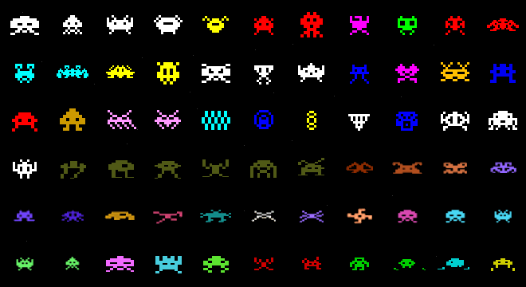
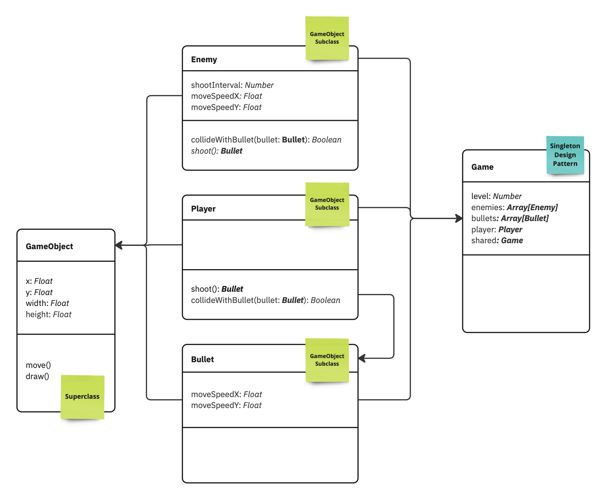
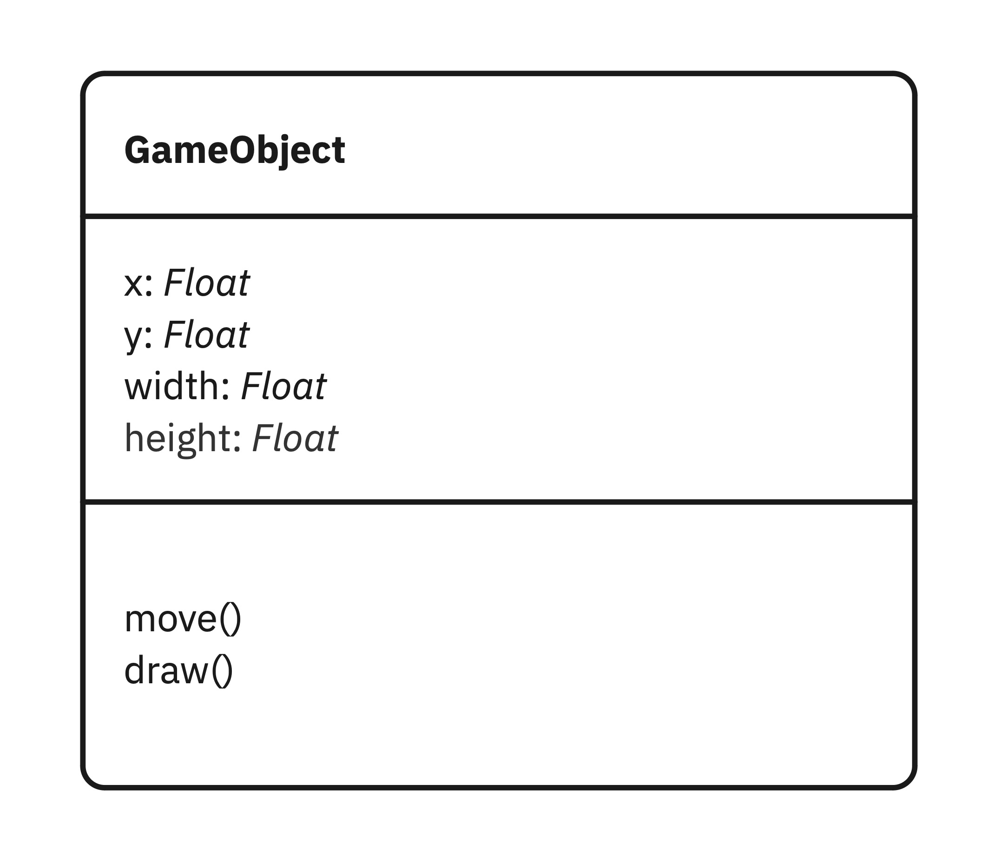
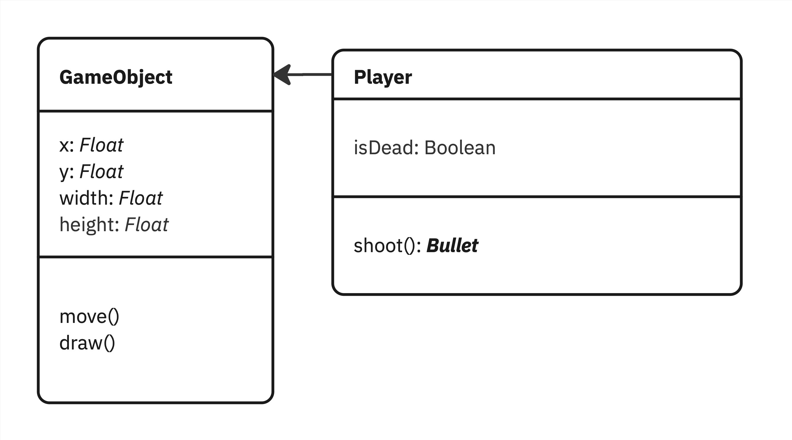
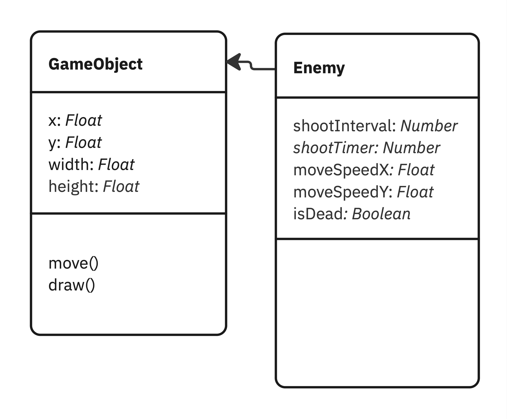
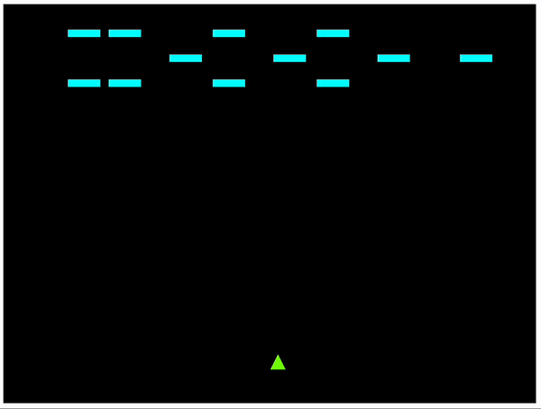
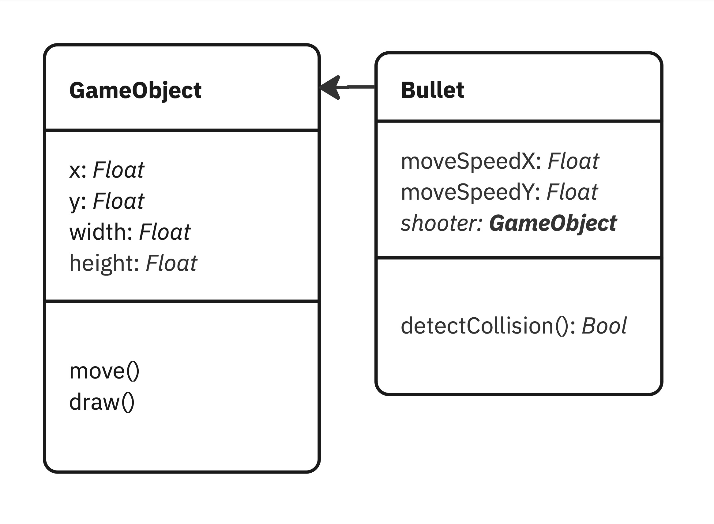
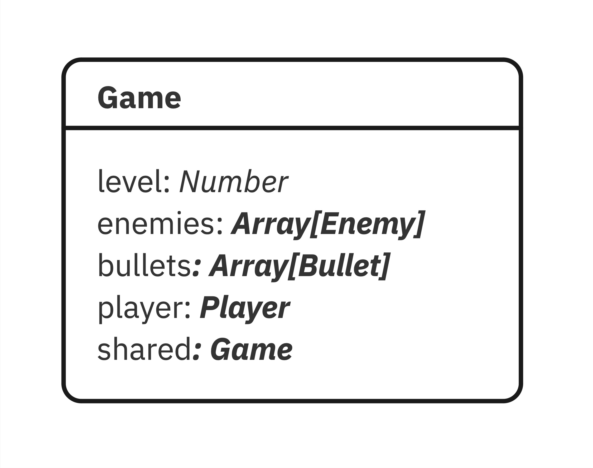

# Week 17 - Object-Oriented Programming with Space Invaders!

Since we learned **Object-Oriented Programming** in the previous three weeks. Let's put our new knowledge into practice! This week, we are going to create a simplified game with p5.js, inspired by one of the most iconic video games in history: [Space Invaders](https://en.wikipedia.org/wiki/Space_Invaders)

  

*****
### Task 0 - Familiar with the Class Diagram of our game project

As you are now more comfortable to work with the Class Diagram. Before we start coding, let's take a few minutes to **look** at the Class Diagram below, to understand the structure of our game project. To complete this project, you need to create 5 classes, including:



- `Game`, a **singleton** Class where we stored data, including `level`, `health`, `enemies`, `bullets` and `player`.
- `GameObject`, is a **superclass** where we store, `x`, `y`, `width`, and `height` properties.
- `Enemy`, `Player` and `Bullet` are **subclass**es of `GameObject`, they share the same properties as `GameObject`. However, the implementation of their `move()` and `draw()` are different.

If you fully understand the game structure, let's move to the next step!

*****
### Task 1 - Bootstrapping your project

#### 1. Download the template

1. Firstly, let's download and extract our [space invaders template](./space_invaders_template.zip).
2. Next, let's drag and drop the extracted folder into Visual Studio Code
3. Use [Live Server](https://marketplace.visualstudio.com/items?itemName=ritwickdey.LiveServer) to open your sketch in a web browser.

#### 2. Creating `GameObject.js`

Before we start coding the `sketch.js`, let's focus on creating the Superclass `GameObject.js`!



According to the Class Diagram above, the `GameObject` needs to keep 4 properties and 2 functions. Please open the `gameObject.js` file and complete it with the code as follows:

```javascript
class GameObject
{
  constructor(x, y, width, height)
  {
    this.x = x;
    this.y = y;
    this.width = width;
    this.height = height;
  }

  move()
  {
    // The GameObject will not move itself, so let's leave it empty;
  }

  draw()
  {
    // Draw a Red Circle to represent a GameObject.
    fill('red');
    rect(this.x, this.y, this.width, this.height);
  }
}
```

#### 3. Creating the `sketch.js`

Next, let's create `sketch.js`. Let's start from this simple template with a `GameObject` instance as follows:

```javascript

let gameObject = new GameObject(320, 420, 20, 20);

function setup() 
{
  createCanvas(640, 480);
}

function draw() 
{
  background(0);
  gameObject.draw();
}
```

If everything works well, we will see a red rectangle inside the canvas.


*****

### Task 2 - Creating `Player` Class



#### 1. Inherit from `GameObject`

As the Diagram demonstrated, the `Player` Class is inherited from its superclass `GameObject`, therefore, we need to use the statement `extends` to create the `Player` class. Since the `Player` class is inherited from the `GameObject` class, we just need to add new variables of `Player` on top of `GameObject`. How good is that! 🥳

```javascript
class Player extends GameObject
{
  isDead = false;
}
```

#### 2. Overriding `draw()`

However, we should create different looks between the spaceship and the enemies. We need to create a custom look for the player by **overriding** the `draw()` function, which we inherit from its superclass `GameObject`. 

To make things simple, let's just use a triangle to represent the spaceship. However, you could choose to use any other shapes or images to draw the spaceship!

```javascript
draw()
{
  fill('lawngreen');
  triangle(this.x, this.y + this.height, // The first point;
           this.x + this.width / 2, this.y, // The second point;
           this.x + this.width,  this.y + this.height);  // The third point;
}
```

Since we had created a new `Player` Class based on the `GameObject` class, let's replace the `gameObject` in our `sketch.js` with our new fancy "Spaceship"!

```javascript

// Replace the gameObject variable with our new Player

let player = new Player(320, 420, 20, 20); // +ADDED
// let gameObject = new GameObject(320, 420, 20, 20); -REMOVED


function setup() 
{
  createCanvas(640, 480);
}

function draw() 
{
  // Replace gameObject.draw() with our new player.draw();

  player.draw(); // +ADDED
  // - REMOVED: gameObject.draw(); -REMOVED
}
```

### &#x1F536; 1st code challenge:  

```diff
! Since we had override the draw() function for Player, 
! let's override the move() function of Player as well! 
! If the user is pressing the Right Arrow or Left Arrow on their keyboards,
! It will move the spaceship.
``` 

<details>
<summary>Tip:</summary>
You might need to use the <a href="https://p5js.org/reference/#/p5/keyIsDown">keyIsDown</a> to detect keyboard events.
</details>  

### &#x1F536; 2nd code challenge:  



```diff
! Follow the diagram above, let's complete the `enemy.js`,
! Please complete the Enemy Class by overriding its move() and draw()
! with a customised looks and moving logic,
! and add a few rows of enemies into your sketch!
``` 

Idealistically, after you finish the two challenges above, there will be a few rows of enemies and a player on your sketch. 



<details>
<summary>Tip:</summary>
You will need to use For loops to create a few rows of enemies, and you will also need to customize the moving speed of enemies based on their row number!
</details>  

*****

### Task 3 - Let's bullets Fly!

If you have completed these tasks, it's time to enable our player to shoot bullets!



As the diagram demonstrated above, the bullets are driven by `moveSpeedX` and the `moveSpeedY`. Since both the `Player` and the `Enemy` can shoot bullets. Let's create a `Bullet` class to create a moving bullet.

Since the bullet comes from a `Player` or an `Enemy` Class, we need to prevent the `Player` from shooting themselves and the `Enemy` from shooting their teammates! Therefore, the `Bullet` needs to record who shot them.

```javascript
class Bullet extends GameObject
{
  // The Bullet will move upward by decreasing its Y axis
  moveSpeedY = -1;

  // Create a new bullet by passing who is the shooter.
  constructor(shooter)
  {
    // Use super() statement to call its superclass - GameObject, to initialise a new Bullet object. based on current shooter's x and y axis.
    super(shooter.x,shooter.y,2,20);

    // Record who shoot the bullet
    this.shooter = shooter;
  }

  draw()
  {
    // Draw a white long retangle to represent the bullet, it moves upward by moveSpeedY
    fill('white');
    rect(this.x,this.y+moveSpeedY,this.width,this.height);
  }
}
```

To enable our player to shoot Bullets. We need to add the new function `shoot()` into our `Player` Class. If we detect a player pressing a key, it will generate a bullet from the current player's position.

*****

### Task 4 - Implementing the `Game` Class into `sketch.js`



*****