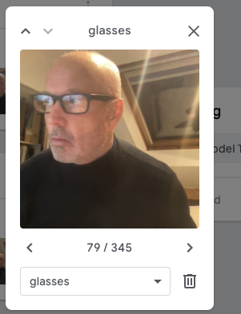
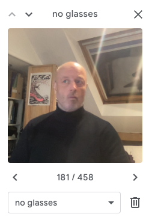
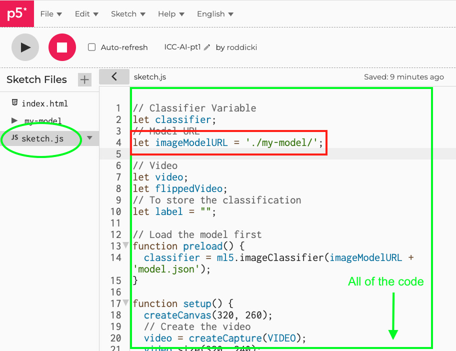

# Week 17

## AI and Machine Learning pt 1

This week and next week we are focusing on AI and Machine Learning (ML) for p5.  
This week we will focus on machine vision and object recognition.  

To start with we will see how ML works using Google's Teachable Machine platform.  
Then we will move onto implement ML with P5 using the ml5.js library.  

You will need a webcam for this workshop.  

Team up with someone and help each other with these tasks. (Help each other capture images for the dataset).    

## Task 1 - Teachable Machine - Creating a model from dataset with classes

- We are going to create a dataset and classifier with https://teachablemachine.withgoogle.com/ 

- We will be teaching our machines to recognise an object (choose something distinctive, a pen, bottle, laptop, your hand, glasses etc) 

- Click to get started with teachable machine and choose 'Image Project' https://teachablemachine.withgoogle.com/train 

- Initially we will create a dataset of images of our chosen object using the teachable machine platform and following the instructions on the teachable machine web page.  

- choose a new Image project and Standard image model.   

<p align="center">

</p>

- Use the webcam to record image samples of your chosen object. Rotate your object so that there images of every angle close and far. Aim for about 300 images.  

- Edit the name of the class. This will be label for the classifier. 

- Repeat this for two or three classes.  

<p align="center">

</p>

- I used my face with and without glasses.    

<p align="center">

</p>

- Then click 'train the model' and preview and test it. **Don't close the webpage!** 
- Hopefully it works like mine below. You have now created a machine learning **model** and **classifier**.

<p align="center">

</p>

## Task 2 - Teachable Machine - Deploying your model into a web page

Export your model from the Teachable Machine page. Select **Tensorflow.js** and **Download**.   
**Don't close the webpage!** (it will download as a .zip file). 

Download a new P5 empty example onto your machine. Rename the ```empty-example```  directory.  I've called mine ```machine-learning-example```.


<p align="center">

</p>

Add the downloaded and unzipped model folder (probably called ```tm-my-image-model```) into your renamed empty example directory, next to ```sketch.js```.  

  

Replace the content of your ```sketch.js``` with the code from the example ```sketch.js``` code here:  
https://editor.p5js.org/roddicki/sketches/21J3iubL-   

  

Now also in ```sketch.js``` change the following line so that ```'./my_model/'``` is the name of your model folder you downloaded.  

```javascript
  let imageModelURL = './my_model/';
```   

Next in ```index.html``` add a ```<script>``` tag to include the ml5 p5 library.   
  Edit your code so it looks like the following:

```
<script src="../p5.min.js"></script>
<!-- <script src="../addons/p5.sound.js"></script> -->  
<!-- Comment: add the p5 ml5 library: -->
<script src="https://cdn.jsdelivr.net/npm/ml5@0.5.0/dist/ml5.min.js"></script>
<!-- Comment: Be sure that the script link to sketch.js is BENEATH the other code libraries: -->
<script src="sketch.js"></script>
```

That's it! You are now ready to test and run your code. 

## Task 3 - Teachable Machine - Testing your model and web page with a local server
To test and run your model and web page you will need **to run it as a local server**

<details>
<summary>Find out what a local server is:</summary>
https://developer.mozilla.org/en-US/docs/Learn/Common_questions/Tools_and_setup/set_up_a_local_testing_server
</details>


Visual studio code provides a local server as part of its code environment.  
You will first need to install this in Visual studio code.  
Click on the blocks (extensions) icon in the left hand nav.  
Search for 'live' and install the 'Live Server'.

<p align="center">

</p>

Once installed open the **whole p5 folder** in Visual studio code. Accept the prompts to 'trust the author'.
Click on ```index.html``` and then 'Go live' at the bottom right of the window. A new window will open with a view of your html file which uses ```http://127.0.0.1/``` or ```localhost```


From now on you should **ALWAYS** run any web pages as a local server **whatever the project**.

<details>
<summary>Other ways to create a local server</summary>
You can also create a local server using the python programming language in the terminal or command line, or by installing a Chrome extension.   


More here:  
https://developer.mozilla.org/en-US/docs/Learn/Common_questions/Tools_and_setup/set_up_a_local_testing_server  
And here:  
https://github.com/processing/p5.js/wiki/Local-server  
</details>

Once the page is running you should see a web cam view with the classification of the image below

<p align="center">

</p>

## &#x1F536; Code Challenge 1:

```diff
! Display the video image in index.html so it is much bigger.
```

Before we move on let's look at how the classifier works. In the ```function gotResult()``` at the bottom of the script change the commented out console message to:

```javascript
// The results are in an array ordered by confidence.
console.log(results);
```
Run the page with the local server and look at the output in the console (in the developer tools). As the webcam runs and the image is classified the model returns a prediction about the likelihood of each classifier.

When I have glasses on the prediction has high (0.98) confidence in the 'glasses' classifier:
<p align="center">

</p>

In machine learning confidence is always expressed as a value between 0 and 1.  
In machine learning the system does not 'know' that I am wearing glasses it makes a prediction about the likelhood that I might be. This prediction is a confidence value.  

## Task 4 - P5 - Using the classifier to trigger other code to run  

We will use the classifier and model we have created to change an image on our ```index.html``` page.    
We will use the confidence value of the prediction to change what we see on the screen. 

Make the P5 canvas bigger and video image smaller:  

```javascript
function setup() {
  console.log("running setup");
  createCanvas(640, 480); // make the canvas bigger
  // Create the video
  video = createCapture(VIDEO);
  video.size(320, 240); // and make the image small
  video.hide();

  flippedVideo = ml5.flipImage(video);
  // Start classifying
  classifyVideo();
}
```

<p align="center">

</p>

## &#x1F536; Code Challenge 2:

```diff
! Find and download two images to use to represent each classifier.
! Add them to your example folder.
! Use P5 to add one of the images onto the center of the canvas 
! (I'm using an emoji but you can use what you like).
! If you aren't sure how to do this search the P5 reference to how to add an image.
```
<details>
<summary>Hint:</summary>
You can find the answers to the code challenges above at the top of the page.
</details>

Now we will add another image and swap them based on the classifiers 'glasses' / 'no glasses'.  

<p align="center">

</p>

Add another image variable at the top of the sketch. 
```javascript
let img_2;
```
and preload it in the ```preload()``` function (note this runs before ```setup()```. 

```javascript
function preload() {
  classifier = ml5.imageClassifier(imageModelURL + 'model.json');
  img_1 = loadImage('smiling-face.png'); // NEW
  img_2 = loadImage('nerdface.png'); // NEW
}
```

To swap each image to display depending on the classifier we can use the ```label``` variable in ```draw()```.  

In ```draw()``` add:

```javascript
if (label == "glasses") {
  image(img_2, width/2, height/2, 250, 250); // NEW
}
else {
  image(img_1, width/2, height/2, 250, 250); // NEW
}
```

You will need to change ```label == "<your classifier name>"``` and use the name of your classifier.  

Your sketch should now work something like this:

<p align="center">

</p>


