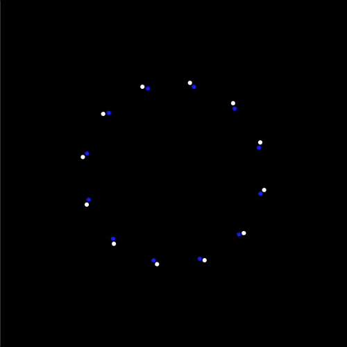

# Week 17

## Audio reactive visuals

For this week's task we're going to make an interactive audio-visualiser.  This worksheet is inspired by Yannis Yannakopoulos' [audio-visualisers](https://tympanus.net/Development/AudioVisualizers) so spend a bit of time playing with them first.  You'll notice that the location of the mouse cursor on the canvas allows you to interact with them, in our example we'll be creating visuals that reactive to audio elements of a song.

### Task 1 - Load sound file

For all the tasks in this weeksheet you'll need to run a local server.  If you've forgotten how to do that you can check [here](https://github.com/processing/p5.js/wiki/Local-server).  If you are using Visual Studio Code you can use the Live Server extension.

To start with we need to load an audio track to play.  You can find one via [Soundsnap](https://www.soundsnap.com/) (of which you should have licenses).  Alternatively you could use generative AI to create on from a text prompt such as [MusicGen](https://huggingface.co/spaces/facebook/MusicGen).

Now you have your audio file place it in th same folder as your ```index.html``` and ```sketch.js``` files.  Next paste the following code into your ```sketch.js``` file:

```javascript
let mySound;
let amp;

function preload() {
  mySound = loadSound('reggae30s.wav');
}

function setup(){
  let cnv = createCanvas(500, 500);
  cnv.mousePressed(canvasPressed);
  textAlign(CENTER);
  textSize(30);
  strokeWeight(4);
  stroke(255);

  amp = new p5.Amplitude();
  amp.setInput(mySound);
}

function draw(){
  background(0);

  if (!mySound.isPlaying()){
    console.log('not playing');
    text('tap here to play', width/2, height/2);
  }

  let level = amp.getLevel();
  console.log(level);
}

function canvasPressed() {
  mySound.play();
  mySound.loop();
}
````

This code [loads an audio file](https://p5js.org/reference/p5/loadSound/) in a `preload()` function (this runs before `setup()`) and then uses the [`p5.Amplitude`](https://p5js.org/reference/p5.sound/p5.Amplitude/) object to get the amplitude (volume) of the audio file.  NB: You'll need to change the name of the sound file in the code.

If you run this example you will notice you are required to press the mouse cursor on the canvas before it starts working.  If you are using Chrome you can see a warning in the console about the AudioContext not being allowed to start.  This is to force developers to include a play button or such like so that users can choose to play a sound rather than it just blasting as soon as you open a webpage.  You can read more about it [here](https://developer.chrome.com/blog/autoplay/#webaudio)).

I'm going to base my audio-visualiser off of [Demo 3](https://tympanus.net/Development/AudioVisualizers/index3.html).  This example consists on rotating points and lines that move in time to the music.  

Notice that they all rotate around the centre of the canvas, so we need to change our point of origin using the `translate()` function.  Now let's use a for loop and the `rotate()` function to draw some [points](https://p5js.org/reference/p5/point) in a circle shape.  This is the code that I added to my `draw() function`:

```javascript
translate(width / 2, height / 2);

let noOfPoints = 12;

for (let i = 0; i < noOfPoints; i++) {
  rotate(TWO_PI / noOfPoints);

  strokeWeight(4);
  stroke(255);
  point(0, height/4);
}
```

Now I want to use the values coming in from the audio file to move the points.  If you look at the code you'll see that the `getLevel()` function is being used to access the volume level (amplitude).  We are then printing the amplitude level of the sound file to the console.  Can you see how these values change as the song plays? In particular look for the maximum and minimum values.

Next you'll need to use the `map()` function to map the minimum and maximum values from the audio file to the minimum and maximum values that you want the points to move to.

Your `draw()` function should now look something like the following:

```javascript
function draw(){
  background(0);

  if (!mySound.isPlaying()){
    console.log('not playing');
    text('tap here to play', width/2, height/2);
  }

  let level = amp.getLevel();
  console.log(level);
  
  let mappedLevel = map(level, 0, 0.2, 0, 100); // map level to desirable range

  translate(width / 2, height / 2); // move point of origin to centre of canvas

  let noOfPoints = 12; // total number of points to draw

  for (let i = 0; i < noOfPoints; i++) { // for all of the points
    rotate(TWO_PI / noOfPoints); // rotate around a circle - default for p5 is radians
    point(mappedLevel, height/4);
  }

}
```

Now run this and watch those points dance!  You might need to adjust the values inside the map function depending on how loud your music is.  

Here is a screenshot of my end of Task 1 and a [link](https://simonemberton.panel.uwe.ac.uk/Week17/Task1/) to see it working.

<p align="center">
  
</p>


### Task 2 - Frequency Analysis

Let's try and develop this a bit further by applying some audio analysis to the incoming signal so that we can isolate the high, mid and low frequency bands rather than just overall amplitude.  The method of audio analysis we'll be using is the Fast Fourier Transform [FFT](https://p5js.org/reference/p5.sound/p5.FFT/).  

First we need to create a new global variable called `fft` at the top of the `sketch.js` file.  Remember it's a global variable so it's outside of the `setup()` function.  Next at the end of the `setup()` function we'll make our `fft` variable equal to a new `p5.FFT` object and then set the input to `fft` to be the `mySound` variable from our sound file using the following code:
```javascript
fft = new p5.FFT();
fft.setInput(mySound);
```
Then inside the `draw()` function instead of calling `mySound.getLevel()` we'll use the following code to get the frequency spectrum of the audio signal:
```javascript
let spectrum = fft.analyze();
```
Now `console.log` the `spectrum` variable and see the output in the console. You'll need to comment out the rest of the code so that errors don't prevent the code from running.  You'll see in the console that the `spectrum` variable contains an array of length 1024 where each location in the array has a value between 0-255 which represents the amplitude at that slice of the frequency spectrum.

We could use the data from `fft.analyze()` to create some interesting visuals but instead I want to make use of fft's [`getEnergy()`](https://p5js.org/reference/p5.FFT/getEnergy/) function to get the average values from predefined frequencies ranges, in particular the treble, mid and bass frequencies.  FYI we always have to use `fft.analyze()` before using `fft.getEnergy()`.  Add the following code:
```javascript
let treble = fft.getEnergy("treble");
let mid = fft.getEnergy("mid");
let bass = fft.getEnergy("bass");
```
Now print the values from the `treble`, `mid` and `bass` variables to the console. You'll see that we now have a value between 0-255 for each of the three frequency bands.  Let's draw circles of points for each of these frequency bands.  We need to use `map()` functions for each of the bands to map the values within appropriate ranges.  Here are what my `map()` functions look like:
```javascript
let mappedTreble = map(treble, 0, 50, 0, 200); 
let mappedMid = map(mid, 0, 255, -200, 100); 
let mappedBass = map(bass, 0, 255, -200, 50);
```
Next inside the for loop add more `point()` functions so that we've got one for each frequency band, where the `x` location of each `point()` takes a mapped frequency band as the input. I've made mine a different colour too so that you can see the difference:
```javascript
// treble
strokeWeight(6);
stroke(255,0,0);
point(mappedTreble, height/4);

// mid
strokeWeight(6);
stroke(0,0,255);
point(mappedMid, height/4);

// bass
strokeWeight(6);
stroke(255);
point(mappedBass, height/4);
```
Now you should be able to see each of the points reacting slightly differently to different parts of the music.  If you can't see all three points try adjusting the map function values so that it works well for your song.

Here is a screenshot of my end of Task 2 and a [link](https://simonemberton.panel.uwe.ac.uk/Week17/Task2/) to see it working.

<p align="center">
  
</p>

### Task 3 - Finishing touches

The audio-visualiser is nearly there but I want to add a few finishing touches.  

First I'm going to add another shape to the scene for the mid frequencies.  In my example I've used it to draw lines but you could use other shapes here. I want to draw my line from around the centre to the edge of the canvas so I'll create a `map` function which maps the mid frequencies to within that range using the following code:
```javascript
let scaleMidLine = map(mid, 0, 255, 0, width); 
```

The code for drawing the mid frequency shapes now looks like this:
```javascript
// mid
strokeWeight(6);
stroke(0,0,255);
point(mappedMid, height/4);
strokeWeight(2);
line(0, height/4, scaleMidLine, height);
```

Finally I'm adding slight trails to the whole visualisation by putting some transparency on the `background()` function at the top of `draw()` like this:
```javascript
background(0,50);
```

Here is a screenshot of the end of Task 3 and a [link](https://simonemberton.panel.uwe.ac.uk/Week17/Task3/) to see it working.

<p align="center">
  
</p>
