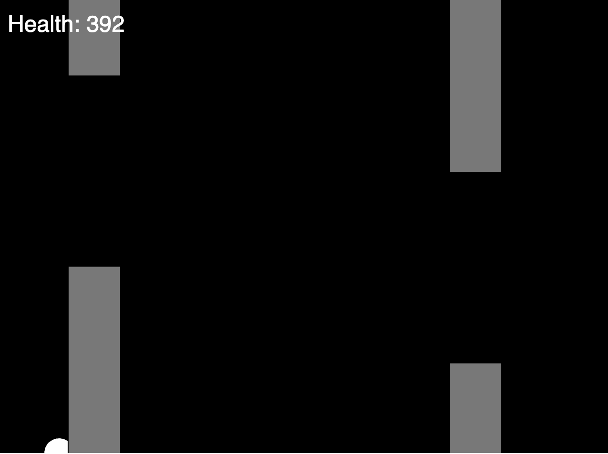

# Week 16

## Answer - Task 5 - Add a health variable

- in sketch.js
- Add a health variable as a global variable.  
- Add text in draw.  

```javascript
let bird;
let pipe;
let pipes = [];
let health = 500; // health variable

function setup() {
  //frameRate(2);
  createCanvas(640, 480);
  bird = new Bird();
  pipe = new Pipe();
}

function draw() {
  background(0);
  bird.show();
  bird.update();
  if (frameCount % 400 == 0) {
    //console.log(frameCount);
    pipes.push(new Pipe());

  }

  for (var i = 0; i < pipes.length; i++) {
    pipes[i].show();
    pipes[i].update();

    if (pipes[i].hits(bird)) {
      console.log("HIT");
      health --; // minus one every hit
    }
  }

  // display the health text
  fill(255);
  textSize(24);
  textAlign(LEFT, CENTER);
  text("Health: "+health, 10, 30);


  //pipe.show();
  //pipe.update();

}


function keyPressed() {
  if (key == ' ') {
    bird.up();
  }
}
```


  

