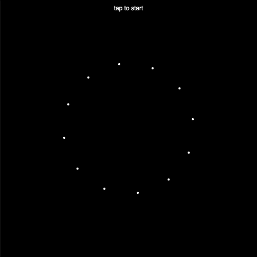
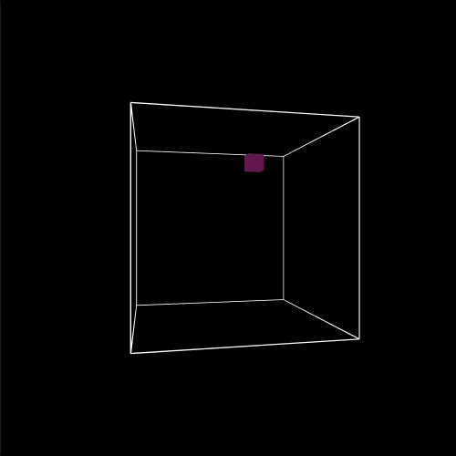
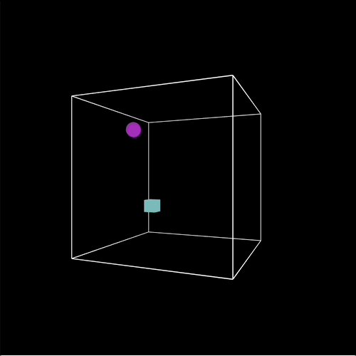
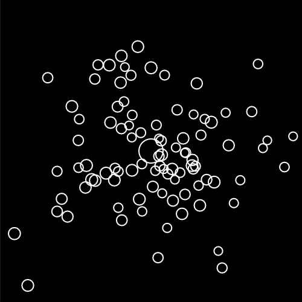
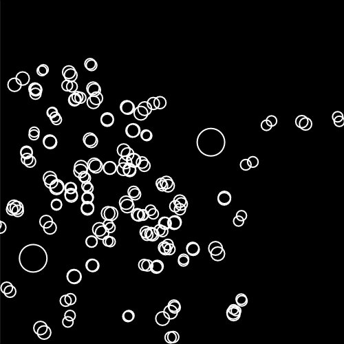
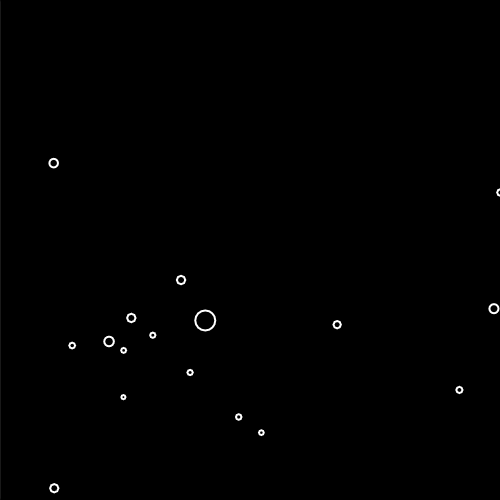

# Week 18

## Adding more complex behaviours to your particle system

### Task 1 - Vectors

<!-- 1_1 -->

Start a new project and copy the following code to your `sketch.js` file.  This example reuses some of the code that was introduced last semester and shows a circle bouncing around the screen.

```javascript

let p1;

function setup() {
	createCanvas(500,500);
	p1 = new Particle(random(50,width-50),random(50,height-50)); 
}

function draw() {
	background(0);

	p1.update();
	p1.display();
	p1.checkEdges();
}


class Particle {
	
	constructor(startX, startY){
		this.x = startX;
		this.y = startY;
		this.r = 10;

		this.xVel = random(0.5,2.5);
		this.yVel = random(0.5,2.5);
	}

	update() {
		this.x = this.x + this.xVel;
		this.y = this.y + this.yVel;
	}

	display() {
		stroke(255);
		strokeWeight(2);
		noFill();
		ellipse(this.x, this.y,this.r*2,this.r*2);
	}

	checkEdges() {

		if (this.x > (width-this.r)) {
		  this.xVel *= -1;
		  this.x = width-this.r;
		} else if (this.x < (0+this.r)) {
		  this.xVel *= -1;
		  this.x = 0+this.r;
		}

		if (this.y > (height-this.r)) {
		  this.yVel *= -1;
		  this.y = height-this.r;
		} else if (this.y < (0+this.r)) {
		  this.yVel *= -1;
		  this.y = 0+this.r;
		}

	}

}
```
<p align="center">
  
</p>

<!-- 1_2 Convert to vectors -->

Your task is to convert this code so that we are working with vectors.  For example instead of ```this.x``` and ```this.y``` use  

```javascript
this.pos = createVector( ... , ... );
```

In the update function it's not possible to add position and velocity vectors using the addition operator ```this.pos = this.pos + this.vel;```.  You'll need to make use of p5's [add function for vectors](https://p5js.org/reference/#/p5.Vector/add).  

If you're feeling unsure about vectors and how to do maths with them in p5.js I recommend watching these two Coding Train videos on [What is a Vector?](https://www.youtube.com/watch?v=bKEaK7WNLzM&list=PLRqwX-V7Uu6ZV4yEcW3uDwOgGXKUUsPOM&index=11&ab_channel=TheCodingTrain) and [Vector Math](https://www.youtube.com/watch?v=Rob0pbE7kks&list=PLRqwX-V7Uu6ZV4yEcW3uDwOgGXKUUsPOM&index=12&ab_channel=TheCodingTrain).

Here is an example of the running [code](https://simonemberton.panel.uwe.ac.uk/Week18/Task1/).

### Task 2 - May the force be with you

<!-- 2 Acceleration - update randomly each frame -->

Now that we're working with vectors let's introduce some forces to our simulation.  In the constructor of our particle class let's make a new vector for acceleration e.g.

```javascript 
this.acc = createVector(0,0);
```

We'll also need a new class method to apply the forces

```javascript
applyForce(force) {
	this.acc.add(force);
} 
```

and in the ```update()``` function we'll add the acceleration to the velocity on each frame, we'll also set the acceleration to zero so that this value doesn't accumulate.

```javascript
update() {
	this.vel.add(this.acc);
	this.pos.add(this.vel);
	this.acc.set(0, 0);
}
```

Now let's call the ```applyForce()``` function inside ```draw()``` and pass in random values which change on each frame.  Try changing the range of random values that are input to the function and see how it changes the direction and magnitude of the force.

Here is an example of the running [code](https://simonemberton.panel.uwe.ac.uk/Week18/Task2/).

### Task 3 - Gravitational Attraction

<!-- 3 Accelerate towards an object (give code for this function) -->
The following code is a slightly modified Attractor class from Daniel's Shiffman's book the [Nature of Code](https://github.com/shiffman/The-Nature-of-Code-Examples-p5.js)

```javascript
class Attractor {

  constructor(x, y) {
    this.pos = createVector(x, y);
    this.mass = 20;
    this.G = 1;
  }

  calculateAttraction(p) {
    // Calculate direction of force
    let force = p5.Vector.sub(this.pos, p.pos);
    // Distance between objects
    let distance = force.mag();
    // Artificial constraint
    distance = constrain(distance, 5, 25);
    // Normalize vector (distance doesn't matter here, we just want this vector for direction)
    force.normalize();
    // Calculate gravitional force magnitude
    let strength = (this.G * this.mass * p.mass) / (distance * distance);
    // Get force vector -> magnitude * direction
    force.mult(strength);
    return force;
  }

  display() {
    ellipseMode(CENTER);
    strokeWeight(2);
    stroke(255);
    ellipse(this.pos.x, this.pos.y, this.mass*2, this.mass*2);
  }
}

/*
# Nature_of_Code_p5js

Study files of - Daniel Shiffman's Nature of Code course on:
https://www.kadenze.com/courses/the-nature-of-code/info


More info:
https://github.com/shiffman/The-Nature-of-Code
http://natureofcode.com/

Gravitational Attraction
*/
```

Add this to your project.  You might want to put it in its own separate file and then link to it in the ```index.html``` file.

You'll need to create a new variable (I've called mine `a1`) for your attractor and create an instance of this object in the `setup()` function.  Inside the `draw()` function we'll call the `calculateAttraction()` function to calculate the attraction between our particle and attractor objects and then use this `force` value in our `applyForce()` function like this:
```javascript
let force = a1.calculateAttraction(p1);
p1.applyForce(force);
```
You'll also want to call the `display()` method for your attractor object in the `draw()` function.

Now add a ```mass``` variable to your particle class. This value is used in the ```calculateAttraction()``` function inside the ```Attractor``` class.  Try changing the value assigned to the ```mass``` variable and see how it changes the force of attraction towards the central ellipse.

We'll also use mass in the particles ```applyForce()``` function so that the mass of each particle is used in the calculation of the force acting on it as in Newton's second law of motion (this will be useful when we start to add more particles of varied mass)

```javascript
applyForce(force) {
	let f = p5.Vector.div(force, this.mass);
	this.acc.add(force);
}
```
The output of this task should have a small ellipse orbiting around a larger central ellipse. You can see this code running [here](https://simonemberton.panel.uwe.ac.uk/Week18/Task3/).

<p align="center">
  
</p>

### Task 4 - Arrays of particles

<!-- 4 -->
Remember back to last term when we had an [array of Bubble objects](https://simonemberton.panel.uwe.ac.uk/Week07/Task02/).  Using this example as a template can you now create an array of particle objects that are all attracted towards the central ellipse.

If you can get that working it should look something like [this](https://simonemberton.panel.uwe.ac.uk/Week18/Task4/):

<p align="center">
  
</p>

### Extra challenges

<!-- 5_1 -->
* Try making each particle that you create in ```setup()``` have a different mass. Code example [here](https://simonemberton.panel.uwe.ac.uk/Week18/Task5_1/).

<p align="center">
  
</p>

<!-- 5_2 -->
* Try adding more attractors (not too many though or things get a bit out of control!). Code example [here](https://simonemberton.panel.uwe.ac.uk/Week18/Task5_2/).

<p align="center">
  
</p>

<!-- 5_3 -->
* Make the attractors move around the screen (now you'll start to see 'interesting' behaviours emerging). Code example [here](https://simonemberton.panel.uwe.ac.uk/Week18/Task5_3/).

<p align="center">
  
</p>
