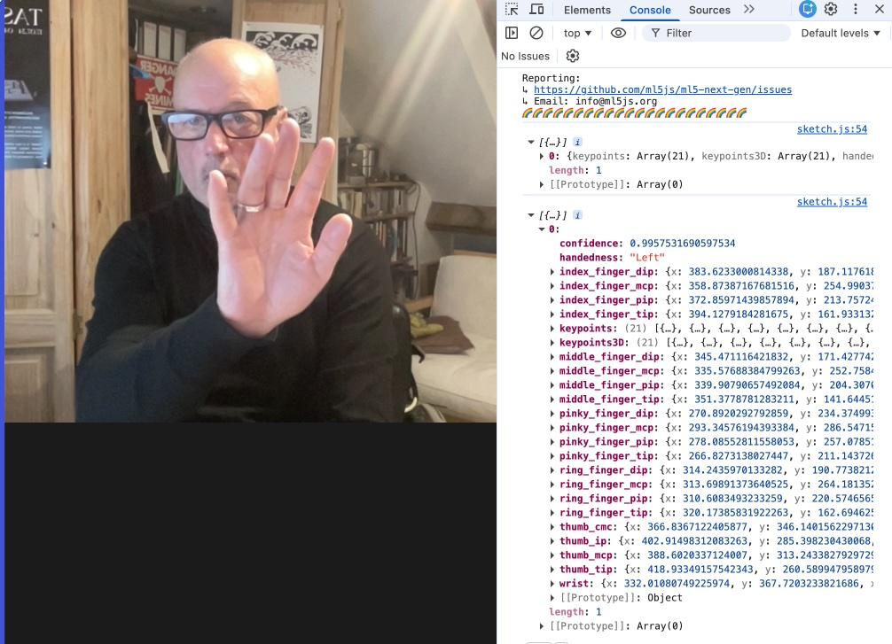
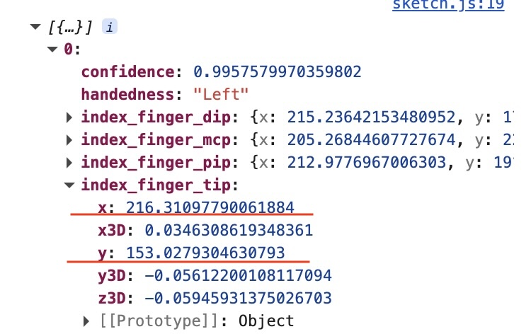
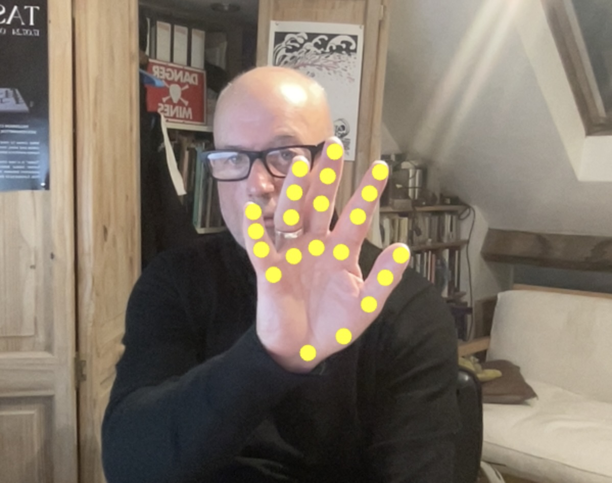
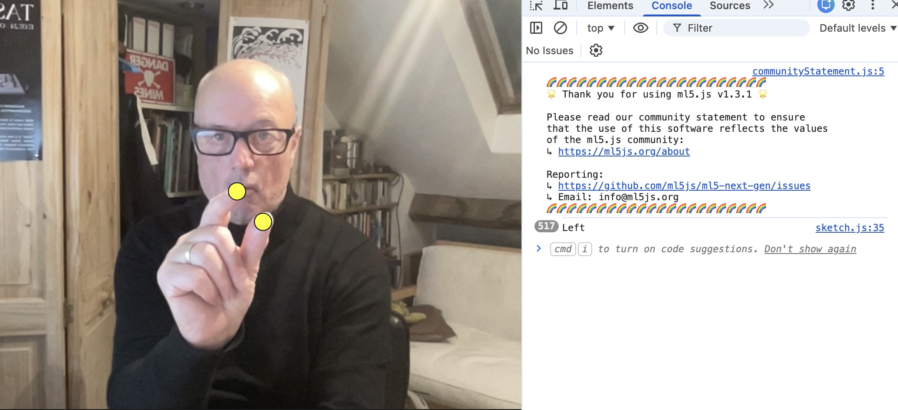
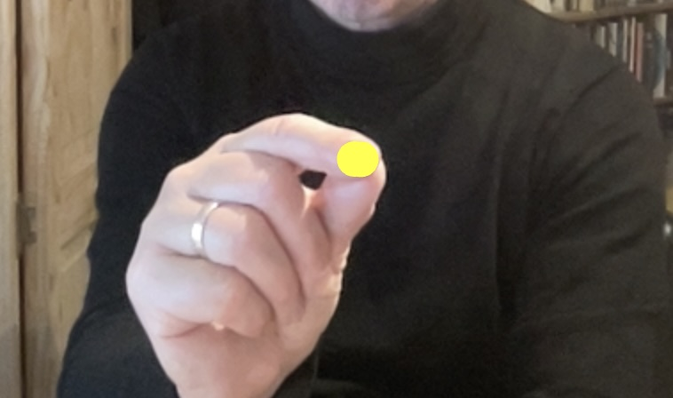
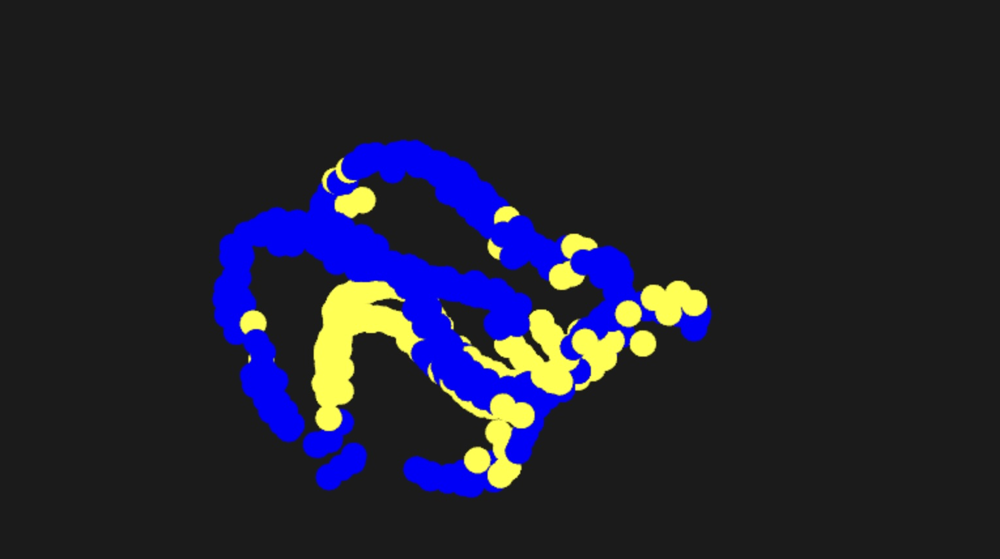

# Week 18

## AI and Machine Learning pt 2

This week we will continue our focus on machine vision and object recognition and implement Machine Learning with P5 using the ml5.js library.  
https://ml5js.org/  

This week we are going to focus on using machine learning to detect our hands and fingers and then we are going to code our sketch so that we can draw on the canvas moving our finger.   

ml5.js Already has a pretrained machine learning model to recognise hands called handpose.   
https://docs.ml5js.org/#/reference/handpose 

This workshop is a variation of The Coding Train video:  
Hand Pose Detection with ml5.js   
https://thecodingtrain.com/tracks/ml5js-beginners-guide/ml5/hand-pose   


## Steps / Tasks:  


This workshop is divided into the following steps:   
- **Step 1:** Capture the video from our webcam and draw it onto the canvas.  
- **Step 2:** Use the webcam image to detect our hands and fingers using the handpose machine learning model 
- **Step 3:** See it working detecting our fingers.   
- **Step 4:** Narrow down its focus so that it only detect our index finger and thumb. We will get a circle to track their movement.   
- **Step 5:** Use the tracking of our index finger to draw a line on the canvas.  
- **Step 6:** Integrate the webcam image with the line drawing  

You will need a webcam for this workshop.  

Team up with someone and help each other with these tasks so you can problem solve together.  


## Step 1 - Use the handpose machine learning model to detect your fingers 


You will need to download a new P5 'empty example'.

#### Configure index.html:

In the ```<head>``` of ```index.html``` add a link to the ml5.js library above the link to your ```sketch.js``` file.
Use the following (the exact versions are important)  

```html
<script src="https://cdnjs.cloudflare.com/ajax/libs/p5.js/1.10.0/p5.js"></script>
<script src="https://unpkg.com/ml5@1/dist/ml5.min.js"></script>
<script src="sketch.js"></script>
```

<details>
<summary>Note about script links:</summary>
Notice that you are using a link to ml5.js library rather than downloading into your example folder.  
This is a common way to include script files for libraries and modules.  
The ml5.js script file is hosted on a Content Delivery Network (cdn).  
</details>

#### Step 1. Configure sketch.js:  

First of all we are going to capture the video from our webcam and draw it onto the canvas.  
Setup ```sketch.js``` as follows.  

```javascript
let video;

function setup() {
  createCanvas(640, 480);
  video = createCapture(VIDEO, { flipped: true });
  video.size(640, 480);
  video.hide();
}

function draw() {
  image(video, 0, 0);
}
```

Test your sketch **using a local server**, you should see your webcam image on the canvas.  
Now we can add the object detection model and detection functions. 
<details>
<summary>Hint:</summary>
If you are not sure how to set up Visual Studio Code to run a local server see last week's worksheet.
</details>  


## Step 2 - Use the webcam image to detect our hands and fingers using handpose  

Next we will use the webcam image to detect our hands and fingers using the handpose machine learning model and see it working detecting our fingers.

Add some variable to the top of the ```sketch.js```  

```javascript
let video; // we already have this
let handPose;
let hands = [];
``` 
Like last week add a preload function to load the ml5 handpose model. This should be above ```setup```.   

```javascript
function preload() {
  // Initialize HandPose model with flipped video input
  handPose = ml5.handPose({ flipped: true });
}
``` 

Start detecting hands in setup
```javascript
function setup() {
  createCanvas(640, 480); // we already have this
  video = createCapture(VIDEO, { flipped: true }); // we already have this
  video.hide(); // we already have this

  // Start detecting hands
  handPose.detectStart(video, gotHands);
}
``` 
Draw stays as it is for the moment. But we will add a function to recieve the results of the hand detection called ```gotHands()```.  

This function sets the results to the ```hands``` global variable.   

```javascript
function gotHands(results) {
  hands = results;
}
````

Finally we will use a mousepress to send the results the console. Add this function underneath ```gotHands()```.   

```javascript
function mousePressed() {
  console.log(hands);
}
```
Open the console when you run the sketch and you should see this when you click the mouse with one of your hands in view:

Notice the name of all the finger joints and parts in the console. Next we will visualise them!   

<p align="center">

</p> 

<details>
<summary>Note:</summary>
Your complete sketch.js should look this:   

```javascript
let video;
let handPose;
let hands = [];

function preload() {
  // Initialize HandPose model with flipped video input
  handPose = ml5.handPose({ flipped: true });
}

function setup() {
  createCanvas(640, 480);
  video = createCapture(VIDEO, { flipped: true });
  video.hide();

  // Start detecting hands
  handPose.detectStart(video, gotHands);
}

function draw() {
  image(video, 0, 0);
}

function gotHands(results) {
  hands = results;
}

function mousePressed() {
  console.log(hands);
}

```
</details>


## Step 3 - Draw circles on our joints using the handpose model.

Now we will take all those finger parts and visualise them by drawing a circle on each joint.  
Notice that in the console each finger part has an array with a name and x and y coordinate. This is the place it appears on the canvas that we will use to draw our circle. (Don't worry about the other 3D coordinates).  

Open up a finger array in the console so you can see it like this:  

<p align="center">

</p> 

To draw a circle on each joint we need to loop through each finger and each joint and extract the X and Y values and use these to draw a circle.  

We will add to ```draw()```.  

Add an ```if``` statement to ```draw()``` to check that handpose can see and has returned data about one or more hands.   
The hands are returned as an array so we will check the array has more than 1 item (```hands.length > 0```).    

Next add a ```for``` loop that loops through each finger part:  

Draw should look like this: 

```javascript
function draw() {
  image(video, 0, 0);

  // Check that handpose can see one or more hands
  if (hands.length > 0) {

    // loop through the result getting all the keypoints
    for (let i = 0; i < hands[0].keypoints.length; i++) {
      let keypoint = hands[0].keypoints[i];

      fill(255, 255, 0);
      noStroke();
      // draw a circle using the x, y keypoints
      circle(keypoint.x, keypoint.y, 16);
    }

  }

}
```

It should look like this, with 21 markers per hand. 

The markers and video image are drawn on every frame, making it look like the circles are tracking the hand as it moves.  

<p align="center">

</p> 


This adds circles to the first hand on the screen. You can detect if it is the left or right hand with handedness property in the hand array. Using ```hands[0].handedness```.


## &#x1F536; Code Challenge 1:

```diff
! Output if is the left or right hand using hands[0].handedness.
! Change the colour of the circles for the left and right hand.
```

<details>
<summary>Hint:</summary>
You can find the answers to the code challenges including the final sketch.js code in this weeks folder.
</details>  

## Step 4 - Only detect our index finger and thumb. We will get a circle to track their movement.

We will change draw, delete the ```for`` loop and instead directly access the ```index_finger_tip``` and ```thumb_tip```.
Draw a circle for each

```draw``` should look like this:

```javascript
function draw() {
  image(video, 0, 0);

  // Ensure at least one hand is detected
  if (hands.length > 0) {
    console.log(hands[0].handedness);
    // get the index finger tip and thumb tip (look at the previous console results for the names)
    let index = hands[0].index_finger_tip;
    let thumb = hands[0].thumb_tip;
    // next draw them using there x y
     fill(255, 255, 0);
    noStroke();
    circle(index.x, index.y, 20);
    circle(thumb.x, thumb.y, 20);
  }
}

```

Your sketch should now track your thumb and index finger (you should still be able to see if it is the right or left hand in the console).

<p align="center">

</p> 

Ultimately we are going to draw a line using our index finger. But let's only do that when the index finger and thumb are close together.
We will use the ```dist()``` p5 function to calculate the distance between the index and thumb.  
https://p5js.org/reference/p5.Vector/dist/  

<p align="left">

</p> 

## &#x1F536; Code Challenge 2:

```diff
! use the dist() function to calculate the distance between the index and thumb.
! console.log() the result (distance)
! HINT: the index and thumb both have x, y properties index.x etc
```

We can change the colour of the circles when they touch using an if statement.
if distance is less than 20 fill the circles blue.

Add this ```if``` statement in ```draw()``` under your distance calculation (if you didn't solve that see the code challenge 2 answer at the top of the page).

```javascript
if(d < 20) {
  fill(0,0,255);
}

// draw the circles
circle(index.x, index.y, 20);
circle(thumb.x, thumb.y, 20);
````

<details>
<summary>Hint:</summary>
You can find the answers to the code challenges including the final sketch.js code in this weeks github folder.
</details>  

## Step 5: Use the tracking of our index finger to draw a line on the canvas.  

If you comment out ```image(video, 0, 0);``` in ```draw()``` you will see we are already drawing circles on the canvas
```javascript
//image(video, 0, 0);
```
<p align="left">

</p> 

However we want to draw a continous line and only with the index finger (when it is close to the thumb).

In p5 lines need the x and y for two points, so that P5 can draw a line between them.
```line(x1, y1, x2, y2);```  
https://p5js.org/reference/p5/line/

We will capture the point in the previous frame where the index finger was and draw line between the previous point and the current point.   
The current point is ```index.x``` and ```index.y``` (already in the sketch).
To get the point in the previous frame where the index finger was create two new global variables at the very top of your script:
```javascript
let indexPreviousX;
let indexPreviousY;
```

in ```draw()```
Remove the following lines
```javascript
// set the fill color
fill(255,255,0); 
noStroke();
```

```javascript
fill(0,0,255);
```

```javascript
// draw the circles
circle(index.x, index.y, 20);
circle(thumb.x, thumb.y, 20);```

```

Now edit draw to set the colour and width of the line, draw the line and update ```indexPreviousX``` and ```indexPreviousY``` so it looks like this:   

```javascript
function draw() {
  //image(video, 0, 0);

  // Ensure at least one hand is detected
  if (hands.length > 0) {
    console.log(hands[0].handedness);
    // get the index finger tip and thumb tip (look at the console results for the names)
    let index = hands[0].index_finger_tip;
    let thumb = hands[0].thumb_tip;

    // next use the dist function to get the proximity of both
    let d = dist(index.x, index.y, thumb.x, thumb.y);
    console.log(d);
    // if distance is less than 20 draw with the index
    if(d < 20) {
      // set the colour and width of the line
      stroke(255, 255, 0);
      strokeWeight(8);

      // draw the line - a line needs a current position and a previous position
      line(index.x, index.y, indexPreviousX, indexPreviousY);
    }
    
    indexPreviousX = index.x;
    indexPreviousY = index.y;
    
  }
}
```

You should now be able to draw a line when you index finger and thumb are together.  

## Step 6: Stretch goal: Integrate the webcam image with the line drawing  

Well done if you have got this far. At the moment we can't see the webcam image beacause we commented out. because it re draws every frame it obscures our drawing. So try to work out a way to save the the (coordinates) of the drawing and redraw them every frame...

<p align="left">

</p> 


<details>
<summary>Hint:</summary>
Youc an use an array to store the coordinates of the drawing on every frame.
You can find the solution with the final sketch.js code in this weeks github folder. Look for stretch-goal.md
</details>  


