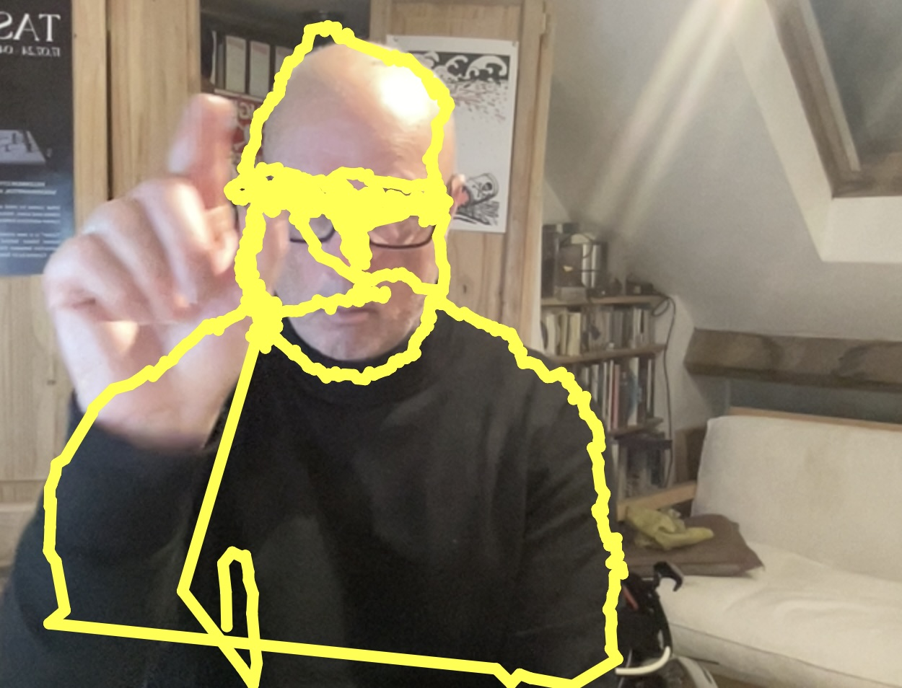

# Week 18

Stretch goal:  

Try to work out a way to save the the (coordinates) of the drawing and redraw them every frame...

<p align="left">

</p> 


```javascript
let video;
let handPose;
let hands = [];
// save coordinates of the drawing here
let drawing = [];

function preload() {
  // Initialize HandPose model with flipped video input
  handPose = ml5.handPose({ flipped: true });
}

function mousePressed() {
  console.log(hands);
  console.log(drawing);
}

function gotHands(results) {
  hands = results;
}

function setup() {
  createCanvas(640, 480);
  video = createCapture(VIDEO, { flipped: true });
  video.hide();

  // Start detecting hands
  handPose.detectStart(video, gotHands);
}

function draw() {
  image(video, 0, 0);

  // Ensure at least one hand is detected
  if (hands.length > 0) {
    //console.log(hands[0].handedness);
    // get the index finger tip and thumb tip (look at the console results for the names)
    let index = hands[0].index_finger_tip;
    let thumb = hands[0].thumb_tip;

    // next use the dist function to get the proximity of both
    let d = dist(index.x, index.y, thumb.x, thumb.y);
    //console.log(d);
    // if distance is less than 20 draw with the index
    if(d < 20) {
      // set the colour and width of the line
      stroke(255, 255, 0);
      strokeWeight(8);

      // make an object to contain the coords on each frame
      let previousObj = {};
      previousObj["x"] = index.x;
      previousObj["y"] = index.y;
      drawing.push(previousObj);
    }
  }

  // draw the line - a line needs a current position and a previous position
  //line(index.x, index.y, indexPreviousX, indexPreviousY);

  // loop through the array of drawing coordinates to draw it
  for (let i = 0; i < drawing.length-1; i++) {
    // get i and i+1
    // draw a line
    line(drawing[i].x, drawing[i].y, drawing[i+1].x, drawing[i+1].y);
  }
}

```