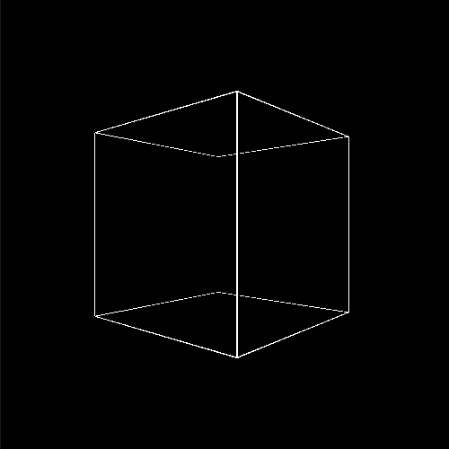
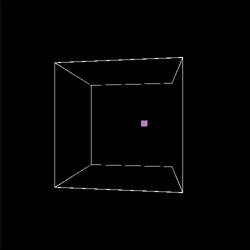
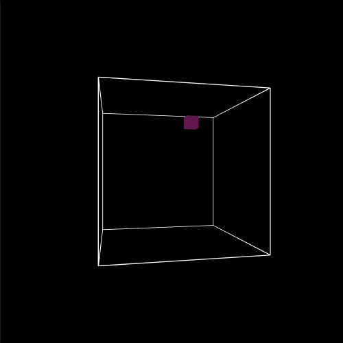
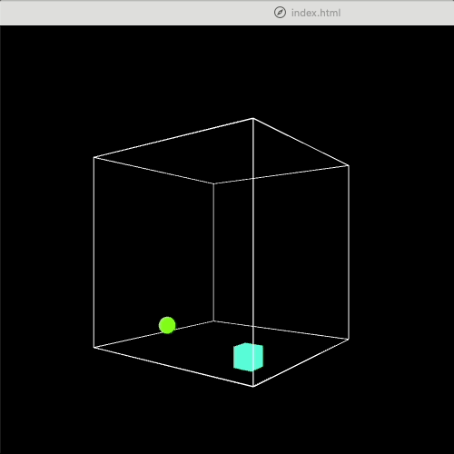

# Week 19

## Exploring concepts of 3D space

First off have a quick look at [this](https://github.com/processing/p5.js/wiki/Getting-started-with-WebGL-in-p5) information describing the main differences when working in p5's WEBGL mode.  You might find it useful to refer back to this page during the following tasks.

### Task 1 - Draw the edges of our space

Start from the following code:

```javascript
let negEdge = -100;
let posEdge = 100;
let count = 0;

function setup() {
	createCanvas(500,500, WEBGL);
}

function draw() {
	background(0);
	ambientLight(255,255,255);

	rotateY(count);
	count = count + (0.003);

	stroke(255);
	drawEdges();
}

function drawEdges() {
	// draw lines here 

}
```

In the ```drawEdges()``` function use [lines](https://p5js.org/reference/#/p5/line) or [vertices](https://p5js.org/reference/#/p5/vertex) to draw a cube that will define the edges of our 3D space.  Use the global variables ```negEdge``` and ```posEdge``` as the negative and positive edge values. 

The output of this task should look like [this](https://simonemberton.panel.uwe.ac.uk/Week19/Task1/):

<p align="center">
  
</p>

### Task 2 - Draw our first 3D shape

Add the following code to the ```draw()``` function to draw a box in a random location within our 3D space on each frame.  Notice how we have to use the ```translate()``` function here and the value input to ```box()``` changes its size.  Try commenting out ```push()``` and ```pop()``` to see what happens.

```javascript
let xVal = random(negEdge,posEdge);
let yVal = random(negEdge,posEdge);
let zVal = random(negEdge,posEdge);

push();
translate(xVal, yVal, zVal);
box(10);
pop();
```

Next add the following code so that we change the colour of the box depending on it's location in the 3D space where each dimension is mapped to a different colour channel.

```javascript
let red = map(xVal, -100, 100, 0, 255);
let green = map(yVal, -100, 100, 0, 255);
let blue = map(zVal, -100, 100, 0, 255);
ambientMaterial(red, green, blue);
```
The output of this task should look like [this](https://simonemberton.panel.uwe.ac.uk/Week19/Task2/):

<p align="center">
  
</p>

### Task 3 - 3D Shape class

Create a new file called ```Shape.js```, copy the following code into it and save it in the current working directory. Make sure you link to this file in the ```index.html``` (e.g. <script src="Shape.js"></script>).

```javascript
class Shape {
	
	constructor(startX, startY){
		this.x = startX;
		this.y = startY;
		this.r = 18;

		this.xVel = random(0.1,1);
		this.yVel = random(0.1,1);
	}
	
	update() {
		this.x = this.x + this.xVel;
		this.y = this.y + this.yVel;
	}

	display() {
	
	}

	checkEdges() {
		if (this.x > posEdge-(this.r/2)) {
		  	this.xVel *= -1;
			this.x = posEdge-(this.r/2);
		} else if (this.x < negEdge+(this.r/2)) {
		  	this.xVel *= -1;
			this.x = negEdge+(this.r/2);
		}

		if (this.y > posEdge-(this.r/2)) {
			this.yVel *= -1;
			this.y = posEdge-(this.r/2);
		} else if (this.y < negEdge+(this.r/2)) {
			this.yVel *= -1;
			this.y = negEdge+(this.r/2);
		}
		
	}

}
```

As you can see this class is for 2D, can you change it so that it works for 3D? 

We'll also need to make some changes in our ```sketch.js``` file. Create a new global variable (remember at the top and outside any functions) called shape1 e.g. ```let shape1;```.  

In the ```setup()``` function allocate a new instance of the ```Shape``` class to our ```shape1``` variable.  The constructor of the ```Shape``` class requires three values for the start locations for the x, y and z axes. Here I'm providing random values inside our cube:
```javascript
shape1 = new Shape(random(negEdge,posEdge), random(negEdge,posEdge), random(negEdge,posEdge));
```

Then inside the ```draw()``` function we need to call the ```update(), display() and checkEdges()``` methods for the `shape1` object:
```javascript
shape1.update();
shape1.display();
shape1.checkEdges(); 
```

Finally we need to add some code to the ```display()``` method of the ```Shape``` class to draw and colour the box:
```javascript
display() {
	let red = map(this.x, -100, 100, 0, 255);
	let green = map(this.y, -100, 100, 0, 255);
	let blue = map(this.z, -100, 100, 0, 255);
	ambientMaterial(red, green, blue);

	push();
		translate(this.x, this.y, this.z);
		box(this.r);
	pop();
}
```

Hopefully now you can see a slightly larger cube moving around the space!

The output of this task should look like [this](https://simonemberton.panel.uwe.ac.uk/Week19/Task3/):

<p align="center">
  
</p>

### Task 4 - Inheritance

Create a new file called ```Sphere.js``` and save it in the same folder, don't forget to link to this file in your ```index.html``` file.

In this file create a ```Sphere``` class which extends the ```Shape``` class.  Remember you've done this before in [Task 7 of Week 14](https://github.com/simonemberton/Introduction_to_Creative_Coding/tree/master/Week_14/).  If you look at this example you'll notice that you need to use the ```extends``` keyword.  In the constructor you need to use the line ```super(startX, startY, startZ);``` to get access to the initiation values from the Shape class.  Now change the ```update()``` and ```display()``` methods so that this class has its own behaviours i.e. moves and looks different.  For the methods that you want to keep the same as the parent class you must again use the ```super``` keyword e.g.:
```javascript
checkEdges() {
	super.checkEdges();
}
```

The output of this task should look like [this](https://simonemberton.panel.uwe.ac.uk/Week19/Task4/):

<p align="center">
  
</p>

### Task 5 - Make it beep

Next I want to add some reactive element to the piece.  This could be using preloaded sound files (e.g. see the [p5.js example](https://p5js.org/examples/sound-load-and-play-sound.html) or the [Coding Train example](https://www.youtube.com/watch?v=40Me1-yAtTc&list=PLRqwX-V7Uu6aFcVjlDAkkGIixw70s7jpW&index=5&ab_channel=TheCodingTrain)) or with synthesied sounds (e.g. see these Coding Train examples on [Sound Synthesis](https://www.youtube.com/watch?v=Bk8rLzzSink&ab_channel=TheCodingTrain) and [ADSR Envelope](https://www.youtube.com/watch?v=wUSva_BnedA&list=PLRqwX-V7Uu6aFcVjlDAkkGIixw70s7jpW&index=7&ab_channel=TheCodingTrain)).

For this example we're going to synthesise sounds using the [```p5.Oscillator()```](https://p5js.org/reference/#/p5.Oscillator) function.

To start with though remember when using sound with p5 we need to use the [p5.sound library](https://p5js.org/reference/#/libraries/p5.sound) so make sure you have that file and are linking to it in your `sketch.js` file.  We'll also need to use a [local server](https://github.com/processing/p5.js/wiki/Local-server) (e.g. Live Server in Visual Studio Code).

As modern browsers require users to press a button before the audio is allowed to play we're going to turn the canvas into a button and ask users to press it if there is no audio playing.  Writing text to the canvas is different in WebGL mode (you can read out a few different ways to do it [here](https://github.com/processing/p5.js/wiki/Getting-started-with-WebGL-in-p5)).  

Firstly we're going to find a font to use and add the font file to our project folder. I chose the `Inconsolata-Regular.ttf` from [here](https://fonts.google.com/specimen/Inconsolata). Next we'll create a global variable for our font e.g. `let inconsolata;`, then we'll use the `preload()` function to load the font before the `setup()` function is called:
```javascript
function preload() {
	inconsolata = loadFont('Inconsolata-Regular.ttf');
  }
```
Next in the `setup()` function we will make our canvas into a clickable button, which when pressed calls the `userStartAudio` function therefore enabling the audio.  We'll also define the font, size and alignment parameters for the text:
```javascript
let cnv = createCanvas(500,500, WEBGL);
cnv.mousePressed(userStartAudio);
textFont(inconsolata);
textSize(width / 20);
textAlign(CENTER, CENTER);
```

Next at the top of the `draw()` function after the background is drawn we'll check to see if audio is running and if not write a message to the user to 'tap to start':
```javascript
if (getAudioContext().state !== 'running') {
	fill(255);
  	text('tap to start', 0, 0);
}
```

Great now we've got that working we can add some audio elements to our objects.  Inside the constructor of our `Shape` class we're going to add a new [p5.Oscillator](https://p5js.org/reference/#/p5.Oscillator) with a sine wave, set the amplitude and then call the `start()` method of the oscillator:
```javascript
this.osc =  new p5.Oscillator('sine');
this.osc.amp(0.2);
this.osc.start();
```
Next in the `update()` method of the `Shape` class we're going to map the x, y and z locations to the frequency, amplitude and panning respectively:
```javascript
// change oscillator frequency based x axis
let freq = map(this.x, -100, 100, 440, 660);
this.osc.freq(freq);
		
// change oscillator amplitude based y axis
let amp = map(this.y, -100, 100, 0.2, 0.1);
this.osc.amp(amp);

// change oscillator panning based z axis
let pan = map(this.z, -100, 100, 0.9, 0.1);
this.osc.pan(pan);
```
I've also added the same to the `Sphere` class but changed the parameters a bit.

The output of this task should look and sound like [this](https://simonemberton.panel.uwe.ac.uk/Week19/Task5/):

### Stretch goals

* Create an array of Shapes filled with either Shape or Sphere objects. Try using an if statement and the modulo operator so that when iterating through the for loop when ```i``` is odd you create a ```Shape``` object and when even a ```Sphere``` object. 

* Make another class that also inherits from ```Shape``` but behaves differently to ```Sphere```.

* Try adding different audio effects for example triggering a different notes each time an object collides with the edge of the cube space.  You could use this [example](https://p5js.org/examples/sound-note-envelope.html) as a starting point.


