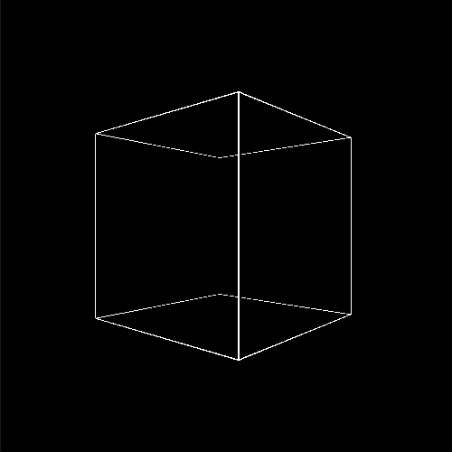
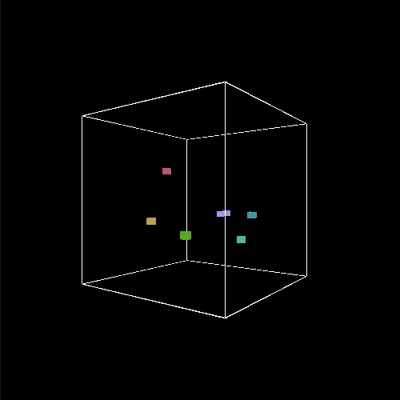
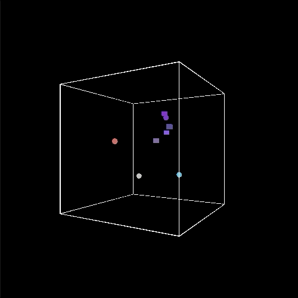

# Week 20

## Exploring concepts of 3D space

First off have a quick look at [this](https://github.com/processing/p5.js/wiki/Getting-started-with-WebGL-in-p5) information describing the main differences when working in p5's WEBGL mode.  You might find it useful to refer back to this page during the following tasks.

### Task 1 - Draw the edges of our space

Start from the following code:

```javascript
let negEdge = -100;
let posEdge = 100;
let count = 0;

function setup() {
	createCanvas(500,500, WEBGL);
}

function draw() {
	background(0);
	ambientLight(255,255,255);

	rotateY(count);
	count = count + (0.003);

	stroke(255);
	drawEdges();
}

function drawEdges() {
	// draw lines here 

}
```

In the ```drawEdges()``` function use [lines](https://p5js.org/reference/#/p5/line) or [vertices](https://p5js.org/reference/#/p5/vertex) to draw a cube that will define the edges of our 3D space.  Use the global variables ```negEdge``` and ```posEdge``` as the negative and positive edge values. 

The output of this task should look like [this](https://simonemberton.panel.uwe.ac.uk/Week20/Task1/):

<p align="center">
  
</p>

### Task 2 - Draw our first 3D shape

Add the following code to the ```draw()``` function to draw a box in a random location within our 3D space on each frame.  Notice how we have to use the ```translate()``` function here and the value input to ```box()``` changes its size.  Try commenting out ```push()``` and ```pop()``` to see what happens.

```javascript
let xVal = random(negEdge,posEdge);
let yVal = random(negEdge,posEdge);
let zVal = random(negEdge,posEdge);

push();
translate(xVal, yVal, zVal);
box(10);
pop();
```

Next add the following code so that we change the colour of the box depending on it's location in the 3D space where each dimension is mapped to a different colour channel.

```javascript
let red = map(xVal, -100, 100, 0, 255);
let green = map(yVal, -100, 100, 0, 255);
let blue = map(zVal, -100, 100, 0, 255);
ambientMaterial(red, green, blue);
```
The output of this task should look like [this](https://simonemberton.panel.uwe.ac.uk/Week20/Task2/):

<p align="center">
  
</p>

### Task 3 - 3D Shape class

Create a new file called ```Shape.js```, copy the following code into it and save it in the current working directory. Make sure you link to this file in the ```index.html```.

```javascript
class Shape {
	
	constructor(startX, startY){
		this.x = startX;
		this.y = startY;
		this.r = 8;

		this.xVel = random(0.1,1);
		this.yVel = random(0.1,1);
	}
	
	update() {
		this.x = this.x + this.xVel;
		this.y = this.y + this.yVel;
	}

	display() {
	
	}

	checkEdges() {
		if (this.x > posEdge-(this.r/2)) {
		  	this.xVel *= -1;
			this.x = posEdge-(this.r/2);
		} else if (this.x < negEdge+(this.r/2)) {
		  	this.xVel *= -1;
			this.x = negEdge+(this.r/2);
		}

		if (this.y > posEdge-(this.r/2)) {
			this.yVel *= -1;
			this.y = posEdge-(this.r/2);
		} else if (this.y < negEdge+(this.r/2)) {
			this.yVel *= -1;
			this.y = negEdge+(this.r/2);
		}
		
	}

}
```

As you can see this class is for 2D, can you change it so that it works for 3D? 

We'll also need to make some changes in our ```sketch.js``` file.  Create a new global array ```var shapes = [];```.  In the ```setup()``` function create a for loop which fills our ```shapes``` array with instances of our ```Shape``` class and provides three random values between ```negEdge``` and ```posEdge``` as the start locations for our object in each of the three dimensions. 

In the ```draw()``` function create another for loop which iterates through each of the objects in our ```shapes``` array and calls each of the class methods e.g. ```update()```, ```display()``` and ```checkEdges()```.  You'll also need to move the code that we just previously wrote for drawing and colouring a box to the ```display()``` method.

Finally, add the sound effects that you used last week in Task 4 of the sound [workshop](https://github.com/davemeckin/Intro_to_Creative_Programming/blob/master/Week_19/Week_19.md) so that each time an object hits an edge a sound is made.

The output of this task should look like [this](https://simonemberton.panel.uwe.ac.uk/Week20/Task3/):

<p align="center">
  
</p>

### Task 4 - Inheritance

Create a new file called ```Sphere.js``` and save it in the same folder, don't forget to link to this file in your ```index.html``` file.

In this file create a ```Sphere``` class which extends the ```Shape``` class.  Remember you've done this [before](https://davemeckin.panel.uwe.ac.uk/tut5demo/tut5/).  If you look at this example notice your need to use the ```extends``` keyword.  In the constructor you need to use the line ```super(startX,startY,startZ);``` to get access to the initiation values from the Shape class.  Now change the ```update()``` and ```display()``` methods so that this class has its own behaviours i.e. moves and looks different.  For the methods that you want to keep the same as the parent class you must again use the ```super``` keyword e.g.:

```javascript
checkEdges() {
	super.checkEdges();
}
```

Now in the ```setup()``` function fill the ```shapes``` array with both Shape and Sphere objects.  Try using an if statement and the modulo operator so that when iterating through the for loop when ```i``` is odd you create a ```Shape``` object and when even a ```Sphere``` object. 

The output of this task should look like [this](https://simonemberton.panel.uwe.ac.uk/Week20/Task4/):

<p align="center">
  
</p>

### Extra challenge

Make another class that also inherits from ```Shape``` but behaves differently to ```Sphere```.

